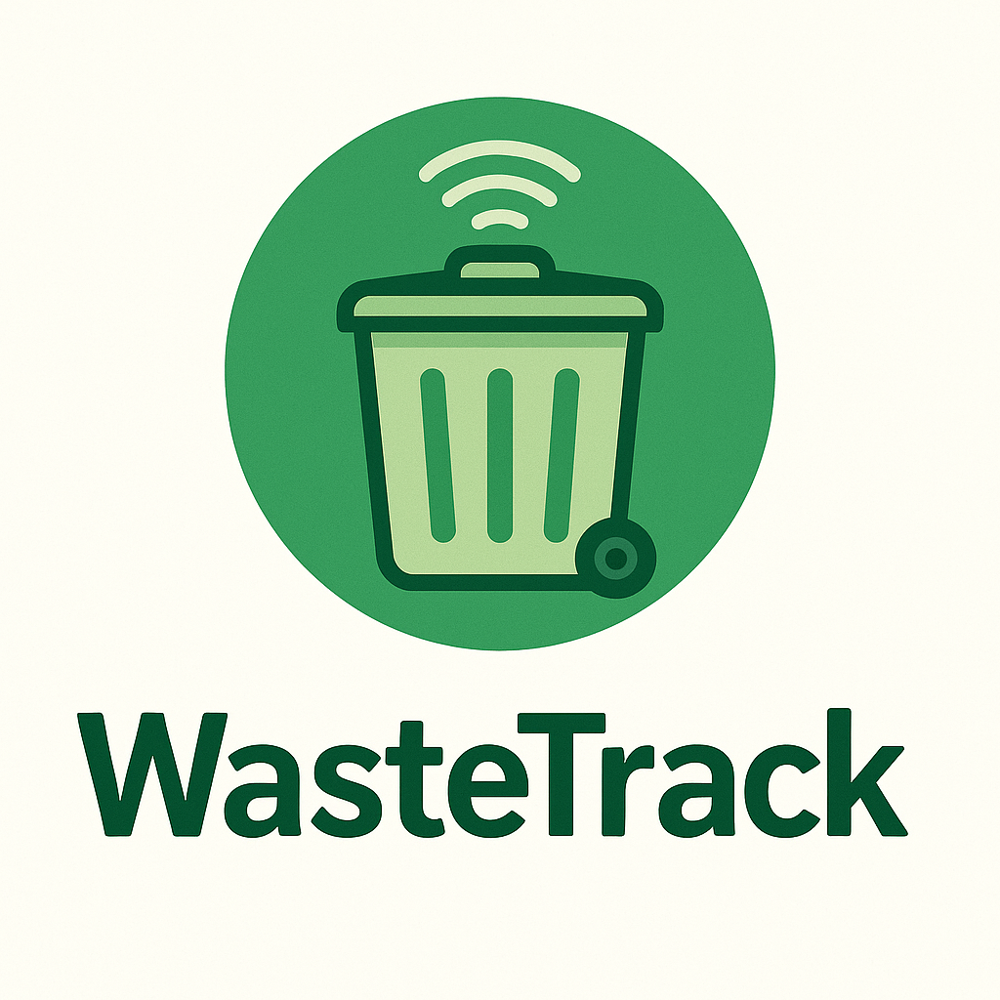
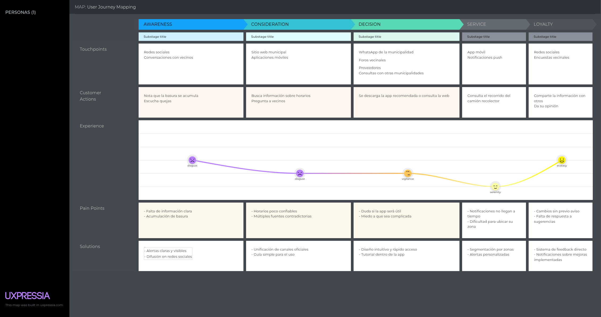
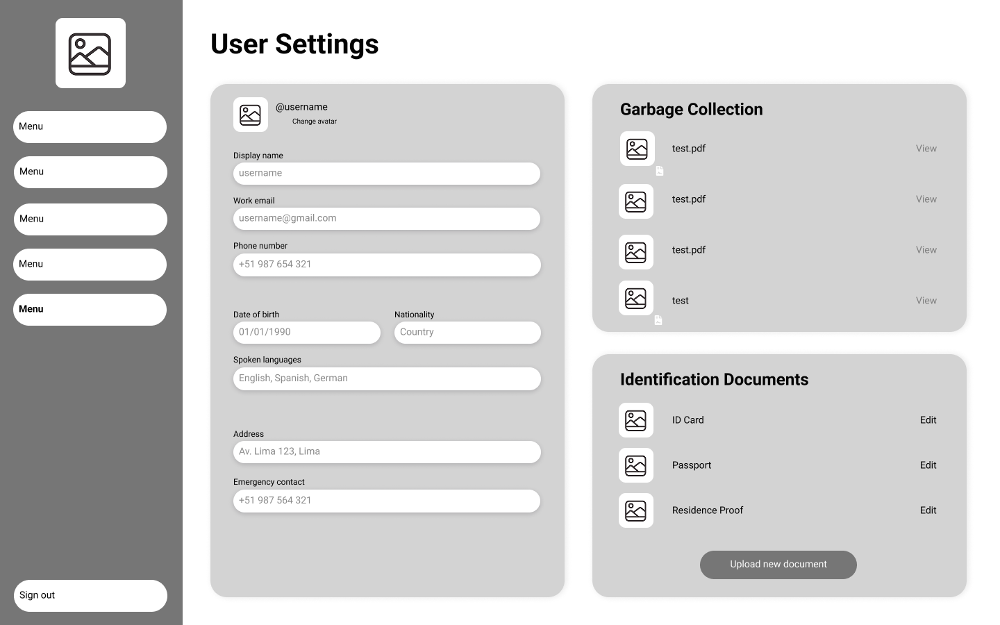
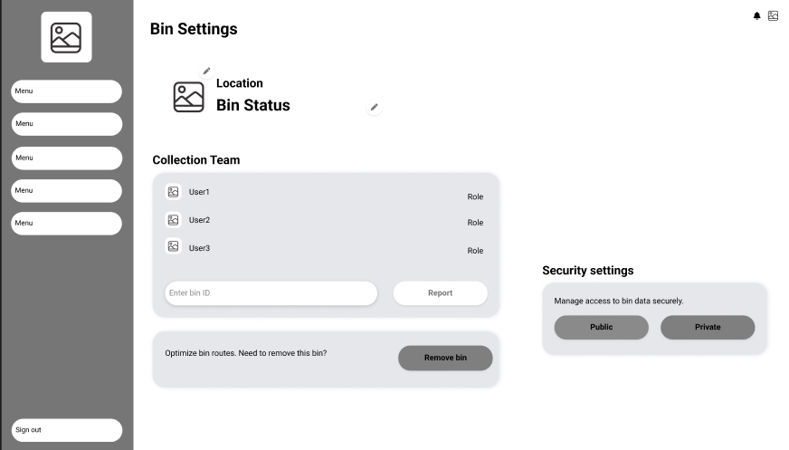
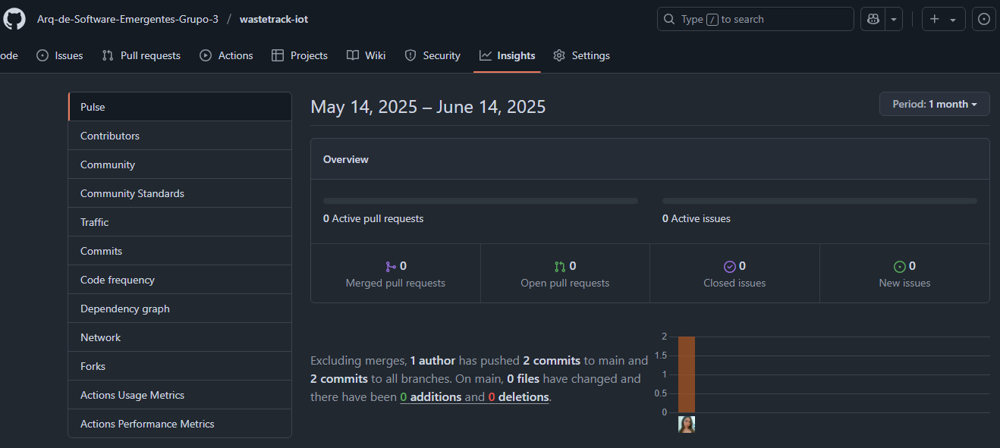

<p align="center">
    <strong>Universidad Peruana de Ciencias Aplicadas</strong><br>
<br></img><br>  
    <strong>Ingeniería de Software - 2025-01</strong><br>
    <br>
    <strong>Arquitecturas De Software Emergentes - 1ASI0728 </strong><br>  
    <br>
    <strong>Profesor: Royer Edelwer Rojas Malasquez
</strong><br>
    <br> <strong>INFORME DE TRABAJO FINAL - TB2 </strong> 
</p>
<p align="center">
    <strong>Startup: CleanCity Team </strong><br>
    <strong>Producto: WasteTrack </strong>
</p>

<h3 align="center" >Team Members:</h3>
<div>
    <table align="center">
        <tr>
            <th style="text-align:center;">Member</th>
            <th style="text-align:center;">Code</th>
        </tr>
        <tr>
    <td>Avalos Santos, Anthony Piero</td>
    <td>U20211C596</td>
</tr>
<tr>
    <td>Cortés Hidalgo, Nicolás Andrés</td>
    <td>U202123548</td>
</tr>
<tr>
    <td>Díaz Villacrez, Maria Alejandra</td>
    <td>U202118315</td>
</tr>
<tr>
    <td>Rivadeneyra Ramos, Joaquin David</td>
    <td>U202211846</td>
</tr>
<tr>
    <td>Valverde Lopez, Daniel</td>
    <td>U202121440</td>
</tr>
    </table>
  <h3 align="center" >Junio 2025</h3>
</div>
<br>

## Registro de Versiones del Informe

| Versión | Fecha      | Autor               | Descripción de modificación                                                                                         |
|---------|------------|---------------------|---------------------------------------------------------------------------------------------------------------------|
| 1.0     | 04/04/2025 | Alejandra Díaz      | Se creó la ramificación del repositorio y se adicionaron los documentos en su versión inicial previa a la investigación |
| 1.1     | 20/04/2025 | Joaquin Rivadeneyra | Se concluye el capítulo 1 y 2                                                                                       |
| 1.1     | 21/04/2025 | Alejandra Díaz      | Avance del capítulo 4                                                                                               |
| 1.2     | 23/04/2025 | Daniel Valverde     | Se concluye el capítulo 4 y se agrega entrevista                                                                    |
| 1.3     | 23/04/2025 | Nicolás Cortés      | Primera parte del Capítulo 4 finalizada, se añadió entrevista                                                        |
| 1.4     | 24/04/2025 | Anthony Avalos      | Se concluyó el capítulo 3, evidenciando correctamente la solución a la problemática establecida                      |
| 1.5     | 13/05/2025 | Maria Alejandra Díaz| Revisión y corrección del capítulo 5: Tactical-Level Software Design                                                |
| 1.6     | 13/05/2025 | Joaquin Rivadeneyra | Avance en el Capítulo 6: Solution UX Design, se definieron los wireframes de la aplicación                           |
| 1.7     | 14/05/2025 | Daniel Valverde     | Se completó el diagrama de la arquitectura de componentes y la estructura de navegación                             |
| 1.8     | 15/05/2025 | Nicolás Cortés      | Se finalizó la definición de los SEO Tags y Meta Tags en el capítulo 6.2.4                                          |
| 1.9     | 15/05/2025 | Anthony Avalos      | Integración de los sistemas de navegación en el prototipo de la aplicación y validación de flujos                    |
| 1.8     | 16/05/2025 | Nicolás Cortés      | Se concluyó el capítulo V & VI                                        |
| 1.9     | 14/06/2025 | Alejandra Díaz      | Avance del capítulo 7                                        |
| 2.0     | 16/06/2025 | Nicolás Cortés      | Finalización del capítulo 7 y mejoras en el capítulo 6         |

### Project Report Collaboration Insights

URL del repositorio para el reporte del proyecto: https://github.com/Arq-de-Software-Emergentes-Grupo-3/project-report

Github Collaboration Insights proporciona un cronograma que muestra las principales ramas y los procesos de fusión que han ocurrido. Todas las ramas se han generado siguiendo los principios de GitFlow, lo que garantiza una organización efectiva al utilizar un sistema de control de versiones.

- Maria Alejandra Díaz Villacrez (alehandraxx)
- Anthony Piero Avalos Santos (Anthony2000AA)
- Joaquin David Rivadeneyra Ramos (joqui4)
- Daniel Valverde Lopez (danielv)
- Nicolás Andrés Cortés Hidalgo (Mrkonik16)

Se divieron las siguientes ramas para la colaboración en el proyecto:

- main
- develop

#### TB1   

Se han realizado todas las tareas asignadas para la entrega del **TB1** del proyecto **WasteTrack**, enfocadas en el desarrollo inicial de la plataforma. En esta fase, se identificaron las bases del proyecto, se estructuró la infraestructura backend para la recolección y almacenamiento de datos, y se diseñó un sistema de geolocalización para visualizar el estado de los contenedores en un mapa interactivo. Además, se desarrollaron interfaces básicas para los usuarios municipales, permitiendo la configuración de parámetros y la gestión de rutas, así como una interfaz para ciudadanos que les permite visualizar el recorrido de los camiones recolectores. Cada miembro del equipo participó en la documentación y revisión de los avances, asegurando calidad y consistencia en cada entrega.

#### TP1 

Para la entrega del **TP1**, el equipo se centró en el diseño arquitectónico y de experiencia de usuario, alineado con los lineamientos establecidos en el Capítulo V y VI. En el ámbito de diseño táctico, se documentaron las capas de dominio, aplicación, infraestructura e interfaz, además de los diagramas de componentes y diseño de base de datos. En el área de experiencia de usuario, se definieron los lineamientos de estilo, arquitectura de información, sistemas de búsqueda y navegación, así como los wireframes, mock-ups y prototipos interactivos de la landing page y las aplicaciones móviles. Este proceso permitió fortalecer la estructura del sistema y validar la experiencia de usuario antes de la integración completa, asegurando un producto final alineado con los objetivos de WasteTrack.

#### TB2

Para la entrega del **TB2**, el equipo se enfocó en la implementación técnica del producto, así como en su validación con usuarios finales, conforme a lo establecido en el Capítulo VI: Product Implementation, Validation & Deployment. En el área de configuración del software, se detallaron los entornos de desarrollo utilizados, la gestión de versiones del código fuente, las convenciones de estilo adoptadas y el proceso de despliegue en producción. Durante la implementación, se evidenció el trabajo realizado en el Sprint 1, incluyendo la planificación, backlog, desarrollo colaborativo, pruebas funcionales, documentación de servicios, despliegue de la landing page y aplicaciones móviles, y reflexiones del equipo sobre la ejecución del sprint.  
Asimismo, se desarrolló el proceso completo de validation interviews, abarcando desde el diseño y registro de entrevistas hasta su análisis basado en heurísticas de usabilidad. Finalmente, se elaboró el video About-the-Product, en el cual se presenta de manera integrada el funcionamiento y propuesta de valor del sistema WasteTrack.


## Contenido 

1. [Capítulo I: Introducción](docs/chapter-I.md#capítulo-i-introducción)

    1.1. [Startup Profile](docs/chapter-I.md#11-startup-profile)

    1.1.1. [Descripción de la Startup](docs/chapter-I.md#111-descripción-de-la-startup)

    1.1.2. [Perfiles de integrantes del equipo](docs/chapter-I.md#112-perfiles-de-integrantes-del-equipo)

    1.2. [Solution Profile](docs/chapter-I.md#12-solution-profile)

    1.2.1. [Antecedentes y problemática](docs/chapter-I.md#121-antecedentes-y-problemática)

    1.2.2. [Lean UX Process](docs/chapter-I.md#122-lean-ux-process)

    1.2.2.1. [Lean UX Problem Statements](docs/chapter-I.md#1221-lean-ux-problem-statements)
     
    1.2.2.2. [Lean UX Assumptions](docs/chapter-I.md#1222-lean-ux-assumptions)   

    1.2.2.3. [Lean UX Hypothesis Statements](docs/chapter-I.md#1223-lean-ux-hypothesis-statements)

    1.2.2.4. [Lean UX Canvas](docs/chapter-I.md#1224-lean-ux-canvas)

    1.3. [Segmentos Objetivo](docs/chapter-I.md#13-segmentos-objetivos)

2. [Capítulo II: Requirements Elicitation & Analysis](docs/chapter-II.md#capítulo-ii-requirements-elicitation--analysis)
   
    2.1. [Competidores](docs/chapter-II.md#21-competidores)
    
    2.1.1. [Análisis competitivo](docs/chapter-II.md#211-análisis-competitivo)
   
    2.1.2. [Estrategias y tácticas frente a competidores](docs/chapter-II.md#212-estrategias-y-tácticas-frente-a-competidores)
   
    2.2. [Entrevistas](docs/chapter-II.md#22-entrevistas)
   
    2.2.1. [Diseño de entrevistas](docs/chapter-II.md#221-diseño-de-entrevistas)
   
    2.2.2. [Registro de entrevistas](docs/chapter-II.md#222-registro-de-entrevistas)
   
    2.2.3. [Análisis de entrevistas](docs/chapter-II.md#223-análisis-de-entrevistas)
    
    2.3. [Needfinding](docs/chapter-II.md#23-needfinding)
    
    2.3.1. [User Personas](docs/chapter-II.md#231-user-personas)
    
    2.3.2. [User Task Matrix](docs/chapter-II.md#232-user-task-matrix)
    
    2.3.3. [User Journey Mapping](docs/chapter-II.md#233-user-journey-mapping)
    
    2.3.5. [As-is Scenario Mapping](docs/chapter-II.md#235-as-is-scenario-mapping)
    
    2.4. [Ubiquitous Language](docs/chapter-II.md#24-ubiquitous-language)

3. [Capítulo III: Requirements Specification](docs/chapter-III.md#capítulo-iii-requirements-specification)

    3.1. [To-Be Scenario Mapping](docs/chapter-III.md#31-to-be-scenario-mapping)

    3.2. [User Stories](docs/chapter-III.md#32-user-stories)
   
    3.3. [Impact Mapping](docs/chapter-III.md#33-impact-mapping)
   
    3.4. [Product Backlog](docs/chapter-III.md#34-product-backlog)

4. [Capítulo IV: Strategic-Level Software Design](docs/chapter-IV.md#capítulo-iv-strategic-level-software-design)

    4.1. [Strategic-Level Attribute-Driven Design](docs/chapter-IV.md#41-strategic-level-attribute-driven-design)

      4.1.1. [Design Purpose](docs/chapter-IV.md#411-design-purpose)

      4.1.2. [Attribute-Driven Design Inputs](docs/chapter-IV.md#412-attribute-driven-design-inputs)

      4.1.2.1. [Primary Functionality (Primary User Stories)](docs/chapter-IV.md#4121-primary-functionality-primary-user-stories)

      4.1.2.2. [Quality attribute Scenarios](docs/chapter-IV.md#4122-quality-attribute-scenarios)

      4.1.2.3. [Constraints](docs/chapter-IV.md#4123-constraints)

      4.1.3. [Architectural Drivers Backlog](docs/chapter-IV.md#413-architectural-drivers-backlog)

      4.1.4. [Architectural Design Decisions](docs/chapter-IV.md#414-architectural-design-decisions)

      4.1.5. [Quality Attribute Scenario Refinements](docs/chapter-IV.md#415-quality-attribute-scenario-refinements)

    4.2. [Strategic-Level Domain-Driven Design](docs/chapter-IV.md#42-strategic-level-domain-driven-design)

      4.2.1. [EventStorming](docs/chapter-IV.md#421-eventstorming)

      4.2.2. [Candidate Context Discovery](docs/chapter-IV.md#422-candidate-context-discovery)

      4.2.3. [Domain Message Flows Modeling](docs/chapter-IV.md#423-domain-message-flows-modeling)

      4.2.4. [Bounded Context Canvases](docs/chapter-IV.md#424-bounded-context-canvases)

      4.2.5. [Context Mapping](docs/chapter-IV.md#425-context-mapping)

    4.3. [Software Architecture](docs/chapter-IV.md#43-software-architecture)

      4.3.1. [Software Architecture System Landscape Diagram](docs/chapter-IV.md#431-software-architecture-system-landscape-diagram)

      4.3.2. [Software Architecture Context Level Diagrams](docs/chapter-IV.md#432-software-architecture-context-level-diagrams)

      4.3.3. [Software Architecture Container Level Diagrams](docs/chapter-IV.md#433-software-architecture-container-level-diagrams)

      4.3.4. [Software Architecture Deployment Diagrams](docs/chapter-IV.md#434-software-architecture-deployment-diagrams)

5. [Capítulo V: Solution UI/UX Design](docs/chapter-V.md#capítulo-v-solution-uiux-design)

    5.1. [Style Guidelines](docs/chapter-V.md#51-style-guidelines)
    
    5.1.1. [General Style Guidelines](docs/chapter-V.md#511-general-style-guidelines)
    
    5.1.2. [Web, Mobile and IoT Style Guidelines](docs/chapter-V.md#512-web-mobile-and-iot-style-guidelines)
    
    5.2. [Information Architecture](docs/chapter-V.md#52-information-architecture)
    
    5.2.1. [Organization Systems](docs/chapter-V.md#521-organization-systems)
    
    5.2.2. [Labeling Systems](docs/chapter-V.md#522-labeling-systems)
    
    5.2.3. [SEO Tags and Meta Tags](docs/chapter-V.md#523-seo-tags-and-meta-tags)
    
    5.2.4. [Searching Systems](docs/chapter-V.md#524-searching-systems)
    
    5.2.5. [Navigation Systems](docs/chapter-V.md#525-navigation-systems)
    
    5.3. [Landing Page UI Design](docs/chapter-V.md#53-landing-page-ui-design)
    
    5.3.1. [Landing Page Wireframe](docs/chapter-V.md#531-landing-page-wireframe)
    
    5.3.2. [Landing Page Mock-up](docs/chapter-V.md#532-landing-page-mock-up)
    
    5.4. [Applications UX/UI Design](docs/chapter-V.md#54-applications-uxui-design)
    
    5.4.1. [Applications Wireframes](docs/chapter-V.md#541-applications-wireframes)
    
    5.4.2. [Applications Wireflow Diagrams](docs/chapter-V.md#542-applications-wireflow-diagrams)
    
    5.4.3. [Applications Mock-ups](docs/chapter-V.md#543-applications-mock-ups)
    
    5.4.4. [Applications User Flow Diagrams](docs/chapter-V.md#544-applications-user-flow-diagrams)
    
    5.5. [Applications Prototyping](docs/chapter-V.md#55-applications-prototyping)

6. [Capítulo VI: Product Implementation, Validation & Deployment](docs/chapter-VI.md#capítulo-vi-product-implementation-validation--deployment)

    6.1. [Software Configuration Management](docs/chapter-VI.md#61-software-configuration-management)

    6.1.1. [Software Development Environment Configuration](docs/chapter-VI.md#611-software-development-environment-configuration)

    6.1.2. [Source Code Management](docs/chapter-VI.md#612-source-code-management)

    6.1.3. [Source Code Style Guide & Conventions](docs/chapter-VI.md#613-source-code-style-guide--conventions)

    6.1.4. [Software Deployment Configuration](docs/chapter-VI.md#614-software-deployment-configuration)

    6.2. [Landing Page, Services & Applications Implementation](docs/chapter-VI.md#62-landing-page-services--applications-implementation)

    6.2.1. [Sprint 1](docs/chapter-VI.md#621-sprint-1)

    6.2.1.1. [Sprint Planning 1](docs/chapter-VI.md#6211-sprint-planning-1)

    6.2.1.2. [Aspect Leaders and Collaborators](docs/chapter-VI.md#6212-aspect-leaders-and-collaborators)

    6.2.1.3. [Sprint Backlog 1](docs/chapter-VI.md#6213-sprint-backlog-1)

    6.2.1.4. [Development Evidence for Sprint Review](docs/chapter-VI.md#6214-development-evidence-for-sprint-review)

    6.2.1.5. [Testing Suite Evidence for Sprint Review](docs/chapter-VI.md#6215-testing-suite-evidence-for-sprint-review)

    6.2.1.6. [Execution Evidence for Sprint Review](docs/chapter-VI.md#6216-execution-evidence-for-sprint-review)

    6.2.1.7. [Services Documentation Evidence for Sprint Review](docs/chapter-VI.md#6217-services-documentation-evidence-for-sprint-review)

    6.2.1.8. [Software Deployment Evidence for Sprint Review](docs/chapter-VI.md#6218-software-deployment-evidence-for-sprint-review)

    6.2.1.9. [Team Collaboration Insights during Sprint](docs/chapter-VI.md#6219-team-collaboration-insights-during-sprint)

    6.3. [Validation Interviews](docs/chapter-VI.md#63-validation-interviews)

    6.3.1. [Diseño de Entrevistas](docs/chapter-VI.md#631-diseño-de-entrevistas)

    6.3.2. [Registro de Entrevistas](docs/chapter-VI.md#632-registro-de-entrevistas)

    6.3.3. [Evaluaciones según heurísticas](docs/chapter-VI.md#633-evaluaciones-según-heurísticas)

    6.4. [Video About-the-Product](docs/chapter-VI.md#64-video-about-the-product)

7. [Conclusiones](docs/chapter-VI.md#7-conclusiones)

    7.1. [Conclusiones y recomendaciones](docs/chapter-VI.md#71-conclusiones-y-recomendaciones)

    7.2. [Video About-the-Team](docs/chapter-VI.md#72-video-about-the-team)

8. [Bibliografía](docs/chapter-VI.md#8-bibliografía)

9. [Anexos](docs/chapter-VI.md#9-anexos)
<br>

## Student Outcome

ABET 3: Capacidad de comunicarse efectivamente con un rango de audiencias

<table>
  <thead>
    <tr>
      <th>Criterio especifico</th>
      <th>Acciones realizadas</th>
      <th>Conclusiones</th>
    </tr>
  </thead>
  <tbody>
    <tr>
     <!--PRIMER CRITERIO DE STUDENT OUTCOME-->
      <td rowspan="17">
        3.c1. Comunica oralmente con efectividad a
        diferentes rangos de audiencia
      </td>
       <!--ENTREGA TB1-->
      <!-- Estudiante 1 TB1 -->    
      <td>
        <b>Díaz Villacrez, María Alejandra TB1:</b> 
        Lideré la elaboración del EventStorming y el Context Mapping para el sistema WasteTrack, facilitando sesiones colaborativas donde identificamos bounded contexts, relaciones y patrones de integración. Coordiné la creación de los diagramas en Miro y garanticé que todas las perspectivas del equipo fueran consideradas durante el proceso de diseño estratégico. 
        </td>
        <td rowspan="5"> 
         <b>CONCLUSIÓN DEL ENTREGABLE TB1</b><br>
        El equipo demostró un liderazgo efectivo y distribuido durante el diseño estratégico de la arquitectura de WasteTrack. Cada miembro asumió responsabilidades según sus fortalezas, permitiendo una colaboración fluida en la elaboración del EventStorming, identificación de bounded contexts y definición del Context Mapping. Esta aproximación distribuyó naturalmente el liderazgo según las diferentes etapas del proceso, resultando en un diseño de arquitectura cohesivo que responde efectivamente a las necesidades de los stakeholders y a los atributos de calidad definidos. 
      </td>   
    </tr>
    <!-- Estudiante 2 TB1 --> 
    <tr> 
      <td>
      <b>Rivadeneyra Ramos, Joaquin TB1:</b> <br> 
      Realicé presentaciones orales a equipos internos y stakeholders de WasteTrack, adaptando el lenguaje según el público. Expresé claramente los beneficios de la plataforma durante entrevistas con usuarios, explicando cómo optimiza la recolección de residuos y fomenta la participación ciudadana. También presenté el análisis de segmentos objetivo, la competencia y las estrategias del proyecto, utilizando herramientas visuales para asegurar la comprensión y alineación de todos los involucrados. 
    </td>   
    </tr>
    <!-- Estudiante 3 TB1-->
     <tr>   
      <td>
        <b>Valverde Lopez, Daniel TB1</b>: Realicé una entrevista al segmento objetivo de ciudadanos, a partir de la comunicación efectiva pude entender la problemática que enfrenta y cómo la solución propuesta genera una buena expectativa frente al usuario, además elaboré los diagramas de arquitectura del software los cuales nos ayudarán para entender a distintos niveles de especificación cómo se relacionan entre sí los distintos artefactos que componen la solución.<br>
      </td>    
    </tr>
    <!-- Estudiante 4 TB1-->
     <tr>   
      <td>
      <b>Cortés Hidalgo, Nicolás TB1:</b> Me encargué de la primera del Capítulo IV, que incluye apartados principalmente relacionados a la arquitectura del sistema a desarrollar, calidad de los mismos, y restricciones que cada una de las tecnologías a utilizar puedan llegar a tener en el transcurso del desarrollo. Además de ello, realize una entrevista a un funcionario publico de gestión de residuos urbanos, permitiéndome entender mucho mejor la problemática que estamos tratando de resolver.<br>
       </td>   
    </tr>
    <!-- Estudiante 5 TB1-->
    <tr>   
      <td>
        <b>Avalos Santos, Anthony Piero TB1:</b><br>
        Me encargue de identificar los User Personas ,dando a conocer a realidad actual de cada uno de ello, asi como tambien plantear el As-Is Scenario Mapping para evidenciar como esque llevar actualmente sus procesos. Tambien, realice el To-Be Scenario Mapping, evidenciando como es que nuestra solucion aborda la problematica por los cuales nuestros usuarios estan pasando. Idenficando asi correctamente las User Stories y Product Backlog.
      </td>   
    </tr>
    <tbody>
    <tr>
     <!--SEGUNDO CRITERIO DE STUDENT OUTCOME-->
      <td rowspan="17">
        3.c2. Comunica por escrito con efectividad a diferentes rangos de audiencia 
      </td>
       <!--ENTREGA TB1-->
      <!-- Estudiante 1 TB1 -->    
      <td>
        <b>Díaz Villacrez, María Alejandra TB1:</b> 
        Organicé reuniones semanales de sincronización donde cada miembro compartía sus avances y desafíos, fomentando un entorno donde todos podían contribuir con ideas y recibir retroalimentación constructiva. 
        </td>
        <td rowspan="5"> 
         <b>CONCLUSIÓN DEL ENTREGABLE TB1</b><br>
        El equipo logró crear un ambiente de trabajo colaborativo y estructurado mediante la combinación de herramientas de planificación efectivas, comunicación transparente y división equilibrada de responsabilidades. Los objetivos establecidos para el TB1 se cumplieron satisfactoriamente gracias a la definición clara de metas individuales y colectivas, seguimiento constante del progreso y adaptación ágil frente a obstáculos. Esta metodología de trabajo nos permitió completar el diseño estratégico de la arquitectura dentro del plazo establecido, manteniendo alta calidad en los entregables y asegurando la participación equitativa de todos los miembros. 
      </td>   
    </tr>
    <!-- Estudiante 2 TB1 --> 
    <tr> 
      <td>
      <b>Rivadeneyra Ramos, Joaquin TB1:</b> <br> 
      Realicé comunicaciones escritas efectivas para diferentes audiencias, incluyendo informes detallados sobre el progreso de WasteTrack para stakeholders y resúmenes ejecutivos que destacaban los objetivos clave y resultados obtenidos. Redacté documentación técnica para el equipo de desarrollo, asegurando que las funcionalidades y requisitos de la plataforma estuvieran claramente especificados.
    </td>   
    </tr>
    <!-- Estudiante 3 TB1-->
     <tr>   
      <td>
        <b>Valverde Lopez, Daniel TB1:</b> Comuniqué efectivamente con el equipo de trabajo sobre las tareas asignadas a cada uno, el estado de realización de las mismas y aporté ideas relacionadas al desarrollo de la solución.<br>
      </td>    
    </tr>
    <!-- Estudiante 4 TB1-->
     <tr>   
      <td>
      <b>Cortés Hidalgo, Nicolás TB1:</b> Cumplí con mis tareas asignadas (realización del capítulo 4 y entrevista a segmento objetivo funcionario) y me comuniqué con el equipo para informar de mis avances, para mantener una comunicación y trabajo en equipo efectivos.<br>
       </td>   
    </tr>
    <!-- Estudiante 5 TB1-->
    <tr>   
      <td>
        <b>Avalos Santos, Anthony Piero TB1:</b><br>
        Comunique efectivamente las tareas asignadas a mi persona cada que se cumplia. Ademas, esto nos sirvio para llevar un seguimiento de los avances del proyecto y poder plasmarlo exitosamente en un entorno colaborativo dentro de las reuniones que llevabamos a cabo semanalmente.
      </td>   
    </tr>
</table>

<!--TP1-->

<table>
  <thead>
    <tr>
      <th>Criterio especifico</th>
      <th>Acciones realizadas</th>
      <th>Conclusiones</th>
    </tr>
  </thead>
  <tbody>
    <tr>
     <!--PRIMER CRITERIO DE STUDENT OUTCOME-->
      <td rowspan="17">
        3.c1. Comunica oralmente con efectividad a
        diferentes rangos de audiencia
      </td>
       <!--ENTREGA TP1-->
      <!-- Estudiante 1 TP1 -->    
      <td>
        <b>Díaz Villacrez, María Alejandra TP1:</b> 
        Presenté el diseño arquitectónico del sistema WasteTrack, explicando detalladamente cada una de las capas del modelo, su interacción y la forma en que optimizan el monitoreo de residuos. Además, lideré la exposición de los diagramas de componentes y el diseño de la base de datos, validando su estructura con los stakeholders.
        </td>
        <td rowspan="5"> 
         <b>CONCLUSIÓN DEL ENTREGABLE TP1</b><br>
         Durante la entrega del TP1, el equipo demostró un alto nivel de comunicación oral, permitiendo explicar de manera clara y efectiva conceptos técnicos complejos a diferentes audiencias. Esto facilitó la validación de las propuestas arquitectónicas y de UX/UI de WasteTrack, logrando una alineación clara en los objetivos del proyecto. La capacidad de transmitir ideas técnicas con precisión fortaleció la colaboración entre los miembros del equipo y los stakeholders, asegurando un entendimiento mutuo de los objetivos y funcionalidades del sistema.  
      </td>   
    </tr>
    <!-- Estudiante 2 TP1 --> 
    <tr> 
      <td>
      <b>Rivadeneyra Ramos, Joaquin TP1:</b> <br> 
      Expuse los lineamientos de UX/UI para WasteTrack, destacando las guías de estilo y los wireframes diseñados para la aplicación web y móvil. Además, participé en reuniones técnicas para explicar los flujos de navegación y coordinar su implementación en el frontend.
    </td>   
    </tr>
    <!-- Estudiante 3 TP1-->
     <tr>   
      <td>
        <b>Valverde Lopez, Daniel TP1</b>: Realicé presentaciones sobre los casos de uso y su implementación en la arquitectura de WasteTrack, explicando cómo los usuarios interactúan con el sistema en cada proceso. También facilité sesiones de retroalimentación para optimizar la integración entre capas del modelo.<br>
      </td>    
    </tr>
    <!-- Estudiante 4 TP1-->
     <tr>   
      <td>
      <b>Cortés Hidalgo, Nicolás TP1:</b> Expuse el diseño de los sistemas de navegación y la arquitectura de información implementada en WasteTrack, resaltando la optimización de rutas y la experiencia del usuario en la aplicación. Además, participé en sesiones técnicas para validar el mapeo de datos.<br>
       </td>   
    </tr>
    <!-- Estudiante 5 TP1-->
    <tr>   
      <td>
        <b>Avalos Santos, Anthony Piero TP1:</b><br>
        Presenté los User Flow Diagrams y el diseño de la Landing Page, asegurando que los flujos de usuario fueran claros y alineados con los objetivos del proyecto. Además, participé en sesiones de validación para optimizar los wireframes presentados.
      </td>   
    </tr>
    <tbody>
    <tr>
     <!--SEGUNDO CRITERIO DE STUDENT OUTCOME-->
      <td rowspan="17">
        3.c2. Comunica por escrito con efectividad a diferentes rangos de audiencia 
      </td>
       <!--ENTREGA TP1-->
      <!-- Estudiante 1 TP1 -->    
      <td>
        <b>Díaz Villacrez, María Alejandra TP1:</b> 
        Documenté la arquitectura de componentes y el diseño de la base de datos de WasteTrack, especificando cada uno de los elementos y su interacción para optimizar la gestión de residuos urbanos. Aseguré que la documentación técnica estuviera alineada con los requerimientos del proyecto.
        </td>
        <td rowspan="5"> 
         <b>CONCLUSIÓN DEL ENTREGABLE TP1</b><br>
         Durante la entrega del TP1, el equipo mostró una notable capacidad para documentar de manera clara y efectiva los componentes de WasteTrack, facilitando que tanto desarrolladores como stakeholders pudieran entender los avances y la estructura del sistema sin ambigüedades. Esta habilidad permitió optimizar el proceso de revisión, detectando oportunidades de mejora en el diseño arquitectónico y de UX/UI. Además, se garantizó un desarrollo coherente y alineado con los objetivos definidos.  
      </td>   
    </tr>
    <!-- Estudiante 2 TP1 --> 
    <tr> 
      <td>
      <b>Rivadeneyra Ramos, Joaquin TP1:</b> <br> 
      Redacté los informes sobre el avance de los flujos de navegación y la integración de componentes en WasteTrack, explicando los cambios realizados y justificando las decisiones técnicas tomadas.
    </td>   
    </tr>
    <!-- Estudiante 3 TP1-->
     <tr>   
      <td>
        <b>Valverde Lopez, Daniel TP1:</b> Documenté los casos de uso desarrollados en el proyecto, detallando los procesos de interacción entre los usuarios y el sistema. Además, redacté reportes de avances para mantener alineados a los integrantes del equipo.<br>
      </td>    
    </tr>
    <!-- Estudiante 4 TP1-->
     <tr>   
      <td>
      <b>Cortés Hidalgo, Nicolás TP1:</b> Me encargué de la documentación relacionada con los sistemas de navegación y arquitectura de información, especificando los flujos de datos y la estructura lógica del sistema.<br>
       </td>   
    </tr>
    <!-- Estudiante 5 TP1-->
    <tr>   
      <td>
        <b>Avalos Santos, Anthony Piero TP1:</b><br>
        Redacté la documentación de los User Flow Diagrams y el diseño de la Landing Page, detallando cada uno de los flujos y componentes que forman parte de la interfaz de usuario.
      </td>   
    </tr>
</table>

<!--TB2-->

<table>
  <thead>
    <tr>
      <th>Criterio especifico</th>
      <th>Acciones realizadas</th>
      <th>Conclusiones</th>
    </tr>
  </thead>
  <tbody>
    <tr>
     <!--PRIMER CRITERIO DE STUDENT OUTCOME-->
      <td rowspan="17">
        3.c1. Comunica oralmente con efectividad a
        diferentes rangos de audiencia
      </td>
       <!--ENTREGA TB2-->
      <!-- Estudiante 1 TB2 -->    
      <td>
        <b>Díaz Villacrez, María Alejandra TB2:</b> Para la entrega de la TB2, colaboré en equipo en el desarrollo de los web services y el prototipo de wokwi de nuestro IoT device. Pude comunicar efectivamente las tareas a mis compañeros y los avances correspondientes. 
        </td>
        <td rowspan="5"> 
         <b>CONCLUSIÓN DEL ENTREGABLE TB2</b><br> Durante esta entrega, el equipo demostró una comunicación oral sólida y adaptativa al momento de socializar los avances técnicos del sistema WasteTrack. Las reuniones sincrónicas, entrevistas de validación y presentaciones permitieron que cada integrante transmita con claridad la lógica detrás de las decisiones tomadas, como la elección de tecnologías y configuraciones de entorno. En particular, la explicación oral de la arquitectura de despliegue, la estandarización del estilo de código y la integración de herramientas como Vercel, Azure y GitHub Actions fue clave para garantizar que tanto los usuarios técnicos como los actores no técnicos comprendieran el valor del sistema. Esta habilidad fortaleció la toma de decisiones conjunta y el alineamiento del equipo con los objetivos del producto
      </td>   
    </tr>
    <!-- Estudiante 2 TB2 --> 
    <tr> 
      <td>
      <b>Rivadeneyra Ramos, Joaquin TB2:</b> Durante la entrega, presenté la configuración del entorno de desarrollo y el enfoque utilizado para gestionar el código fuente de WasteTrack. Expliqué con claridad el uso de herramientas como Visual Studio Code, PyCharm, Docker y GitHub, adaptando el lenguaje técnico según el perfil del público, ya sean docentes, compañeros o stakeholders externos. <br> 
    </td>   
    </tr>
    <!-- Estudiante 3 TB2-->
     <tr>   
      <td>
        <b>Valverde Lopez, Daniel TB2</b>:<br>
      </td>    
    </tr>
    <!-- Estudiante 4 TB2-->
     <tr>   
      <td>
      <b>Cortés Hidalgo, Nicolás TB2:</b> Para la entrega de la TB2, me encargué de corregir errores en el diseño de mockups del Figma para poder mejorar la interfaz visual final que mostrará la aplicación. Pude finalizar la tarea sin problemas y avisando de mi estado constantemente.
       </td>   
    </tr>
    <!-- Estudiante 5 TB2-->
    <tr>   
      <td>
        <b>Avalos Santos, Anthony Piero TB2:</b><br>
        Me encargue del desarrollo de la aplicacion web, donde se puede ver todas las funcionalidades para los funcionarios de las municipalidades, como la configuracion de los contenedores, la visualizacion de los recorridos de los camiones recolectores, entre otros. Ademas, pude comunicarme con mis compañeros para coordinar las tareas y avances del proyecto.
      </td>   
    </tr>
    <tbody>
    <tr>
     <!--SEGUNDO CRITERIO DE STUDENT OUTCOME-->
      <td rowspan="17">
        3.c2. Comunica por escrito con efectividad a diferentes rangos de audiencia 
      </td>
       <!--ENTREGA TB2-->
      <!-- Estudiante 1 TB2 -->    
      <td>
        <b>Díaz Villacrez, María Alejandra TB2:</b>Para la entrega de la TB2, colaboré en equipo en el desarrollo de los web services y el prototipo de wokwi de nuestro IoT device. Pude documentar en nuestro reporte los pasos técnicos necesarios para completar todos los entregables. 
        </td>
        <td rowspan="5"> 
         <b>CONCLUSIÓN DEL ENTREGABLE TB2</b><br> La documentación entregada en TB2 evidencia una comunicación escrita clara, estructurada y profesional, adecuada para distintos niveles de audiencia. Se elaboraron descripciones detalladas sobre la configuración del entorno de desarrollo, la gestión del código fuente, las convenciones de estilo y el pipeline de despliegue continuo. Estas secciones, elaboradas con un lenguaje técnico riguroso y acompañado de recursos visuales, permitieron plasmar con precisión la implementación práctica de WasteTrack. La correcta organización de la información, el uso consistente de convenciones de redacción y la presentación mediante Markdown facilitaron su comprensión tanto por el equipo docente como por posibles stakeholders externos interesados en replicar el modelo. 
      </td>   
    </tr>
    <!-- Estudiante 2 TB2 --> 
    <tr> 
      <td>
      <b>Rivadeneyra Ramos, Joaquin TB2:</b> Me encargué de documentar detalladamente toda la sección de Software Configuration Management del entregable TB2. Redacté descripciones estructuradas y comprensibles sobre las herramientas utilizadas, el flujo de trabajo con Git, las convenciones de estilo para frontend y backend, y los pasos de despliegue automatizado.<br> 
    </td>   
    </tr>
    <!-- Estudiante 3 TB2-->
     <tr>   
      <td>
        <b>Valverde Lopez, Daniel TB2:</b><br>
      </td>    
    </tr>
    <!-- Estudiante 4 TB2-->
     <tr>   
      <td>
      <b>Cortés Hidalgo, Nicolás TB2:</b> Para la entrega de la TB2, corregí aquellas observaciones realizadas por el profesor en el capítulo 6, del mismo modo, me encargué de diseñar el prototipo final de la app y de evaluar la misma hacienso uso de las heurísticas de Nielsen. Realicé la docuentación respectiva para cada uno de los apartados asignados.
       </td>   
    </tr>
    <!-- Estudiante 5 TB2-->
    <tr>   
      <td>
        <b>Avalos Santos, Anthony Piero TB2:</b><br> 
        Corregimos las observaciones en el TP1 y TB1, además de documentar los avances en el desarrollo de la aplicación web y com este se comunica con los dispositivos IoT para manejar los eventos en timepo real. También redacté la documentación técnica necesaria para que el equipo pueda entender los avances y las funcionalidades implementadas.       
      </td>   
    </tr>
</table>

## **Capítulo I: Presentación**

### **1.1. Startup Profile**

#### **1.1.1. Descripción de la Startup**

**WasteTrack** es una startup innovadora dedicada a transformar la gestión de residuos urbanos a través de la tecnología. Mediante el uso de sensores IoT, nuestra plataforma permite monitorear en tiempo real el nivel de llenado de los contenedores de residuos, optimizando las rutas de recolección de basura de manera eficiente. A través de una interfaz intuitiva, los usuarios municipales pueden configurar y gestionar de forma individualizada cada contenedor, ajustando parámetros como el umbral de llenado, el tipo de residuo, los horarios de recolección y la prioridad. Al mismo tiempo, los ciudadanos pueden acceder a una interfaz básica que les permite visualizar el recorrido estimado de los camiones recolectores en su zona, promoviendo la transparencia y la colaboración en la gestión de residuos. El objetivo de WasteTrack es mejorar la eficiencia del servicio de recolección, reducir los costos operativos, evitar el desbordamiento de residuos y contribuir a la sostenibilidad de las ciudades.

<p align="center">
 
</p>

**Misión:**  
Facilitar la gestión inteligente de los residuos urbanos mediante tecnología avanzada, optimizando las rutas de recolección y promoviendo la participación activa de los ciudadanos en el proceso de limpieza urbana. Buscamos empoderar a los municipios con herramientas eficaces para tomar decisiones basadas en datos, mientras incentivamos a los ciudadanos a participar activamente en el mantenimiento de una ciudad más limpia.

**Visión:**  
Convertirnos en la plataforma líder de gestión de residuos urbanos, utilizando tecnología de vanguardia para mejorar la sostenibilidad y la eficiencia en las ciudades. Aspiramos a crear una red global de comunidades colaborativas que utilicen WasteTrack para optimizar sus servicios de recolección de basura, contribuyendo a un modelo de ciudad más limpia, eficiente y transparente.

### 1.1.2. Perfiles de integrantes del equipo

<table style="text-align:center">
    <thead>
        <tr>
            <th>Integrantes</th>
            <th>Descripción</th>
            <th>Conocimientos</th>
        </tr>
    </thead>
    <body >
        <tr>
            <!-- DATOS del integrante 1-->
            <td> 
             
            <br>María Alejandra Díaz Villacrez U202118315 
            </td>
            <!-- DESCRIPCIÓN del integrante 1-->
            <td >Soy estudiante de 7to ciclo de la carrera de Ingeniería de Software y desarrolladora fullstack especializada en tecnologías .NET. Mis intereses son aprender nuevas tecnologías y el desarrollo de videojuegos.</td>
            <!-- CONOCIMIENTOS del integrante 1-->
            <td>Poseo conocimientos en los lenguajes de programación: C++, Python, JavaScript, C#, Java, entre otros. Me gusta trabajar en equipo y soy una persona responsable, lista para ayudar a los que lo necesiten. Puedo aportar mis habilidades técnicas y blandas para mejorar la eficacia de mi equipo</td>
        </tr>
        <tr>
            <!-- DATOS del integrante 2-->
            <td>
            
            <br>Joaquin David Rivadeneyra Ramos - U202211846
            </td>
            <!-- DESCRIPCIÓN del integrante 2-->
            <td>Soy Joaquin Rivadeneyra, tengo 20 años y actualmente estoy cursando el 7to ciclo de la carrera de Ingeniería de Software. Me considero una persona comunicativa y abierta a nuevas ideas, lo que me permite tener una buena relación con los demás miembros del equipo y fomentar un ambiente de trabajo colaborativo.</td>
            <!-- CONOCIMIENTOS del integrante 2-->
            <td>Poseo habilidades en las que puedo aportar en el grupo son dominio y práctica de lenguajes de programación como Vue y Angular, documentación de proyectos y metodologías ágiles y conocimientos básicos de base de datos.</td>
        </tr>
        <tr>
            <!-- DATOS del integrante 3-->
            <td>
            
            <br>Josue Daniel Valverde Lopez - U202121440
            </td>
            <td>Estudiante de la carrera de Ingeniería de Software en 8avo ciclo. Me gusta trabajar en equipo, aprender sobre nuevas tecnologías relacionadas a la inteligencia artificial y automatización de procesos.</td>
            <!-- CONOCIMIENTOS del integrante 2-->
            <td>Poseo conocimientos en desarrollo web fullstack usando frameworks como angular, vue, express y herramientas de nube como azure function apps, app services y cosmos db</td>
        </tr>
        <tr>
            <!-- DATOS del integrante 4-->
            <td>
            
            <br>Nicolás Andrés Cortés Hidalgo U202016311
            </td>
            <!-- DESCRIPCIÓN del integrante 2-->
            <td>Estudiante de 22 años de la carrera de Ingeniería de Software y Practicante de desarrollo web; Me considero una persona competitiva, amable y con la que es fácil socializar. Mis intereses principales son el análisis de datos y todo lo relacionado a la ciberseguridad.</td>
            <!-- CONOCIMIENTOS del integrante 2-->
            <td>Mis conocimientos principales están orientados a los lenguajes de programación, destacando en C#, PHP y Java. Además de ello, tengo experiencia manejando los frameworks de Angular, .NET y Spring Boot. Me desenvuelvo muy bien con distintos tipos de personas, por lo que me resulta fácil trabajar en equipo, priorizando siempre el avance del o de los proyectos.</td>
        </tr>
        <tr>
            <!-- DATOS del integrante 5-->
            <td>
            
            <br>Anthony Piero Avalos Santos - U20211C596
            </td>
            <!-- DESCRIPCIÓN del integrante 2-->
            <td>Soy Anthony Avalos, tengo 21 años, actualmente me encuentro en el 9no ciclo de mi carrera de Ingeniería de Software. Soy un apasionado por el desarrollo Fullstack, me considero una persona super proactiva y con ganas de seguir aprendiendo una nueva tecnología emergente. Me gusta el trabajo en equipo y colaborar con grande profesionales</td>
            <!-- CONOCIMIENTOS del integrante 2-->
            <td>Poseo  un amplio conocimiento en lenguajes de programacion. Por el lado del fronted, domino a un nivel avanzo Angular, y por el lado del backend, tengo un dominio avanzado de Java (Spring Boot) y Python (FastAPI). Tambien tengo concimiento de todo el entorno de Azure.</td>
        </tr>
    </body>
</table>

### **1.2. Solution Profile**

#### **1.2.1 Antecedentes y problemática**

**Antecedentes**  
La gestión de residuos urbanos es un desafío continuo para muchas ciudades. Los métodos tradicionales de recolección a menudo resultan ineficientes, con rutas no optimizadas, desbordamiento de contenedores y altos costos operativos. Además, la falta de transparencia en el proceso de recolección hace que los ciudadanos pierdan confianza en el sistema.

**Problemática**  
La recolección de residuos enfrenta varios problemas, como el mal manejo de rutas, la falta de monitoreo en tiempo real y la escasa participación ciudadana. Los sistemas actuales carecen de eficiencia y transparencia, lo que genera inconvenientes tanto para los municipios como para los ciudadanos.

- **Who? (¿Quién?)**
  
  Los consumidores urbanos que enfrentan una mala gestión de residuos y las municipalidades que buscan mejorar sus operaciones de recolección.

- **What? (¿Qué?)**
  
  Necesitamos mejorar la transparencia en los precios, optimizar las rutas de recolección, proporcionar una interfaz amigable y fomentar la participación de los ciudadanos.

- **Where? (¿Dónde?)**
  
  Principalmente en áreas urbanas con alta densidad de población, pero también en zonas menos cubiertas que pueden beneficiarse de soluciones tecnológicas.

- **When? (¿Cuándo?)**
  
  Durante periodos de alta demanda, como festividades o eventos, es crucial implementar tecnologías que mejoren la recolección en tiempo real.

- **Why? (¿Por qué?)**
  
  Porque los métodos actuales son ineficientes y carecen de transparencia, lo que crea frustración tanto en los ciudadanos como en las municipalidades.

- **How? (¿Cómo?)**
  
  WasteTrack resuelve estos problemas mediante el uso de sensores IoT para monitorear los niveles de llenado y la optimización de rutas para los camiones recolectores. Además, proporciona a los ciudadanos una plataforma para visualizar el recorrido estimado del camión y participar activamente.

- **How Much? (¿Cuánto?)**
  
  El costo de implementar WasteTrack incluye desarrollo tecnológico, integración de IoT y marketing. Utilizamos un modelo de negocio basado en suscripciones y comisiones, lo que permite un flujo de ingresos sostenible para los socios comerciales.

#### **1.2.2 Lean UX Process**

#### **1.2.2.1. Lean UX Problem Statements**

---

La gestión de residuos urbanos tradicionalmente involucra una planificación de rutas ineficiente, contenedores desbordados y falta de visibilidad en tiempo real sobre el estado de los mismos, lo que genera un proceso poco transparente y difícil de gestionar para los municipios y los ciudadanos.

Las soluciones actuales de gestión de residuos suelen carecer de una plataforma unificada que optimice las rutas de recolección, permita el monitoreo en tiempo real y facilite la participación de los ciudadanos. Esto provoca frustración en los usuarios y una experiencia inconsistente en el proceso de recolección de residuos.

Nuestro producto, **WasteTrack**, abordará esta brecha a través de una plataforma web que ofrece una interfaz intuitiva para monitorear y gestionar contenedores de residuos, optimizar rutas de recolección y fomentar la participación activa de los ciudadanos en el mantenimiento de la limpieza urbana. La aplicación proporcionará información clara sobre el estado de los contenedores y las rutas de los camiones, promoviendo la eficiencia y la sostenibilidad en la gestión de residuos.

Nuestro enfoque inicial será dirigido a municipalidades que buscan optimizar la recolección de residuos y ciudadanos interesados en mejorar su contribución al cuidado del medio ambiente.

Sabremos que hemos tenido éxito cuando logremos una adopción del 30% entre las municipalidades dentro de los primeros 6 meses de implementación, y un índice de satisfacción superior al 80% medido a través de encuestas de los usuarios.

#### **1.2.2.2. Lean UX Assumptions**

---

**Business Assumptions:**

- Creemos que las municipalidades necesitan una forma más eficiente y transparente para gestionar la recolección de residuos.
- Estas necesidades se pueden resolver con una plataforma web que optimice las rutas de recolección, permita el monitoreo de contenedores y fomente la participación ciudadana.
- Nuestros clientes iniciales serán las municipalidades que buscan optimizar la recolección de residuos y los ciudadanos interesados en mejorar la gestión de su entorno.
- El valor principal que un cliente desea obtener de **WasteTrack** es un proceso de gestión de residuos simplificado y eficiente, con acceso en tiempo real a la información sobre el estado de los contenedores y las rutas de los camiones.
- Los beneficios adicionales incluyen la optimización de rutas, el monitoreo de contenedores, y la participación ciudadana para mejorar la limpieza urbana.
- Vamos a adquirir la mayoría de nuestros clientes a través de asociaciones con municipalidades y campañas de concienciación sobre la gestión de residuos.
- Generaremos ingresos mediante un modelo de suscripción para las municipalidades y servicios adicionales ofrecidos a través de la plataforma.
- Nuestra competencia principal serán otras plataformas de gestión de residuos y soluciones de optimización de rutas.
- Venceremos a la competencia mediante una experiencia de usuario más intuitiva, mejores funcionalidades de monitoreo y mayor transparencia en la recolección de residuos.
- El mayor riesgo es la adopción de nuevas tecnologías por parte de las municipalidades y la resistencia de los ciudadanos a participar activamente en la gestión de residuos.
- Resolveremos esto mediante una interfaz fácil de usar, tutoriales explicativos y soporte al cliente accesible.

**User Assumptions:**

- Los usuarios principales serán los empleados de las municipalidades que gestionan la recolección de residuos y los ciudadanos que desean contribuir al mantenimiento de una ciudad limpia.
- **WasteTrack** se integrará en la vida diaria de los usuarios proporcionando una plataforma centralizada para gestionar los contenedores, optimizar rutas y ver el estado de los camiones recolectores en tiempo real.
- El producto resolverá problemas de complejidad y falta de transparencia en la gestión de residuos, mejorando la toma de decisiones con información clara y opciones personalizadas.
- Los usuarios utilizarán la plataforma web para obtener información sobre el estado de los contenedores, la optimización de las rutas y las notificaciones sobre los horarios de recolección.
- Las características importantes incluyen una interfaz de usuario intuitiva, información sobre el nivel de llenado de los contenedores, notificaciones en tiempo real y herramientas de participación ciudadana.
- **WasteTrack** debe tener un diseño limpio y moderno, con una interfaz clara que facilite la navegación y la visualización de las rutas y horarios.

**Business Outcomes:**

- Lograr que al menos el 30% de las municipalidades en áreas urbanas adopten **WasteTrack** dentro del primer año.
- Asegurar que al menos el 70% de las municipalidades utilicen la plataforma para optimizar sus rutas de recolección.
- Observar que más del 50% de los ciudadanos registrados utilicen la plataforma para seguir la ruta del camión recolector y contribuir activamente al mantenimiento de la ciudad.
- Mantener una tasa de retención del 75% entre los usuarios activos.
- Recibir una valoración positiva superior al 85% en las encuestas de satisfacción de los usuarios después de cada recolección.

---

**User Outcomes:**

- Los usuarios experimentarán un proceso de gestión de residuos más eficiente y menos complicado, desde la visualización del nivel de llenado de los contenedores hasta la optimización de las rutas.
- Obtendrán información clara y precisa sobre los horarios de recolección y las rutas de los camiones, lo que facilita la planificación de sus actividades.
- Podrán participar activamente en la gestión de residuos, reportando incidencias o colaborando con el proceso de reciclaje.
- Los usuarios confiarán en la plataforma para gestionar las recolecciones de manera segura y eficiente, con soporte al cliente disponible para resolver dudas o problemas.

**Features:**

- **Interfaz Intuitiva:** Un diseño fácil de usar que permite a los usuarios gestionar y monitorear los contenedores de residuos rápidamente.
- **Disponibilidad en Tiempo Real:** Información actualizada sobre el nivel de llenado de los contenedores y las rutas de los camiones recolectores.
- **Optimización de Rutas:** Algoritmos que generan las rutas más eficientes para la recolección de residuos, ahorrando tiempo y recursos.
- **Participación Ciudadana:** Funcionalidad para que los ciudadanos sigan el recorrido de los camiones recolectores y reporten problemas o incidencias.
- **Soporte al Cliente:** Acceso a soporte en vivo para resolver problemas o responder preguntas.
- **Sistema de Notificaciones:** Alertas sobre horarios de recolección y eventos especiales relacionados con la gestión de residuos.

#### **1.2.2.3. Lean UX Hypothesis Statements**

---

**Hipótesis 1:**

Creemos que brindando herramientas adecuadas para la gestión de residuos urbanos y la optimización de las rutas de recolección, podremos mejorar la eficiencia de los servicios de recolección en las municipalidades.

Sabremos que hemos tenido éxito cuando los usuarios municipales informen un incremento del 30% en la eficiencia de las rutas de recolección, junto con una mejora del 25% en la satisfacción del equipo de recolección respecto a la planificación y ejecución de las rutas.

---

**Hipótesis 2:**

Creemos que al integrar una plataforma intuitiva para el monitoreo en tiempo real de los contenedores de residuos, mejoraremos la eficiencia operativa y reduciremos los desbordamientos de residuos en áreas urbanas.

Sabremos que estamos en lo cierto cuando veamos una reducción del 20% en los incidentes de desbordamiento de contenedores y una mejora del 18% en la capacidad de respuesta ante situaciones imprevistas en las rutas.

---

**Hipótesis 3:**

Creemos que proporcionando a los ciudadanos una herramienta para seguir el recorrido en tiempo real de los camiones recolectores, incrementaremos su participación en la gestión de residuos y su satisfacción con el servicio.

Sabremos que hemos tenido éxito cuando observemos un aumento del 25% en la participación activa de los ciudadanos en el reporte de contenedores llenos y una mejora del 15% en la satisfacción general del ciudadano con el servicio de recolección.

---

**Hipótesis 4:**

Creemos que la implementación de alertas y notificaciones en tiempo real sobre la llegada del camión recolector mejorará la planificación de los ciudadanos y optimizará la eficiencia del proceso de recolección.

Sabremos que estamos en lo cierto cuando veamos una mejora del 20% en la puntualidad de los ciudadanos al disponer de sus residuos y un aumento del 10% en la eficiencia de la recolección.

---

**Hipótesis 5:**

Creemos que al ofrecer un sistema de monitoreo y seguimiento accesible y transparente para los ciudadanos, aumentaremos la confianza en el sistema de recolección de residuos y la percepción de limpieza en la ciudad.

Sabremos que hemos tenido éxito cuando observemos un aumento del 30% en la tasa de satisfacción de los ciudadanos respecto a la transparencia del servicio y una reducción del 10% en los reclamos relacionados con la falta de recolección.

---

**Hipótesis 6:**

Creemos que la automatización de la recolección de datos sobre el nivel de llenado de los contenedores reducirá la carga administrativa de las municipalidades y permitirá una planificación más eficiente.

Sabremos que hemos tenido éxito cuando veamos una reducción del 15% en el tiempo destinado a tareas administrativas y una mejora del 20% en la capacidad de las municipalidades para ajustar las rutas de recolección en función de los datos en tiempo real.

---

**Hipótesis 7:**

Creemos que la integración de un sistema de análisis predictivo para la gestión de residuos ayudará a prever desbordamientos y optimizar las rutas de recolección, mejorando la eficiencia del servicio.

Sabremos que hemos tenido éxito cuando veamos una reducción del 12% en los incidentes de desbordamiento de contenedores y un incremento del 25% en la capacidad de los servicios de recolección para adaptarse a cambios imprevistos.

---

**Hipótesis 8:**

Creemos que la posibilidad de gestionar las rutas de recolección y la disposición de residuos desde cualquier dispositivo aumentará la flexibilidad y eficiencia de las municipalidades en la gestión de residuos urbanos.

Sabremos que hemos tenido éxito cuando observemos un aumento del 20% en la eficiencia operativa de las municipalidades y una mejora del 18% en la capacidad de respuesta ante cambios en los horarios o rutas de recolección.

---

#### **1.2.2.4. Lean UX Canvas**

| Sección | Contenido |
| -- | -- |
| **Business Problem** | La gestión ineficiente de la recolección de residuos urbanos genera desbordamientos, costos operativos elevados y falta de transparencia. Los métodos tradicionales carecen de herramientas para monitorear en tiempo real y optimizar las rutas de recolección. |
| **Business Outcomes** | Mejorar la eficiencia operativa de las municipalidades. <br> Reducir el tiempo de recolección y los costos operativos asociados a rutas no optimizadas. |
| **Users and Customers** | Municipalidades encargadas de la recolección de residuos y ciudadanos interesados en mejorar la limpieza urbana. |
| **User Benefits** | Optimización del proceso de recolección de residuos. <br> Participación activa de los ciudadanos. <br> Mayor transparencia y confianza en el servicio de recolección. |
| **Solution Ideas** | Implementar una plataforma web para monitorear los niveles de llenado de los contenedores en tiempo real. <br> Integrar algoritmos para optimizar las rutas de recolección. <br> Crear un sistema de notificaciones y alertas para los ciudadanos sobre los horarios de recolección y el estado de los contenedores. |
| **Hypotheses** | Creemos que brindando herramientas adecuadas para la gestión de residuos urbanos y optimización de rutas, mejoraremos la eficiencia operativa de las municipalidades y la participación ciudadana. Sabremos que hemos tenido éxito cuando observemos una mejora del 25% en la eficiencia de la recolección y un aumento del 30% en la participación ciudadana. |
| **What's the most important <br> thing we need to learn first?** | Conocer las expectativas de los municipios y los ciudadanos sobre la optimización de la recolección de residuos y la visibilidad en tiempo real. |
| **What's the least amount of <br> work we need to do to learn <br> the next most important thing?** | Realizar entrevistas con usuarios municipales y ciudadanos para entender sus necesidades y expectativas. <br> Probar prototipos de la plataforma para validar la utilidad de las notificaciones y la optimización de rutas. |

<p align="center">
  
</p>

### **1.3. Segmentos Objetivo**

**Municipalidades:** 

**Descripción:**  
Municipalidades encargadas de la planificación, monitoreo y optimización de los servicios de recolección de residuos urbanos. Buscan implementar soluciones tecnológicas que les ayuden a mejorar la eficiencia operativa, reducir los costos y optimizar las rutas de los camiones recolectores.  

**Necesidades:**  
Requieren herramientas para gestionar de manera eficiente la recolección de residuos, optimizar las rutas de los camiones, monitorear el nivel de llenado de los contenedores y mejorar la transparencia en la recolección.  

**Aspiraciones:**  
Desean mejorar la eficiencia del servicio, reducir costos operativos, promover la sostenibilidad y aumentar la participación ciudadana en la gestión de residuos.

---

**Ciudadanos:** 

**Descripción:**  
Ciudadanos que buscan disponer adecuadamente de sus residuos y seguir el recorrido del camión recolector para contribuir al mantenimiento de una ciudad más limpia.  

**Necesidades:**  
Requieren una plataforma que les permita conocer el recorrido del camión recolector en tiempo real, disponer sus residuos de forma adecuada y participar en la gestión de residuos urbanos.  

**Aspiraciones:**  
Desean contribuir activamente al cuidado del medio ambiente, conocer el estado de la recolección y estar informados sobre el proceso de gestión de residuos.

---

## **Capítulo II: Requirements Elicitation & Analysis**

### **2.1. Competidores**

1. **Bigbelly**  
   Bigbelly es un sistema inteligente de gestión de residuos urbanos que utiliza contenedores solares equipados con sensores IoT para monitorear el nivel de llenado y optimizar las rutas de recolección.

   <p align="center">
     
   </p>

2. **Enevo**  
   Enevo es una plataforma que utiliza sensores inteligentes y tecnología de análisis de datos para optimizar la gestión de residuos, monitoreando el nivel de llenado de los contenedores y mejorando la sostenibilidad.

   <p align="center">
     
   </p>

3. **Sensoneo**  
   Sensoneo ofrece una solución de gestión de residuos basada en sensores IoT que permite monitorear los contenedores de residuos en tiempo real, proporcionando datos valiosos para optimizar las rutas de recolección, reducir costos y mejorar la eficiencia de los servicios de recolección.

   <p align="center">
     
   </p>

### **2.1.1. Análisis Competitivo**

### **WasteTrack**  
**WasteTrack** se diferencia de los competidores internacionales como Bigbelly, Enevo y Sensoneo al estar **totalmente adaptado a las necesidades de las municipalidades peruanas**. A diferencia de otras plataformas, WasteTrack está diseñada específicamente para optimizar los procesos de recolección de residuos en Perú, donde las condiciones urbanas, el tráfico y la gestión de residuos tienen características únicas que requieren soluciones personalizadas.

**Diferenciación y Valor Extra:**
- **Adaptación Local**: WasteTrack está adaptado a las particularidades de Perú, considerando la infraestructura urbana y las necesidades de los municipios locales. Mientras que competidores como **Bigbelly** y **Sensoneo** ofrecen soluciones globales, **WasteTrack** está completamente alineada con la realidad operativa de las municipalidades peruanas, lo que lo convierte en una opción más accesible y eficaz para las autoridades locales.
- **Interfaz de Participación Ciudadana**: A diferencia de otros competidores, **WasteTrack** permite a los ciudadanos seguir el recorrido de los camiones recolectores en tiempo real y participar activamente en la gestión de residuos. Esta interacción ciudadana es clave para mejorar la transparencia y la sostenibilidad del servicio.
- **Costo Asequible y Escalable**: **WasteTrack** ofrece una solución más económica y escalable, ideal para las municipalidades con presupuestos ajustados, lo que lo hace accesible en un mercado que a menudo enfrenta limitaciones de recursos.
- **Optimización Local de Rutas**: **WasteTrack** optimiza las rutas de recolección teniendo en cuenta factores locales como el tráfico, la disposición geográfica de los contenedores y las prioridades de las municipalidades, lo que mejora la eficiencia operativa de manera más precisa que los competidores globales.

   <p align="center">
     
   </p>

<table>
<tr><th colspan="16" valign="top"><b>Competitive Analysis Landscape</b></th></tr>
<tr><td colspan="9" valign="top">¿Por qué llevar a cabo este análisis?</td><td colspan="7" valign="top">Este análisis se lleva a cabo para investigar, analizar y comparar el comportamiento de los competidores directos o indirectos en el mercado de gestión de residuos urbanos y optimización de rutas de recolección. Bigbelly destaca por su enfoque en la sostenibilidad mediante el uso de contenedores solares inteligentes.</td></tr>
<tr><td colspan="6" valign="top"><b>Nombre</b></td><td colspan="3" valign="top"><b>Bigbelly</b></td><td colspan="3" valign="top"><b>Enevo</b></td><td colspan="3" valign="top"><b>Sensoneo</b></td><td valign="top"><b>WasteTrack</b></td></tr>
<tr><td colspan="6" valign="top"><b>Logo</b></td><td colspan="3" valign="top"></td><td colspan="3" valign="top"></td><td colspan="3" valign="top"></td><td valign="top"></td></tr>
<tr><td colspan="3" rowspan="4" valign="top"><b>Perfil</b></td><td colspan="3" rowspan="2" valign="top"><b>Overview</b></td><td colspan="3" rowspan="2" valign="top">Plataforma inteligente de gestión de residuos urbanos que utiliza contenedores solares equipados con sensores IoT para monitorear el nivel de llenado y optimizar las rutas de recolección.</td><td colspan="3" rowspan="2" valign="top">Enevo utiliza sensores IoT para optimizar la gestión de residuos, generando rutas más eficientes y reduciendo costos mediante análisis de datos.</td><td colspan="3" rowspan="2" valign="top">Sensoneo ofrece una solución avanzada con sensores IoT, proporcionando monitoreo en tiempo real y análisis predictivo para optimizar las rutas de recolección.</td><td rowspan="2" valign="top">WasteTrack es la única plataforma adaptada a las necesidades de las municipalidades peruanas, optimizando las rutas de recolección y mejorando la participación ciudadana mediante una plataforma fácil de usar.</td></tr>
<tr></tr>
<tr><td colspan="3" rowspan="2" valign="top"><b>Ventaja competitiva ¿Qué valor ofrece a los clientes?</b></td><td colspan="3" rowspan="2" valign="top">Utiliza contenedores solares inteligentes para monitorear el nivel de llenado y optimizar rutas de recolección.</td><td colspan="3" rowspan="2" valign="top">Enfoque integral para optimización de rutas con análisis predictivos y monitoreo en tiempo real.</td><td colspan="3" rowspan="2" valign="top">Capacidad avanzada de análisis y monitoreo en tiempo real para mejorar la eficiencia operativa.</td><td rowspan="2" valign="top">WasteTrack ofrece la mejor solución para las municipalidades peruanas, con integración de sensores IoT adaptados a las necesidades locales y una interfaz ciudadana que mejora la participación y la transparencia.</td></tr>
<tr></tr>
<tr><td colspan="3" rowspan="2" valign="top"><b>Perfil de Marketing</b></td><td colspan="3" valign="top"><b>Mercado objetivo</b></td><td colspan="3" valign="top">Gobiernos locales y empresas de gestión de residuos que buscan una solución eficiente para la recolección.</td><td colspan="3" valign="top">Municipalidades y empresas interesadas en la optimización de rutas y gestión de residuos mediante IoT.</td><td colspan="3" valign="top">Gobiernos locales y empresas que buscan mejorar la eficiencia operativa y reducir costos en la recolección de residuos urbanos.</td><td valign="top">Municipalidades peruanas y ciudadanos interesados en mejorar la recolección de residuos, reduciendo costos y optimizando rutas de forma transparente.</td></tr>
<tr><td colspan="3" valign="top"><b>Estrategias de Marketing</b></td><td colspan="3" valign="top"><p>Marketing digital, colaboraciones con gobiernos locales, presencia en eventos sostenibles.</p></td><td colspan="3" valign="top"><p>Alianzas estratégicas con municipalidades, marketing digital, y presencia en eventos de sostenibilidad.</p></td><td colspan="3" valign="top"><p>Marketing a través de asociaciones con gobiernos locales, demostraciones de eficiencia en la gestión de residuos.</p></td><td valign="top"><p>WasteTrack se enfoca en marketing digital local, colaboraciones con autoridades municipales y programas de concientización ciudadana.</p></td></tr>
<tr><td colspan="3" rowspan="3" valign="top"><b>Perfil de producto</b></td><td colspan="3" valign="top"><b>Productos y Servicios</b></td><td colspan="3" valign="top">Contenedores solares con sensores IoT, plataforma de optimización de rutas, informes en tiempo real.</td><td colspan="3" valign="top">Plataforma de sensores IoT, software de optimización de rutas, herramientas de análisis de datos.</td><td colspan="3" valign="top">Plataforma de monitoreo IoT, optimización de rutas en tiempo real, análisis predictivo para la recolección de residuos.</td><td valign="top">WasteTrack ofrece una plataforma web con monitoreo en tiempo real, optimización avanzada de rutas y participación ciudadana activa.</td></tr>
<tr><td colspan="3" valign="top"><b>Precios y Costos</b></td><td colspan="3" valign="top">Varía según el número de contenedores instalados y los servicios adicionales de monitoreo.</td><td colspan="3" valign="top">Precios según el número de sensores y la personalización de la plataforma.</td><td colspan="3" valign="top">Precios basados en los sensores IoT y la integración con otros sistemas de gestión de residuos.</td><td valign="top">WasteTrack es una opción más económica y accesible para las municipalidades peruanas, con un modelo escalable que permite reducir costos operativos de manera significativa.</td></tr>
<tr><td colspan="3" valign="top"><b>Canales de distribución</b></td><td colspan="3" valign="top"><p>- Sucursales físicas, acuerdos con municipalidades.</p></td><td colspan="3" valign="top"><p>- Alianzas estratégicas, acuerdos gubernamentales.</p></td><td colspan="3" valign="top"><p>- Distribución a través de asociaciones gubernamentales, venta directa a través de la web.</p></td><td valign="top"><p>- Distribución a través de asociaciones municipales locales, acuerdos directos con gobiernos y plataformas web.</p></td></tr>
<tr><td colspan="3" rowspan="4" valign="top"><b>Análisis FODA</b></td><td colspan="3" valign="top"><b>Fortalezas</b></td><td colspan="3" valign="top"><p>- Sensores solares inteligentes, optimización de rutas, datos en tiempo real.</p></td><td colspan="3" valign="top"><p>- Optimización de rutas, soluciones de análisis predictivo, monitoreo en tiempo real.</p></td><td colspan="3" valign="top"><p>- Monitoreo avanzado, optimización de rutas en tiempo real.</p></td><td valign="top"><p>- Solución completamente adaptada al contexto peruano, optimización avanzada de rutas, participación ciudadana activa.</p></td></tr>
<tr><td colspan="3" valign="top"><b>Debilidades</b></td><td colspan="3" valign="top"><p>- Dependencia de infraestructura solar, costos iniciales elevados.</p></td><td colspan="3" valign="top"><p>- Necesidad de infraestructura adicional, dependencia de la conectividad.</p></td><td colspan="3" valign="top"><p>- Dependencia de la calidad de sensores, algunos costos adicionales de instalación.</p></td><td valign="top"><p>- Enfoque específico en el mercado peruano, con menor presencia internacional.</p></td></tr>
<tr><td colspan="3" valign="top"><b>Oportunidades</b></td><td colspan="3" valign="top"><p>- Expansión global, alianzas con gobiernos locales.</p></td><td colspan="3" valign="top"><p>- Expansión en mercados emergentes, mejoras tecnológicas.</p></td><td colspan="3" valign="top"><p>- Expansión en nuevos mercados y ciudades, innovación tecnológica.</p></td><td valign="top"><p>- Expansión a nivel nacional en Perú, concientización y participación ciudadana.</p></td></tr>
<tr><td colspan="3" valign="top"><b>Amenazas</b></td><td colspan="3" valign="top"><p>- Competencia en soluciones económicas, cambios regulatorios.</p></td><td colspan="3" valign="top"><p>- Competencia de soluciones más baratas, cambios regulatorios.</p></td><td colspan="3" valign="top"><p>- Competencia en plataformas similares, cambios en regulaciones públicas.</p></td><td valign="top"><p>- Competencia de soluciones internacionales, necesidad de educar al mercado local.</p></td></tr>
</table>

### **2.1.2. Estrategias y Tácticas Frente a Competidores**

Hemos empleado un análisis FODA para identificar las oportunidades y desafíos en el mercado de gestión de residuos urbanos, así como para evaluar nuestras fortalezas y debilidades internas. Esta metodología nos ha permitido concebir estrategias y tácticas que se ajusten de manera coherente a nuestro entorno y a los recursos disponibles.

**Estrategia de Distinción:**

Para destacar en el mercado de gestión de residuos, hemos decidido implementar un enfoque centrado en la eficiencia operativa y la participación ciudadana. Esto incluye la optimización en tiempo real de las rutas de recolección de residuos a través de nuestra plataforma web, la integración de sensores IoT para monitorear el nivel de llenado de los contenedores y la oferta de información clara y accesible sobre el estado de la recolección. Además, ofreceremos una interfaz intuitiva que permita a los ciudadanos seguir el recorrido de los camiones recolectores en tiempo real, promoviendo la transparencia y la colaboración. Como parte de nuestra oferta diferenciada, **WasteTrack** permitirá a los municipios gestionar de manera más eficiente sus servicios de recolección, reducir costos operativos y mejorar la sostenibilidad de la ciudad. También planeamos implementar un sistema de notificaciones y alertas para mantener a los ciudadanos informados sobre el estado de la recolección.

**Estrategia de Liderazgo en Costos:**

Nos enfocaremos en optimizar nuestros costos operativos mediante la implementación de soluciones tecnológicas de vanguardia que permitan una gestión más eficiente de los contenedores y rutas. Esto implicará la adopción de sensores IoT asequibles, la optimización de la logística mediante algoritmos avanzados y la automatización de los procesos de recolección y seguimiento. Al reducir costos, **WasteTrack** podrá ofrecer tarifas competitivas y una plataforma accesible para los municipios, permitiendo que estos optimicen sus servicios sin sacrificar la calidad. Esto atraerá tanto a municipios con presupuestos ajustados como a aquellos que buscan mejorar sus servicios a un costo razonable.

**Estrategia de Mercadotecnia:**

Implementaremos una campaña de marketing digital enfocada en aumentar la visibilidad de nuestra plataforma entre los municipios y ciudadanos interesados en mejorar la gestión de residuos urbanos. Nuestras estrategias incluirán publicidad dirigida en plataformas como Google Ads, LinkedIn y Facebook, donde nos enfocaremos en captar la atención de autoridades locales, empresas de gestión de residuos y ciudadanos interesados en la sostenibilidad. Además, planeamos colaborar con asociaciones y organismos gubernamentales relacionados con el medio ambiente para promover **WasteTrack** como una solución innovadora y eficaz para la gestión de residuos. También lanzaremos promociones, como descuentos o servicios adicionales para municipios que adopten la plataforma en su primera implementación.

**Tácticas:**

Nuestras tácticas incluyen la realización de investigaciones de mercado continuas para identificar las necesidades no satisfechas en la gestión de residuos urbanos. Esta investigación nos permitirá ajustar nuestra plataforma para satisfacer de manera más efectiva las demandas de los municipios y ciudadanos, asegurando que **WasteTrack** se mantenga competitivo y relevante. Además, planeamos realizar pruebas A/B para optimizar nuestras campañas publicitarias y ajustar nuestras ofertas en función de la respuesta del mercado. Esto, junto con un enfoque continuo en la experiencia del usuario y la facilidad de uso de nuestra plataforma, nos permitirá diferenciar **WasteTrack** de otros competidores y brindar un servicio que supere las expectativas tanto de los municipios como de los ciudadanos.

### **2.2. Entrevistas**

### **2.2.1. Diseño de entrevistas**

### **Segmento 1: Municipalidades**

1. **¿Podrías contarnos un poco sobre cómo gestionan la recolección de residuos en su municipio?**
2. **¿Qué tipo de tecnologías utilizan actualmente para gestionar la recolección de residuos?**
3. **¿Cuáles son los principales desafíos que enfrentan en la planificación de las rutas de recolección de residuos?**
4. **¿Cómo deciden la frecuencia de recolección en diferentes zonas de la ciudad?**
5. **¿Cuáles son los factores más importantes que consideran al planificar las rutas de recolección?**
6. **¿Tienen alguna herramienta para monitorear el nivel de llenado de los contenedores?**
7. **¿Cómo gestionan los desbordamientos de residuos o retrasos en la recolección?**
8. **¿Qué tan importante es para usted que los ciudadanos puedan seguir el recorrido de los camiones recolectores?**
9. **¿Cómo gestionan las quejas y reclamos de los ciudadanos relacionados con la recolección de residuos?**
10. **¿Consideran que una plataforma digital que permita la optimización de rutas y monitoreo de contenedores podría mejorar la eficiencia del servicio?**
11. **¿Qué tipo de información necesitarían para optimizar el proceso de recolección de residuos?**
12. **¿Están abiertos a implementar soluciones basadas en IoT para mejorar la gestión de residuos urbanos?**
13. **¿Qué desafíos enfrentan en términos de la participación ciudadana en la gestión de residuos?**
14. **¿Cuáles son los principales beneficios que esperan obtener al mejorar la gestión de residuos en su municipio?**
15. **¿Cómo miden actualmente la eficiencia del servicio de recolección de residuos?**
16. **¿Cómo coordinan la recolección de residuos en eventos especiales o días festivos?**
17. **¿Qué tan importante es para ustedes la transparencia en el proceso de recolección de residuos?**
18. **¿Qué características adicionales le gustaría ver en una plataforma para la gestión de residuos urbanos?**
19. **¿Estaría dispuesto a adoptar una solución que permita integrar tanto la optimización de rutas como la participación ciudadana?**
20. **¿Qué tipo de soporte al cliente esperaría recibir al implementar una plataforma de gestión de residuos urbanos?**

---

### **Segmento 2: Ciudadanos**

1. **¿Cómo te informas actualmente sobre los horarios de recolección de residuos en tu zona?**
2. **¿Qué problemas has experimentado al disponer de tus residuos?**
3. **¿Con qué frecuencia tienes dificultades para encontrar un contenedor de residuos adecuado en tu área?**
4. **¿Cómo te gustaría seguir el recorrido del camión recolector en tu zona?**
5. **¿Qué tan importante sería para ti recibir notificaciones sobre el estado de los contenedores de residuos?**
6. **¿Te gustaría saber en tiempo real si un contenedor está lleno antes de disponerte a dejar tu basura?**
7. **¿Qué tan importante es para ti la posibilidad de seguir el camión recolector en tiempo real?**
8. **¿Qué tan fácil es para ti disponer adecuadamente de los residuos según los horarios y zonas de recolección?**
9. **¿Consideras útil recibir información sobre las rutas de recolección de residuos y horarios de paso del camión?**
10. **¿Cómo prefieres recibir información sobre el servicio de recolección de residuos (por ejemplo, notificaciones en una app, mensajes de texto, etc.)?**
11. **¿Qué tan satisfecho estás con el servicio de recolección de residuos en tu área?**
12. **¿Qué sugerencias tienes para mejorar la experiencia de recolección de residuos en tu comunidad?**
13. **¿Te gustaría participar más activamente en la gestión de residuos urbanos? ¿De qué forma?**
14. **¿Te resultaría útil tener acceso a una plataforma que te permita ver el estado de los contenedores y la ruta del camión recolector?**
15. **¿Qué tan probable sería que recomendaras un servicio como WasteTrack a otros ciudadanos para mejorar la recolección de residuos?**
16. **¿Qué características adicionales te gustaría ver en una plataforma que ayude a gestionar los residuos urbanos?**
17. **¿Qué tan importante es para ti la transparencia en el proceso de recolección de residuos en tu zona?**
18. **¿Has tenido alguna mala experiencia al disponer de tus residuos o al no poder acceder al servicio de recolección?**
19. **¿Qué tipo de asistencia al cliente esperas si tuvieses algún problema con la recolección de residuos?**
20. **¿Qué función crees que mejoraría más tu experiencia como ciudadano en un sistema de gestión de residuos urbanos?**

## 2.2.2. Registro de entrevistas

### Municipalidades:

Entrevistado #1: 

Nelson Serrano

●	Sexo: Masculino

●	Edad: 21 años

●	Distrito en el que vive: Surco

●	Nivel socioeconómico: Clase B
Entrevista:

●	Link: https://upcedupe-my.sharepoint.com/:v:/g/personal/u202211846_upc_edu_pe/EUGufDzUcxlDiBBQxTBYkQoBKULSVQQHI-ChPnlY0AKyJQ?e=uYe5LY&nav=eyJyZWZlcnJhbEluZm8iOnsicmVmZXJyYWxBcHAiOiJTdHJlYW1XZWJBcHAiLCJyZWZlcnJhbFZpZXciOiJTaGFyZURpYWxvZy1MaW5rIiwicmVmZXJyYWxBcHBQbGF0Zm9ybSI6IldlYiIsInJlZmVycmFsTW9kZSI6InZpZXcifX0%3D

●	Momento en el que inicia: 0:00

●	Duración: 5:03

●	Entrevistador: Rivadeneyra Ramos, Joaquin David

Resumen:
<p align="justify">
Nelson Serrano trabaja en la Municipalidad de San Isidro, donde gestiona la recolección de residuos urbanos. En su día a día, utiliza herramientas tecnológicas para mejorar la eficiencia en el servicio y está enfocado en la optimización de rutas y la reducción de costos operativos. Valora la implementación de plataformas que ofrezcan monitoreo en tiempo real de los contenedores mediante sensores IoT y optimización de rutas de recolección, lo que facilita la toma de decisiones informadas. Considera crucial la posibilidad de recibir alertas y notificaciones para mantener el control del proceso de recolección. Aunque ha enfrentado desafíos con la saturación de los contenedores y el desbordamiento de residuos, ve en WasteTrack una solución clave para mejorar la eficiencia, reducir costos y aumentar la transparencia en la gestión de residuos.
</p>

Entrevistado #2:


Nombre: Leonardo Soto Tagle

●	Sexo: Masculino

●	Edad: 22 años

●	Distrito en el que vive: San Miguel


Entrevista:

●	Link: https://upcedupe-my.sharepoint.com/:v:/g/personal/u202016311_upc_edu_pe/EXGtYg9VFuhDn6UgFMzBMVsBKMgEt8Pd4quOlv_OlJV3cw?e=UKNA9M

●	Momento en el que inicia: 0:00

●	Duración: 7:08

Resumen:
<p align="justify">
Leonardo trabaja en la municipalidad de San Miguel, se encarga del monitoreo de los camiones de basura y las operaciones que estos realizan durante las jornadas. Durante sus jornadas regulares, hace uso de herramientas de seguimiento y bases de datos para monitorear los camiones, los desperdicios que estos recogen, y otros parametros adicionales, para asi poder emitir reportes al final del dia con respecto al desempeño diario de cada una de las unidades. Nos indica que valoraria la implementacion de una tecnologia que permita hacer un seguimiento mucho mas detallado a los camiones, para asi determinar si alguno se esta llenando mas de lo debido, ademas, afirma que establecer rutas segun la disposicion del trafico en lugar de rutas predefinidas ayudaria considerablemente a la hora de optimizar los tiempos en los que los camiones opera de forma regular.
</p>

Entrevistado #3

  

●	Nombre: Jacqueline Samanez

●	Edad: 53

●	Sexo: Femenino

●	Residencia: Lima - Pueblo Libre

●	Entrevista:

●	Link: https://upcedupe-my.sharepoint.com/:v:/g/personal/u202118315_upc_edu_pe/ERge36l0G5lAgx48cxEK3cAB5E-irHI-V5akPQDUYP6NdA?e=babxer&nav=eyJyZWZlcnJhbEluZm8iOnsicmVmZXJyYWxBcHAiOiJTdHJlYW1XZWJBcHAiLCJyZWZlcnJhbFZpZXciOiJTaGFyZURpYWxvZy1MaW5rIiwicmVmZXJyYWxBcHBQbGF0Zm9ybSI6IldlYiIsInJlZmVycmFsTW9kZSI6InZpZXcifX0%3D

●	Momento en el que inicia: 

●	Duración: 4:30 min

●	Entrevistador: Diaz Villacrez, Maria Alejandra

Resumen:
<p align="justify">
La entrevistada nos comenta que la municipalidad opera con 5 camiones recolectores siguiendo rutas preestablecidas por zonas, con programación semanal fija. Utilizan tecnologías básicas como GPS en camiones y un software simple de programación de rutas. Ella expresó disposición para adoptar soluciones IoT, siempre que la inversión sea justificable con resultados concretos. Enfatizó la importancia de la transparencia en el servicio y la necesidad de herramientas analíticas predictivas que faciliten la toma de decisiones rápidas.
</p>

### Ciudadanos:

Entrevistado #1: 

Diego Cantoral


 
●	Sexo: Masculino

●	Edad: 22 años

●	Distrito en el que vive: Pueblo Libre


Entrevista:

●	Link: https://upcedupe-my.sharepoint.com/:v:/g/personal/u202121440_upc_edu_pe/EYaN1fHNU7RJm_THwfNQjaIBBaJFdH89zEybwct68Bf6cA?e=fAtIeU&nav=eyJyZWZlcnJhbEluZm8iOnsicmVmZXJyYWxBcHAiOiJTdHJlYW1XZWJBcHAiLCJyZWZlcnJhbFZpZXciOiJTaGFyZURpYWxvZy1MaW5rIiwicmVmZXJyYWxBcHBQbGF0Zm9ybSI6IldlYiIsInJlZmVycmFsTW9kZSI6InZpZXcifX0%3D

●	Momento en el que inicia: 

●	Duración: 

●	Entrevistador: Valverde Lopez, Josue Daniel

Resumen:
<p align="justify">
Diego es un joven ciudadano del distrito de Pueblo Libre, quien nos comenta su experiencia con el servicio de recolección de residuos en su zona e indica que pocas veces falla el servicio de recolección. Sin embargo, ante esas situaciones no sabe como prevenir la acumulación de residuos. Se muestra de acuerdo con una plataforma la cual lo ayude con la visualización y alertas antes de que ocurra una acumulación de residuos.
</p>

Entrevistado #2

 

●	Nombre: Lucero Smith

●	Edad: 33

●	Sexo: Femenino

●	Residencia: Lima - San Isidro

●	Entrevista:

●	Link: https://upcedupe-my.sharepoint.com/:v:/g/personal/u202118315_upc_edu_pe/Eczio0ychKFFnbnmkwUAzR8ByuNTUaSWBhrMmvAMPRdwGA?e=TUtLzw&nav=eyJyZWZlcnJhbEluZm8iOnsicmVmZXJyYWxBcHAiOiJTdHJlYW1XZWJBcHAiLCJyZWZlcnJhbFZpZXciOiJTaGFyZURpYWxvZy1MaW5rIiwicmVmZXJyYWxBcHBQbGF0Zm9ybSI6IldlYiIsInJlZmVycmFsTW9kZSI6InZpZXcifX0%3D

●	Momento en el que inicia: 00:00

●	Duración: 09:34 min

●	Entrevistador: Avalos Santos Anthony Piero

Resumen:
<p align="justify">
Lucero nos comenta que ella tiene muchos problemas con el tema de la recoleccion de residuos, ya que en su zona no existe un horario definido para la recoleccion de sus residuos. Constantemente tiene que ver contenendores desbordados y la acumulacion de residuos en la calle. Ella nos indica que le gustaria tener una plataforma que le permita ver el recorrido del camión recolector, y que le avise cuando el contenedor de su zona se encuentre lleno, para asi poder evitar la acumulacion de residuos en la calle. Ella nos indica que no tiene problemas con el uso de tecnologias, ya que es una persona muy activa en redes sociales. Le gustaria una plataforma facil e intuitiva para poder usarlo con facilidad.
</p>

Entrevistado #3

  

●	Nombre: Lucia Aliaga

●	Edad: 27

●	Sexo: Femenino

●	Residencia: Lima - Los Olivos

●	Entrevista:

●	Link: https://upcedupe-my.sharepoint.com/:v:/g/personal/u202118315_upc_edu_pe/EbEgs3AlkHNHkcx8XZKSFtkBxIxvfz7RwxbPbRRER9GVlg?e=m5eIhg&nav=eyJyZWZlcnJhbEluZm8iOnsicmVmZXJyYWxBcHAiOiJTdHJlYW1XZWJBcHAiLCJyZWZlcnJhbFZpZXciOiJTaGFyZURpYWxvZy1MaW5rIiwicmVmZXJyYWxBcHBQbGF0Zm9ybSI6IldlYiIsInJlZmVycmFsTW9kZSI6InZpZXcifX0%3D

●	Momento en el que inicia: 00:00

●	Duración: 09:30 min

●	Entrevistador: Avalos Santos Anthony Piero

Resumen:
<p align="justify">
Lucia nos comenta que ella vive en una zona donde constantemente tiene que ver contenedores desbordados por la acumulacion de residuos, especialmente en parques, donde la afluencia de personas es mayor. Nos comenta que tiene que estar en constante atencion para ver el camion recolector y poder sacar sus residuos, pero esto le esta generando muchos problemas en su dia a dia porque ella tiene que trabajar. Le gustria una aplicacion donde pueda ver el recorrido que tendra el camion y una hora estimada en la que llegara a su domicilio, asi ya no tendra que estar pendiente de la hora. Nos comenta tambien que le gustaria recibir informacion acerca de como separar correctamente los residuos, ya que no sabe si lo esta haciendo bien.
</p>

### **2.2.3. Análisis de Entrevistas**

Según las entrevistas realizadas y los resúmenes, hemos llevado a cabo un análisis de las entrevistas en el que destacamos las similitudes y hallazgos:

### **Segmento Objetivo #1: Municipalidades**

<p align="justify">
    Durante las entrevistas con los representantes de las municipalidades, se identificó que buscan principalmente mejorar la eficiencia operativa en la gestión de residuos urbanos. Expresaron un fuerte deseo de contar con una plataforma que les permita optimizar las rutas de recolección de residuos en tiempo real, con la capacidad de monitorear el nivel de llenado de los contenedores mediante sensores IoT. Además, valoran la posibilidad de obtener datos precisos para la planificación y la toma de decisiones, así como mejorar la participación ciudadana al ofrecerles información sobre el recorrido de los camiones recolectores. La facilidad para gestionar los horarios, las rutas y la capacidad de adaptación a cambios imprevistos (por ejemplo, eventos o días festivos) son aspectos cruciales para ellos. En resumen, las municipalidades buscan una plataforma que facilite la gestión de residuos, optimice las rutas de recolección y brinde visibilidad tanto a los operadores como a los ciudadanos.
</p>

### **Segmento Objetivo #2: Ciudadanos**

<p align="justify">
    Las entrevistas con los ciudadanos revelaron que buscan principalmente un proceso de disposición de residuos más eficiente y transparente. Expresaron un fuerte interés en poder seguir el recorrido de los camiones recolectores en tiempo real a través de una plataforma móvil, y recibir notificaciones sobre los horarios y el estado de los contenedores en su zona. También valoran la posibilidad de disponer sus residuos de manera adecuada y oportuna, evitando la saturación de los contenedores. La participación activa en la gestión de residuos, a través de la notificación de contenedores llenos o la visualización de información relacionada con la recolección, es importante para ellos. En resumen, los ciudadanos buscan una plataforma que les brinde mayor control sobre el proceso de disposición de residuos, aumente la transparencia en el servicio y facilite la interacción con los servicios de recolección.
</p>

### 2.3. Needfinding

### 2.3.1. User Personas

<p align="justify">
   <strong>Segmento 1:</strong> Ciudadanos que desean conocer el recorrido del camión recolector y contribuir al orden urbano

Luis Ramírez es un ingeniero ambiental de 45 años que trabaja en la Municipalidad de Trujillo, Perú. Está a cargo de la gestión del servicio de limpieza pública y se enfrenta constantemente a desafíos como la sobrecarga de contenedores, rutas ineficientes y quejas vecinales. Aunque tiene experiencia en planificación logística, sus decisiones suelen depender de reportes manuales y supervisiones presenciales. Está muy interesado en adoptar herramientas tecnológicas que automaticen la recolección de datos y optimicen las rutas de recolección de basura. Utiliza su laptop y smartphone para gestionar informes y coordinar con su equipo, y suele consultar LinkedIn para conocer tendencias sobre ciudades inteligentes y sostenibilidad urbana.
</p>
<br></img><br>  <br><br>

<p align="justify">
   <strong>Segmento 2:</strong> Funcionarios de municipalidades encargados de limpieza urbana

Valeria Torres es una madre de familia de 29 años que vive en un barrio residencial de Arequipa, Perú. Se preocupa por la limpieza de su entorno y por educar a sus hijos en prácticas responsables con el medio ambiente. Suele organizar sus actividades del hogar y la disposición de residuos según el horario del camión recolector, pero frecuentemente se ve afectada por demoras o cambios inesperados. Utiliza su celular para comunicarse por WhatsApp, navegar en redes sociales y acceder a aplicaciones útiles. Está interesada en herramientas que le permitan saber exactamente cuándo pasarán a recoger la basura para evitar que se acumule en la vía pública. Sigue cuentas de sostenibilidad y orden urbano en Instagram y TikTok.
</p>
<br></img><br>  <br>

### 2.3.2. User Task Matrix.

<p>El User Task Matrix presenta las tareas más comunes que realizan Luis Ramírez y Valeria Torres en relación con la gestión del sistema de recolección de residuos urbanos. Para Luis, destacan la supervisión del sistema, la planificación de rutas y la atención a incidencias. En el caso de Valeria, las tareas más frecuentes giran en torno a conocer el horario del camión recolector y disponer adecuadamente los residuos. Este análisis revela cómo ambas partes participan en el sistema desde roles complementarios.</p>
<body>
    <h2>User Task Matrix</h2>
    <table border="0" cellspacing="0" cellpadding="8">
        <tr>
            <th rowspan="2">User Task</th>
            <th colspan="2">Luis Ramírez</th>
            <th colspan="2">Valeria Torres</th>
        </tr>
        <tr>
            <th>Frecuencia</th>
            <th>Importancia</th>
            <th>Frecuencia</th>
            <th>Importancia</th>
        </tr>
        <tr>
            <td>Supervisar niveles de llenado de contenedores</td>
            <td>SIEMPRE</td>
            <td>ALTA</td>
            <td>NUNCA</td>
            <td>BAJA</td>
        </tr>
        <tr>
            <td>Planificar rutas de recolección</td>
            <td>USUALMENTE</td>
            <td>ALTA</td>
            <td>NUNCA</td>
            <td>BAJA</td>
        </tr>
        <tr>
            <td>Atender reportes e incidencias de vecinos</td>
            <td>USUALMENTE</td>
            <td>MEDIA</td>
            <td>OCASIONALMENTE</td>
            <td>ALTA</td>
        </tr>
        <tr>
            <td>Visualizar el recorrido estimado del camión recolector</td>
            <td>OCASIONALMENTE</td>
            <td>MEDIA</td>
            <td>SIEMPRE</td>
            <td>ALTA</td>
        </tr>
        <tr>
            <td>Disponer residuos según horario del camión recolector</td>
            <td>RARAMENTE</td>
            <td>MEDIA</td>
            <td>SIEMPRE</td>
            <td>ALTA</td>
        </tr>
        <tr>
            <td>Consultar información sobre sostenibilidad y limpieza urbana</td>
            <td>OCASIONALMENTE</td>
            <td>MEDIA</td>
            <td>USUALMENTE</td>
            <td>MEDIA</td>
        </tr>
    </table>
</body>


### 2.3.3. User Journey Mapping.

<p><strong>User Persona:</strong> Luis Ramirez</p>
<p>El User Journey Mapping de Luis Ramírez resalta los desafíos operativos y estratégicos que enfrenta como encargado del servicio de limpieza pública en la municipalidad. A lo largo del proceso, Luis experimenta una carga significativa debido a la falta de información en tiempo real y herramientas inteligentes para optimizar rutas. Estas limitaciones generan retrasos, ineficiencias y constantes quejas vecinales. La incorporación de un sistema automatizado basado en sensores IoT representa una solución clave para mejorar su toma de decisiones, reducir costos y elevar la percepción ciudadana.</p>
<br></img><br>  <br>

<p><strong>User Persona:</strong> Valeria Torres</p>
<p>El User Journey Mapping de Valeria Torres destaca las situaciones que enfrenta en su rutina diaria para disponer correctamente sus residuos. Valeria experimenta incertidumbre y frustración cuando no sabe con exactitud a qué hora pasará el camión recolector. Esto afecta su organización familiar y genera malestar por la acumulación de basura en la vía pública. La incorporación de una interfaz ciudadana que muestre en tiempo real el recorrido del camión y brinde alertas puede mejorar significativamente su experiencia y fomentar su compromiso con el cuidado del entorno urbano.</p>
<br></img><br>  <br>

### 2.3.4. As-is Scenario Mapping.

<p><strong>User Persona:</strong> Luis Ramirez</p>
<p>Este mapa describe el flujo actual del trabajo de Luis Ramírez como responsable del área de limpieza pública en una municipalidad. Desde la identificación de problemas hasta la entrega de informes, Luis debe revisar reportes, atender quejas vecinales, coordinar con su equipo operativo y tomar decisiones basadas en datos que muchas veces están incompletos o desactualizados. Sus pensamientos se centran en optimizar procesos y reducir quejas, mientras que sus emociones varían entre frustración por la ineficiencia del sistema actual y satisfacción cuando logra implementar mejoras tangibles.</p>
<br></img><br>  <br>


<p><strong>User Persona:</strong> Valeria Torres</p>
<p>Este mapa representa el flujo actual de actividades de Valeria Torres como ciudadana preocupada por el orden y la limpieza en su barrio. A lo largo del día, Valeria organiza la disposición de residuos en su hogar, consulta con vecinos sobre el horario del camión recolector, y enfrenta frustraciones cuando la información no es clara o los residuos no son recogidos a tiempo. Sus pensamientos giran en torno a mantener su hogar y vecindario limpio, mientras que sus emociones fluctúan entre satisfacción cuando todo está en orden y molestia cuando el camión no llega como esperaba.</p>
<br></img><br>  <br>

## 2.4. Ubiquitous Language.


<table border="0" cellspacing="0" cellpadding="8">
    <thead>
        <tr>
            <th>Término</th>
            <th>Definición</th>
        </tr>
    </thead>
    <tbody>
        <tr>
            <td>Smart Bin</td>
            <td>Contenedor de residuos equipado con sensores IoT que miden el nivel de llenado en tiempo real.</td>
        </tr>
        <tr>
            <td>Fill Level</td>
            <td>Porcentaje de capacidad ocupada en un contenedor de basura.</td>
        </tr>
        <tr>
            <td>Collection Route</td>
            <td>Ruta planificada que sigue el camión recolector para recoger los residuos urbanos.</td>
        </tr>
        <tr>
            <td>Route Optimization</td>
            <td>Proceso de cálculo automático de la mejor ruta según nivel de llenado, distancia, prioridad y horario.</td>
        </tr>
        <tr>
            <td>Waste Type</td>
            <td>Categoría del residuo depositado (orgánico, reciclable, no reciclable, peligroso).</td>
        </tr>
        <tr>
            <td>Priority Zone</td>
            <td>Zona geográfica que requiere atención inmediata por alto volumen de residuos o quejas ciudadanas.</td>
        </tr>
        <tr>
            <td>Citizen Interface</td>
            <td>Parte del sistema orientada a los ciudadanos, donde pueden consultar el estado del servicio.</td>
        </tr>
        <tr>
            <td>Alert Notification</td>
            <td>Mensaje enviado a funcionarios o ciudadanos cuando un contenedor supera el umbral de llenado.</td>
        </tr>
        <tr>
            <td>IoT Monitoring</td>
            <td>Supervisión en tiempo real del estado de los contenedores mediante sensores conectados.</td>
        </tr>
        <tr>
            <td>Overflow Risk</td>
            <td>Probabilidad de que un contenedor se desborde antes de ser recolectado.</td>
        </tr>
    </tbody>
</table>

# Capítulo III: Requirements Specification

## 3.1. To-Be Scenario Mapping

<p><strong>Segmento 1:</strong> Funcionarios de municipalidades (Luis Ramírez)</p>
<p>Este mapa describe cómo sería el nuevo flujo de trabajo de Luis Ramírez tras la implementación del sistema inteligente de gestión de residuos. Gracias a los sensores IoT y la plataforma de visualización en tiempo real, Luis puede acceder a información actualizada sobre el estado de los contenedores, planificar rutas óptimas automáticamente y responder rápidamente a incidentes reportados. Su trabajo se vuelve más estratégico, menos reactivo y con una mayor percepción de control y eficiencia.</p>
<br></img><br>  <br>


<p><strong>Segmento 2:</strong>  Ciudadanos (Valeria Torres)</p>
<p>Este mapa representa cómo sería la experiencia de Valeria Torres con la nueva plataforma de gestión inteligente de residuos. Con acceso a una interfaz ciudadana que le brinda información en tiempo real sobre el recorrido del camión recolector y alertas anticipadas, Valeria puede organizar mejor la disposición de sus residuos y participar activamente en el cuidado de su entorno. La tecnología reduce su incertidumbre y le permite actuar con mayor seguridad y responsabilidad.</p>
<br></img><br>  <br>

## 3.2. User Stories

En esta sección se detallan las historias de usuario.

<h2>3.2. User Stories</h2>
<table border="0" cellspacing="0" cellpadding="8">
  <thead>
    <tr>
      <th>Epic/Story ID</th>
      <th>Título</th>
      <th>Descripción</th>
      <th>Criterios de Aceptación</th>
      <th>Relacionado con Epic ID</th>
    </tr>
  </thead>
  <tbody>
    <tr>
      <td>EP001</td>
      <td>Visualización del estado de los contenedores</td>
      <td>Como Funcionario, quiero visualizar en un mapa el estado actual de los contenedores para tomar decisiones más eficientes.</td>
      <td></td>
      <td>-</td>
    </tr>
    <tr>
      <td>US001</td>
      <td>Ver nivel de llenado</td>
      <td>Como Funcionario, quiero ver el porcentaje de llenado de cada contenedor para priorizar su recolección.</td>
      <td>Dado que el usuario está en el mapa, cuando hace clic en un contenedor, entonces se muestra su nivel de llenado.</td>
      <td>EP001</td>
    </tr>
    <tr>
      <td>US002</td>
      <td>Filtrar por tipo de residuo</td>
      <td>Como Funcionario, quiero filtrar los contenedores por tipo de residuo para facilitar la planificación.</td>
      <td>Dado que selecciona un filtro, cuando aplica el tipo "orgánico", entonces solo se muestran esos contenedores.</td>
      <td>EP001</td>
    </tr>
    <tr>
      <td>US003</td>
      <td>Ver alertas por sobrellenado</td>
      <td>Como Funcionario, quiero ver qué contenedores superaron el umbral de llenado para actuar rápidamente.</td>
      <td>Dado que un contenedor se llena, cuando supera el 90%, entonces se muestra una alerta visual.</td>
      <td>EP001</td>
    </tr>
    <tr>
      <td>EP002</td>
      <td>Rutas optimizadas</td>
      <td>Como Funcionario, quiero que el sistema genere rutas automáticas según prioridades y llenado.</td>
      <td></td>
      <td>-</td>
    </tr>
    <tr>
      <td>US004</td>
      <td>Generar ruta automáticamente</td>
      <td>Como Funcionario, quiero generar rutas automáticas para camiones recolectores.</td>
      <td>Dado que hay contenedores por recoger, cuando selecciono "generar ruta", entonces se muestra el itinerario optimizado.</td>
      <td>EP002</td>
    </tr>
    <tr>
      <td>US005</td>
      <td>Editar rutas manualmente</td>
      <td>Como Funcionario, quiero poder editar rutas para hacer ajustes según necesidades reales.</td>
      <td>Dado que hay una ruta generada, cuando hago clic en "editar", entonces puedo mover o eliminar paradas.</td>
      <td>EP002</td>
    </tr>
    <tr>
      <td>US006</td>
      <td>Estimar duración de ruta</td>
      <td>Como Funcionario, quiero ver el tiempo estimado por ruta para mejorar la asignación de turnos.</td>
      <td>Dado que una ruta está generada, cuando visualizo detalles, entonces aparece su duración estimada.</td>
      <td>EP002</td>
    </tr>
    <tr>
      <td>EP003</td>
      <td>Seguimiento ciudadano</td>
      <td>Como Ciudadano, quiero ver cuándo pasará el camión recolector para disponer adecuadamente mis residuos.</td>
      <td></td>
      <td>-</td>
    </tr>
    <tr>
      <td>US007</td>
      <td>Ver recorrido del camión</td>
      <td>Como Ciudadano, quiero ver en un mapa la ruta y hora estimada del camión.</td>
      <td>Dado que ingreso al sistema, cuando selecciono mi zona, entonces veo el recorrido y hora estimada.</td>
      <td>EP003</td>
    </tr>
    <tr>
      <td>US008</td>
      <td>Activar notificaciones</td>
      <td>Como Ciudadano, quiero recibir alertas cuando el camión esté cerca.</td>
      <td>Dado que activo las notificaciones, cuando el camión esté a 5 minutos, entonces recibo una alerta.</td>
      <td>EP003</td>
    </tr>
    <tr>
      <td>US009</td>
      <td>Reportar contenedor desbordado</td>
      <td>Como Ciudadano, quiero reportar contenedores desbordados para que la municipalidad actúe.</td>
      <td>Dado que veo un contenedor lleno, cuando hago clic en "reportar", entonces se envía una alerta al sistema.</td>
      <td>EP003</td>
    </tr>
    <tr>
      <td>US010</td>
      <td>Ver información de reciclaje</td>
      <td>Como Ciudadano, quiero consultar qué tipo de residuos van en cada contenedor.</td>
      <td>Dado que selecciono un contenedor, cuando abro sus detalles, entonces veo el tipo de residuo aceptado.</td>
      <td>EP003</td>
    </tr>
    <tr>
      <td>EP004</td>
      <td>Monitoreo automatizado</td>
      <td>Como Administrador, quiero que los sensores envíen datos automáticamente para monitorear el llenado.</td>
      <td></td>
      <td>-</td>
    </tr>
    <tr>
      <td>US011</td>
      <td>Registrar sensores</td>
      <td>Como Técnico, quiero registrar nuevos sensores para que comiencen a enviar datos.</td>
      <td>Dado que ingreso un nuevo sensor, cuando lo asigno a un contenedor, entonces aparece en el sistema.</td>
      <td>EP004</td>
    </tr>
    <tr>
      <td>US012</td>
      <td>Ver último dato recibido</td>
      <td>Como Funcionario, quiero ver la hora del último dato enviado para verificar el funcionamiento del sensor.</td>
      <td>Dado que selecciono un contenedor, cuando veo detalles, entonces se muestra la última hora de actualización.</td>
      <td>EP004</td>
    </tr>
    <tr>
      <td>US013</td>
      <td>Ver estado del sensor</td>
      <td>Como Técnico, quiero saber si un sensor dejó de enviar datos para dar mantenimiento.</td>
      <td>Dado que el sensor no envía datos por más de X tiempo, entonces se marca como "desconectado".</td>
      <td>EP004</td>
    </tr>
    <tr>
      <td>EP005</td>
      <td>Sistema de alertas</td>
      <td>Como Usuario, quiero recibir notificaciones sobre eventos críticos para actuar con rapidez.</td>
      <td></td>
      <td>-</td>
    </tr>
    <tr>
      <td>US014</td>
      <td>Alertas por zona prioritaria</td>
      <td>Como Funcionario, quiero recibir alertas de zonas críticas.</td>
      <td>Dado que una zona tiene varios contenedores llenos, entonces recibo una notificación para priorizarla.</td>
      <td>EP005</td>
    </tr>
    <tr>
      <td>US015</td>
      <td>Alertas por retraso de camión</td>
      <td>Como Ciudadano, quiero saber si hay demoras en la recolección.</td>
      <td>Dado que el camión no ha pasado, cuando se excede el tiempo estimado, entonces se envía una alerta al usuario.</td>
      <td>EP005</td>
    </tr>
    <tr>
      <td>US016</td>
      <td>Configurar preferencias de alerta</td>
      <td>Como Ciudadano, quiero configurar qué tipo de alertas recibir.</td>
      <td>Dado que ingreso a configuración, cuando selecciono mis preferencias, entonces solo recibo las que he activado.</td>
      <td>EP005</td>
    </tr>
    <tr>
      <td>EP006</td>
      <td>Gestión de datos operativos</td>
      <td>Como Administrador, quiero generar reportes sobre rutas, recolección y alertas para tomar decisiones.</td>
      <td></td>
      <td>-</td>
    </tr>
    <tr>
      <td>US017</td>
      <td>Ver histórico de rutas</td>
      <td>Como Funcionario, quiero consultar rutas pasadas para analizar patrones.</td>
      <td>Dado que selecciono un camión, cuando ingreso a su historial, entonces veo las rutas realizadas.</td>
      <td>EP006</td>
    </tr>
    <tr>
      <td>US018</td>
      <td>Generar reporte semanal</td>
      <td>Como Administrador, quiero exportar reportes en PDF para reuniones.</td>
      <td>Dado que selecciono un rango de fechas, cuando hago clic en "exportar", entonces se descarga el archivo.</td>
      <td>EP006</td>
    </tr>
    <tr>
      <td>US019</td>
      <td>Ver cantidad de residuos por tipo</td>
      <td>Como Funcionario, quiero saber cuánto residuo recolectó cada camión según tipo.</td>
      <td>Dado que reviso el reporte, cuando aplico el filtro, entonces se desglosa por tipo de residuo.</td>
      <td>EP006</td>
    </tr>
    <tr>
      <td>US020</td>
      <td>Ver zonas con más alertas</td>
      <td>Como Administrador, quiero identificar zonas con más problemas.</td>
      <td>Dado que abro el dashboard, cuando selecciono "mapa de calor", entonces veo las zonas con más reportes.</td>
      <td>EP006</td>
    </tr>
  </tbody>
</table>

## 3.3. Impact Mapping

<p>Este Impact Mapping se desarrolló con el objetivo de alcanzar el business goal de lograr la adopción del sistema por 5 municipalidades y al menos 5,000 ciudadanos activos en 12 meses. Se identificaron como actores clave al Funcionario Municipal (Luis Ramírez) y a la Ciudadana Responsable (Valeria Torres). A partir de ellos se derivan los impactos deseados, los entregables necesarios y las User Stories que respaldan los objetivos de negocio.</p>
<br></img><br>  <br>


## 3.4. Product Backlog

En esta sección se presenta el backlog del producto.


<table border="0" cellspacing="0" cellpadding="8">
  <thead>
    <tr>
      <th>Orden</th>
      <th>User Story Id</th>
      <th>Título</th>
      <th>Descripción</th>
      <th>Story Points (1 / 2 / 3 / 5 / 8)</th>
    </tr>
  </thead>
  <tbody>
    <tr><td>1</td><td>US001</td><td>Ver nivel de llenado</td><td>Como Funcionario, quiero ver el porcentaje de llenado de cada contenedor para priorizar su recolección.</td><td>2</td></tr>
    <tr><td>2</td><td>US002</td><td>Filtrar por el estado del contenedor</td><td>Como Funcionario, quiero filtrar los contenedores por el estado del mismo para facilitar la planificación.</td><td>3</td></tr>
    <tr><td>3</td><td>US003</td><td>Ver alertas por sobrellenado</td><td>Como Funcionario, quiero ver qué contenedores superaron el umbral de llenado para actuar rápidamente.</td><td>2</td></tr>
    <tr><td>4</td><td>US004</td><td>Generar ruta automáticamente</td><td>Como Funcionario, quiero generar rutas automáticas para camiones recolectores.</td><td>5</td></tr>
    <tr><td>5</td><td>US005</td><td>Editar rutas manualmente</td><td>Como Funcionario, quiero poder editar rutas para hacer ajustes según necesidades reales.</td><td>3</td></tr>
    <tr><td>6</td><td>US006</td><td>Estimar duración de ruta</td><td>Como Funcionario, quiero ver el tiempo estimado por ruta para mejorar la asignación de turnos.</td><td>2</td></tr>
    <tr><td>7</td><td>US007</td><td>Ver recorrido del camión</td><td>Como Ciudadano, quiero ver en un mapa la ruta y hora estimada del camión.</td><td>3</td></tr>
    <tr><td>8</td><td>US008</td><td>Activar notificaciones</td><td>Como Ciudadano, quiero recibir alertas cuando el camión esté cerca.</td><td>3</td></tr>
    <tr><td>9</td><td>US009</td><td>Reportar contenedor desbordado</td><td>Como Ciudadano, quiero reportar contenedores desbordados para que la municipalidad actúe.</td><td>2</td></tr>
    <tr><td>10</td><td>US010</td><td>Ver información de reciclaje</td><td>Como Ciudadano, quiero consultar qué tipo de residuos van en cada contenedor.</td><td>2</td></tr>
    <tr><td>11</td><td>US011</td><td>Registrar sensores</td><td>Como Técnico, quiero registrar nuevos sensores para que comiencen a enviar datos.</td><td>3</td></tr>
    <tr><td>12</td><td>US012</td><td>Ver último dato recibido</td><td>Como Funcionario, quiero ver la hora del último dato enviado para verificar el funcionamiento del sensor.</td><td>2</td></tr>
    <tr><td>13</td><td>US013</td><td>Ver estado del sensor</td><td>Como Técnico, quiero saber si un sensor dejó de enviar datos para dar mantenimiento.</td><td>3</td></tr>
    <tr><td>14</td><td>US014</td><td>Alertas por zona prioritaria</td><td>Como Funcionario, quiero recibir alertas de zonas críticas.</td><td>3</td></tr>
    <tr><td>15</td><td>US015</td><td>Alertas por retraso de camión</td><td>Como Ciudadano, quiero saber si hay demoras en la recolección.</td><td>3</td></tr>
    <tr><td>16</td><td>US016</td><td>Configurar preferencias de alerta</td><td>Como Ciudadano, quiero configurar qué tipo de alertas recibir.</td><td>2</td></tr>
    <tr><td>17</td><td>US017</td><td>Ver histórico de rutas</td><td>Como Funcionario, quiero consultar rutas pasadas para analizar patrones.</td><td>5</td></tr>
    <tr><td>18</td><td>US018</td><td>Generar reporte semanal</td><td>Como Administrador, quiero exportar reportes en PDF para reuniones.</td><td>3</td></tr>
    <tr><td>19</td><td>US019</td><td>Ver cantidad de residuos por tipo</td><td>Como Funcionario, quiero saber cuánto residuo recolectó cada camión según tipo.</td><td>2</td></tr>
    <tr><td>20</td><td>US020</td><td>Ver zonas con más alertas</td><td>Como Administrador, quiero identificar zonas con más problemas.</td><td>3</td></tr>
  </tbody>
</table>

# Capítulo IV: Strategic-Level Software Design

## 4.1. Strategic-Level Attribute-Driven Design

### 4.1.1. Design Purpose

El propósito de diseño de WasteTrack es desarrollar una plataforma interactiva de simulación de rutas de recolección de residuos urbanos que permita generar datos de operación, tales como nivel de llenado de contenedores, tiempos de viaje, condiciones ambientales y de tráfico, horarios y ubicaciones; para, a partir de ellos, entrenar modelos predictivos de algoritmos de optimización de rutas (Dijkstra o Prim), con el fin de mejorar la eficiencia operativa, reducir costos de combustible y emisiones, y garantizar la atención oportuna de los contenedores mas críticos en diversas ciudades o distritos.

### 4.1.2. Attribute-Driven Design Inputs

#### 4.1.2.1. Primary Functionality (Primary User Stories)

En esta sección se identificarán las Epics y User Stories más relevantes en términos de requisitos funcionales que impacten en la arquitectura de la solucion propuesta para la identificación de rutas óptimas para la recolección de residuos urbanos. Las historias listadas a continuación aseguran que la visualizacion del estado de los contenedores, las rutas optimizadas, el seguimiento ciudadano, el monitoro automatizado, el sistema de alertas y la gestión de datos operativos funcionen de manera óptima:

<table border="0" cellspacing="0" cellpadding="8">
  <thead>
    <tr>
      <th>Epic/User Story ID</th>
      <th>Título</th>
      <th>Descripción</th>
      <th>Criterios de Aceptación</th>
      <th>Relacionado con (Epic ID)</th>
    </tr>
  </thead>
  <tbody>
    <tr>
      <td>EP01/US01</td>
      <td>Ver nivel de llenado</td>
      <td>Como Funcionario, quiero ver el procentaje de llenado de cada contenedor para priorizar su       recolección</td>
      <td>Dado que el usuario está en el mapa, cuando hace clic en un contenedor, entonces se muestra su nivel de llenado.</td>
      <td>Visualización del estado de los contenedores (EP01)</td>
    </tr>
    <tr>
      <td>EP01/US03</td>
      <td>Ver alertas por sobrellenado</td>
      <td>Como Funcionario, quiero ver qué contenedores superaron el umbral de llenado para actuar rápidamente.</td>
      <td>Dado que un contenedor se llena, cuando supera el 90%, entonces se muestra una alerta visual.</td>
      <td>Visualización del estado de los contenedores (EP01)</td>
    </tr>
    <tr>
      <td>EP02/US04</td>
      <td>Generar ruta automáticamente</td>
      <td>Como Funcionario, quiero generar rutas automáticas para camiones recolectores.</td>
      <td>Dado que hay contenedores por recoger, cuando selecciono "generar ruta", entonces se muestra el itinerario optimizado.</td>
      <td>Rutas optimizadas (EP02)</td>
    </tr>
    <tr>
      <td>EP02/US06</td>
      <td>Estimar duración de ruta</td>
      <td>Como Funcionario, quiero ver el tiempo estimado por ruta para mejorar la asignación de turnos.</td>
      <td>Dado que una ruta está generada, cuando visualizo detalles, entonces aparece su duración estimada.</td>
      <td>Rutas optimizadas (EP02)</td>
    </tr>
    <tr>
      <td>EP03/US07</td>
      <td>Ver recorrido del camión</td>
      <td>Como Ciudadano, quiero ver en un mapa la ruta y hora estimada del camión.</td>
      <td>Dado que ingreso al sistema, cuando selecciono mi zona, entonces veo el recorrido y hora estimada.</td>
      <td>Seguimiento ciudadano (EP03)</td>
    </tr>
    <tr>
      <td>EP05/US14</td>
      <td>Alertas por zona prioritaria</td>
      <td>Como Funcionario, quiero recibir alertas de zonas críticas.</td>
      <td>Dado que una zona tiene varios contenedores llenos, entonces recibo una notificación para priorizarla.</td>
      <td>Sistema de alertas (EP05)</td>
    </tr>
    <tr>
      <td>EP05/US15</td>
      <td>Alertas por retraso de camión</td>
      <td>Como Ciudadano, quiero saber si hay demoras en la recolección.</td>
      <td>Dado que el camión no ha pasado, cuando se excede el tiempo estimado, entonces se envía una alerta al usuario.</td>
      <td>Sistema de alertas (EP05)</td>
    </tr>
    <tr>
      <td>EP06/US20</td>
      <td>Ver zonas con más alertas</td>
      <td>Como Administrador, quiero identificar zonas con más problemas.</td>
      <td>Dado que abro el dashboard, cuando selecciono "mapa de calor", entonces veo las zonas con más reportes.</td>
      <td>Gestión de datos operativos (EP06)</td>
    </tr>
  </tbody>
</table>

#### 4.1.2.2. Quality attribute Scenarios

<table border="0" cellspacing="0" cellpadding="8">
  <tbody>
    <tr>
      <th>ID</th>
      <th>Atributo de Calidad</th>
      <th>Fuente</th>
      <th>Estímulo</th>
      <th>Artefacto</th>
      <th>Entorno</th>
      <th>Respuesta</th>
      <th>Medida</th>
    </tr>
    <tr>
      <td>AC-01</td>
      <td>Disponibilidad</td>
      <td>Ciudadano / Sistema</td>
      <td>Intento de reporte de un contenedor desbordado en cualquier momento de operación.</td>
      <td>Sistema de reportes de contenedores desbordados</td>
      <td>Zona de recojo de desperdicios</td>
      <td>El sistema debe permitir que los ciudadanos reporten, en cualquier momento del día, aquellos contenedores que se encuentren desbordados de desperdicios para que la municipalidad del distrito en la que estos se ecnuentran residiendo tome medidas.</td>
      <td>El sistema debe garantizar que el ciudadano pueda reportar la existencia de contenedores desbordados a su municipalidad en cualquier momento del día.</td>
    </tr>
    <tr>
      <td>AC-02</td>
      <td>Usabilidad</td>
      <td>Ciudadano</td>
      <td>Seguimiento de la ruta del camión proximo a pasar por la residencia del ciudadano.</td>
      <td>Interfaz del sistema</td>
      <td>Residencia del ciudadano</td>
      <td>El sistema debe poder actualizar la ubicación del camión que esta próximo a pasar por el hogar de un ciudadano en un tiempo no mayor a 5 segundos y debe enviar una notificación al dispositivo móvil de la persona cuando el camión se encuentre a, aproximadamente, 2 minutos de la residencia del mismo.</td>
      <td>El tiempo de actualización de la ubicación del camión no debe exceder los 5 segundos</td>
    </tr>
    <tr>
      <td>AC-03</td>
      <td>Rendimiento</td>
      <td>Funcionario / Sistema</td>
      <td>Generación de la ruta óptima a seguir por el/los camión(es) en menos de 5 segundos.</td>
      <td>Algortimo de generación de rutas.</td>
      <td>Distrito con múltiples camiones en funcionamiento de forma simultánea y/o en horas punta.</td>
      <td>El sistema debe poder generar la ruta óptima a recorrer por el camión en menos de 5 segundos.</td>
      <td>El tiempo promedio de generación de la ruta no debe exceder los 5 segundos.</td>
    </tr>
    <tr>
      <td>AC-04</td>
      <td>Escalabilidad</td>
      <td>Funcionario</td>
      <td>Incremento en el número de residentes en el distrito y compra de camiones para cubrir la demanda.</td>
      <td>Infraestructura del sistema</td>
      <td>Distrito en proceso de crecimiento poblacional</td>
      <td>El sistema debe ser capaz de escalar para manejar efectivamente un mayor número de residencias, lo cual, trae consigo una mayor cantidad de residuos a recoger y una clasificación mas detallada de los mismos.</td>
      <td>El sistema debe mantener el rendimiento adecuado incluso con incremento poblacional que conlleve un aumento de hasta 35% de los residuos generados.</td>
    </tr>
    <tr>
      <td>AC-05</td>
      <td>Mantenibilidad</td>
      <td>Funcionario</td>
      <td>Realización de pruebas y mantenimientos periódicos.</td>
      <td>Totalidad del sistema</td>
      <td>Municipalidad</td>
      <td>El sistema debe permitir realizar pruebas de mantenimiento asegurando un tiempo mínimo de inactividad, cuya duración no puede exceder las 24 horas.</td>
      <td>El tiempo de inactividad del sistema y sus funciones no debe exceder las 24 horas.</td>
    </tr>
  </tbody>
</table>

#### 4.1.2.3. Constraints

<table border="0" cellspacing="0" cellpadding="8">
  <tbody>
    <tr>
      <th>Technical Story ID</th>
      <th>Título</th>
      <th>Descripción</th>
      <th>Criterios de Aceptación</th>
    </tr>
    <tr>
      <td>CON-01</td>
      <td>Arquitectura del sistema</td>
      <td>Para asegurar un correcto despligue del sistema y mantenimiento del mismo, se seguirá un enfoque de arquitectura monolítica.</td>
      <td>El sistema debe ser desarrollado y desplegado a partir de una arquiectura monolítica.</td>
    </tr>
    <tr>
      <td>CON-02</td>
      <td>Frontend y Backend</td>
      <td>El sistema será desarrollado haciendo uso del framework Angular para el frontend, mientras que para el backend, se utilizará el lenguaje C#, bajo el framework .NET.</td>
      <td>El frontend debe implementar el framework Angular, mientras que el backend, .NET.</td>
    </tr>
    <tr>
      <td>CON-03</td>
      <td>Herramientas de gestión</td>
      <td>Para la gestión del proyecto, se hara uso de Trello, para la planificaión y seguimiento de las tareas a realizar; GitHub, para el control de versiones, y Discord para las reuniones del equipo.</td>
      <td>Las herramientas de Trello, GitHub y Discord seran usadas para llevar un seguimiento del proyecto de forma óptima.</td>
    </tr>
    <tr>
      <td>CON-04</td>
      <td>Gestión de datos</td>
      <td>Para el almacenamiento de los datos tales como estado de los camiones, filtro de residuos, entre otros; se hara uso de una base de datos relacional, la cual será MySQL, asegurando que los registros sean fáciles de manejar.</td>
      <td>La base de datos a utilizar para el almacenamiento de datos sera MySQL.</td>
    </tr>
    <tr>
      <td>CON-05</td>
      <td>Plataforma en la nube</td>
      <td>Para el despliegue de la solución, se hara uso de la plataforma Azurem asegurando asi escalabilidad y disponibilidad.</td>
      <td>El sistema debe estar desplegado en Azure y debe funcionar correctamente, asegurando asi la escalabilidad y disponibilidad.</td>
    </tr>
  </tbody>
</table>

### 4.1.3. Architectural Drivers Backlog

En esta sección, se detallan como la importancia y el impacto que tienen tanto los Quality Attribute Drivers como los Constraints seleccionados.

<table border="0" cellspacing="0" cellpadding="8">
  <tbody>
    <tr>
      <th>Driver ID</th>
      <th>Título de Driver</th>
      <th>Descripción</th>
      <th>Importancia para los Stakeholders</th>
      <th>Impacto en la Complejidad Técnica de la Arquitectura</th>
    </tr>
    <tr>
      <td>CON-01</td>
      <td>Arquitectura del sistema</td>
      <td>Para asegurar un correcto despligue del sistema y mantenimiento del mismo, se seguirá un enfoque de arquitectura monolítica.</td>
      <th>Alta</th>
      <th>Alta</th>
    </tr>
    <tr>
      <td>CON-02</td>
      <td>Frontend y Backend</td>
      <td>El sistema será desarrollado haciendo uso del framework Angular para el frontend, mientras que para el backend, se utilizará el lenguaje C#, bajo el framework .NET.</td>
      <th>Alta</th>
      <th>Alta</th>
    </tr>
    <tr>
      <td>CON-03</td>
      <td>Herramientas de Gestión</td>
      <td>Para la gestión del proyecto, se hara uso de Trello, para la planificaión y seguimiento de las tareas a realizar; GitHub, para el control de versiones, y Discord para las reuniones del equipo.</td>
      <th>Media</th>
      <th>Baja</th>
    </tr>
    <tr>
      <td>CON-04</td>
      <td>Gestión de datos</td>
      <td>Para el almacenamiento de los datos tales como estado de los camiones, filtro de residuos, entre otros; se hara uso de una base de datos relacional, la cual será MySQL, asegurando que los registros sean fáciles de manejar.</td>
      <th>Alta</th>
      <th>Media</th>
    </tr>
    <tr>
      <td>CON-05</td>
      <td>Plataforma en la nube</td>
      <td>Para el despliegue de la solución, se hara uso de la plataforma Azurem asegurando asi escalabilidad y disponibilidad.</td>
      <th>Alta</th>
      <th>Media</th>
    </tr>
    <tr>
      <td>AC-01</td>
      <td>Disponibilidad</td>
      <td>El sistema debe permitir que los ciudadanos reporten, en cualquier momento del día, aquellos contenedores que se encuentren desbordados de desperdicios para que la municipalidad del distrito en la que estos se ecnuentran residiendo tome medidas.</td>
      <th>Alta</th>
      <th>Media</th>
    </tr>
    <tr>
      <td>AC-02</td>
      <td>Usabilidad</td>
      <td>El sistema debe poder actualizar la ubicación del camión que esta próximo a pasar por el hogar de un ciudadano en un tiempo no mayor a 5 segundos y debe enviar una notificación al dispositivo móvil de la persona cuando el camión se encuentre a, aproximadamente, 2 minutos de la residencia del mismo.</td>
      <th>Alta</th>
      <th>Media</th>
    </tr>
    <tr>
      <td>AC-03</td>
      <td>Rendimiento</td>
      <td>El sistema debe poder generar la ruta óptima a recorrer por el camión en menos de 5 segundos.</td>
      <th>Alta</th>
      <th>Alta</th>
    </tr>
    <tr>
      <td>AC-04</td>
      <td>Escalabilidad</td>
      <td>El sistema debe ser capaz de escalar para manejar efectivamente un mayor número de residencias, lo cual, trae consigo una mayor cantidad de residuos a recoger y una clasificación mas detallada de los mismos.</td>
      <th>Media</th>
      <th>Alta</th>
    </tr>
    <tr>
      <td>AC-05</td>
      <td>Mantenibilidad</td>
      <td>El sistema debe permitir realizar pruebas de mantenimiento asegurando un tiempo mínimo de inactividad, cuya duración no puede exceder las 24 horas</td>
      <th>Alta</th>
      <th>Media</th>
    </tr>
  </tbody>
</table>

### 4.1.4. Architectural Design Decisions

<table border="0" cellspacing="0" cellpadding="8">
  <tbody>
    <tr>
      <th rowspan="2">Driver ID</th>
      <th rowspan="2">Título de Driver</th>
      <th>Patrón 1</th>
      <th>Patrón 2</th>
      <th>Patrón 3</th>
    </tr>
    <tr>
      <th>Pro</th>
      <th>Con</th>
      <th>Pro</th>
    </tr>
    <tr>
      <td>AC-01</td>
      <td>Disponibilidad</td>
      <td>Alta disponibilidad garantizada</td>
      <td>Mayor complejidad en la gestión</td>
      <td>Permite medir métricas de forma más precisa</td>
    </tr>
    <tr>
      <td>AC-02</td>
      <td>Usabilidad</td>
      <td>Interfaz fácil de usar para el usuario</td>
      <td>Requiere tiempo de diseño adicional</td>
      <td>El usuario obtiene una mejor experiencia al usar el sistema</td>
    </tr>
    <tr>
      <td>AC-03</td>
      <td>Rendimiento</td>
      <td>Cálculo de rutas rápido y preciso</td>
      <td>Mayor carga en el sistema durante funcionamiento simultáneo de camiones</td>
      <td>Rendimiento óptimo durante horas punta</td>
    </tr>
    <tr>
      <td>AC-04</td>
      <td>Escalabilidad</td>
      <td>Capacidad de manejar incremento de cantidad de residuos</td>
      <td>Complejidad en la infraestructura</td>
      <td>El escalamiento se vuelve más sencillo según el crecimiento</td>
    </tr>
    <tr>
      <td>AC-05</td>
      <td>Mantenibilidad</td>
      <td>Bajo tiempo de inactividad durante pruebas y mantenimientos</td>
      <td>Requiere planificación detallada</td>
      <td>Facilita las pruebas de mantenimiento regulares</td>
    </tr>
  </tbody>
</table>

### 4.1.5. Quality Attribute Scenario Refinements

<table border="0" cellspacing="0" cellpadding="8">
  <tbody>
    <tr>
      <th colspan = "4">Scenario Refinement for Scenario 1</th>
    </tr>
    <tr>
      <th colspan = "2">Scenario</th>
      <td>Disponibilidad</td>
    </tr>
    <tr>
      <th colspan = "2">Business Goals</th>
      <td>El sistema de encontrarse operativo durante el tiempo de operaciones sin ningún tipo de interrupción.</td>
    </tr>
    <tr>
      <th colspan = "2">Relevant Quality Attributes</th>
      <td>Disponibilidad</td>
    </tr>
    <tr>
      <th rowspan = "6">Scenario Components</th>
      <th>Stimulus</th>
      <td>Intento de reporte de un contenedor desbordado por parte de un ciudadano.</td>
    </tr>
    <tr>
      <th>Stimulus Source</th>
      <td>Ciudadano / Sistema</td>
    </tr>
    <tr>
      <th>Environment</th>
      <td>Zona de recojo de desperdicios</td>
    </tr>
    <tr>
      <th>Artifact</th>
      <td>Sistema de reportes de contenedores desbordados</td>
    </tr>
    <tr>
      <th>Response</th>
      <td>El sistema debe permitir que los ciudadanos reporten, en cualquier momento del día, aquellos contenedores que se encuentren desbordados de desperdicios para que la municipalidad del distrito en la que estos se ecnuentran residiendo tome medidas.</td>
    </tr>
    <tr>
      <th>Response Measure</th>
      <td>El reporte generado por el ciudadano con respecto al contenedor desbordado no debe tardar mas de 1 minuto en llegar a la municipalidad.</td>
    </tr>
    <tr>
      <th colspan = "2">Questions</th>
      <td>¿Cómo se garantizará que los reportes lleguen de forma ininterrumpida en el rando de tiempo máximo?</td>
    </tr>
    <tr>
      <th colspan = "2">Issues</th>
      <td>Posibles retrasos a la hora del envío del reporte, ya sea ante el retraso de envío por parte del ciudadano en retraso de recibimiento por parte de la municipalidad.</td>
    </tr>
  </tbody>
</table>

<br>
<br>

<table border="0" cellspacing="0" cellpadding="8">
  <tbody>
    <tr>
      <th colspan = "4">Scenario Refinement for Scenario 2</th>
    </tr>
    <tr>
      <th colspan = "2">Scenario</th>
      <td>Usabilidad</td>
    </tr>
    <tr>
      <th colspan = "2">Business Goals</th>
      <td>Mejorar la eficiencia y experiencia de usuario para los residentes del distrito que hagan uso del sistema.</td>
    </tr>
    <tr>
      <th colspan = "2">Relevant Quality Attributes</th>
      <td>Usabilidad</td>
    </tr>
    <tr>
      <th rowspan = "6">Scenario Components</th>
      <th>Stimulus</th>
      <td>El ciudadano desea saber la ubicación del próximo camión de basura que pasara por su hogar para la recogida de residuos.</td>
    </tr>
    <tr>
      <th>Stimulus Source</th>
      <td>Ciudadano</td>
    </tr>
    <tr>
      <th>Environment</th>
      <td>Residencia del ciudadano</td>
    </tr>
    <tr>
      <th>Artifact</th>
      <td>Interfaz del sistema</td>
    </tr>
    <tr>
      <th>Response</th>
      <td>El sistema debe permitir que un ciudadano pueda visualizar la ubicación actual del camión de basura que realizará la recogida de desechos en su zona de residencia, asi como enviar una notificación cuando este se encuentre cerca de la zona en cuestión</td>
    </tr>
    <tr>
      <th>Response Measure</th>
      <td>La ubicación actual del camión no debe tardar más de 5 segundos en actualizarse, y la notificación cuando este se encuentre cerca de la zona de recojo no deberá enviarse cuando este se encuentre a, como máximo, 2 minutos de la zona.</td>
    </tr>
    <tr>
      <th colspan = "2">Questions</th>
      <td>¿Cómo se lograra que la interfaz actualize constantemente la ubicación del camión de forma precisa?</td>
    </tr>
    <tr>
      <th colspan = "2">Issues</th>
      <td>Consideraciones con el tiempo de espera de la actualización del camión y el envío de la notificación</td>
    </tr>
  </tbody>
</table>

<br>
<br>

<table border="0" cellspacing="0" cellpadding="8">
  <tbody>
    <tr>
      <th colspan = "4">Scenario Refinement for Scenario 3</th>
    </tr>
    <tr>
      <th colspan = "2">Scenario</th>
      <td>Rendimiento</td>
    </tr>
    <tr>
      <th colspan = "2">Business Goals</th>
      <td>Asegurar un funcionamiento óptimo del sistema en horas punta y/o cuando múltiples camiones se encuentren en horario de operaciones.</td>
    </tr>
    <tr>
      <th colspan = "2">Relevant Quality Attributes</th>
      <td>Rendimiento</td>
    </tr>
    <tr>
      <th rowspan = "6">Scenario Components</th>
      <th>Stimulus</th>
      <td>Generación de ruta a seguir para un camión en menos de 5 segundos.</td>
    </tr>
    <tr>
      <th>Stimulus Source</th>
      <td>Funcionario / Sistema</td>
    </tr>
    <tr>
      <th>Environment</th>
      <td>Distrito con múltiples camiones en funcionamiento de forma simultánea y/o en horas punta.</td>
    </tr>
    <tr>
      <th>Artifact</th>
      <td>Algoritmo de generación de rutas</td>
    </tr>
    <tr>
      <th>Response</th>
      <td>El algoritmo usado por el sistema debe ser capaz de emitir la ruta óptima a seguir por el camión en menos de 5 segundos.</td>
    </tr>
    <tr>
      <th>Response Measure</th>
      <td>El tiempo de generación de la ruta a seguir debe ser menor a 5 segundos.</td>
    </tr>
    <tr>
      <th colspan = "2">Questions</th>
      <td>¿Cómo se podra optimizar el rendimiento del sistema para poder calcular la ruta óptima a seguir por el/los camión(es) en horas punta y/o con múltiples camiones en funcionamiento?</td>
    </tr>
    <tr>
      <th colspan = "2">Issues</th>
      <td>Posibles retrasos de generación de rutas en caso de encontrarse en horas punta. Posibilidad de que el algoritmo no emita la ruta óptima.</td>
    </tr>
  </tbody>
</table>

<br>
<br>

<table border="0" cellspacing="0" cellpadding="8">
  <tbody>
    <tr>
      <th colspan = "4">Scenario Refinement for Scenario 4</th>
    </tr>
    <tr>
      <th colspan = "2">Scenario</th>
      <td>Escalabilidad</td>
    </tr>
    <tr>
      <th colspan = "2">Business Goals</th>
      <td>Asegurar que el sistema pueda escalar de forma contínua en caso de enfrentar crecimientos poblacionales que conlleven a una mayor cantidad de desperdicios a recoger.</td>
    </tr>
    <tr>
      <th colspan = "2">Relevant Quality Attributes</th>
      <td>Escalabilidad</td>
    </tr>
    <tr>
      <th rowspan = "6">Scenario Components</th>
      <th>Stimulus</th>
      <td>Incremento poblacional que conlleve a un incremento en los residuos generados.</td>
    </tr>
    <tr>
      <th>Stimulus Source</th>
      <td>Funcionario</td>
    </tr>
    <tr>
      <th>Environment</th>
      <td>Distrito que esté pasando por un incremento en su población</td>
    </tr>
    <tr>
      <th>Artifact</th>
      <td>Infraestructura del sistema</td>
    </tr>
    <tr>
      <th>Response</th>
      <td>El sistema debe mantener el rendimiento adecuado aún cuando un incremento en la población conlleve a un incremento del 35% en los desperdicios a recoger.</td>
    </tr>
    <tr>
      <th>Response Measure</th>
      <td>El sistema debe mantener un rendimiento óptimo ante un incremento del 35% en la cantidad total de desperdicios generados.</td>
    </tr>
    <tr>
      <th colspan = "2">Questions</th>
      <td>¿Cómo se escalará la infraestructura para manejar el incremento en los usuarios y los desperdicios?</td>
    </tr>
    <tr>
      <th colspan = "2">Issues</th>
      <td>Problemas en la gestión de recursos y en la capacidad para manejar horarios donde múltiples camiones estén en funcionamiento.</td>
    </tr>
  </tbody>
</table>

<br>
<br>

<table border="0" cellspacing="0" cellpadding="8">
  <tbody>
    <tr>
      <th colspan = "4">Scenario Refinement for Scenario 5</th>
    </tr>
    <tr>
      <th colspan = "2">Scenario</th>
      <td>Mantenibilidad</td>
    </tr>
    <tr>
      <th colspan = "2">Business Goals</th>
      <td>Garantizar que el sistema pueda realizar periodos de mantenimiento y/o pruebas de desarrollo con el menor tiempo de inactividad posible.</td>
    </tr>
    <tr>
      <th colspan = "2">Relevant Quality Attributes</th>
      <td>Mantenibilidad</td>
    </tr>
    <tr>
      <th rowspan = "6">Scenario Components</th>
      <th>Stimulus</th>
      <td>Realización de pruebas y/o mantenimientos de forma periódica.</td>
    </tr>
    <tr>
      <th>Stimulus Source</th>
      <td>Funcionario</td>
    </tr>
    <tr>
      <th>Environment</th>
      <td>Municipalidad</td>
    </tr>
    <tr>
      <th>Artifact</th>
      <td>Totalidad del Sistema</td>
    </tr>
    <tr>
      <th>Response</th>
      <td>El sistema debe permitir realizar pruebas y/o mantenimientos de forma periódica garantizando que el tiempo de inactividad del sistema no exceda las 24 horas.</td>
    </tr>
    <tr>
      <th>Response Measure</th>
      <td>El tiempo de inactividad del sistema durante periodos de mantenimiento debe ser menor a 24 horas.</td>
    </tr>
    <tr>
      <th colspan = "2">Questions</th>
      <td>¿Qué estrategias serán implementadas para minimizar el tiempo de inactividad durante el mantenimiento para garantizar que no exceda las 24 horas?</td>
    </tr>
    <tr>
      <th colspan = "2">Issues</th>
      <td>Consideraciones acerca de las operaciones en curso para evitar que el mantenimiento impacte significativamente en las mismas.</td>
    </tr>
  </tbody>
</table>

<br>

## 4.2. Strategic-Level Domain-Driven Design

Dentro de esta sección se evidencia el proceso que usamos para descomponer nuestro software en bounded contexts. Utilizando las herramientas de EventStorming y Bounded Context Canvas. 

### 4.2.1. EventStorming

Para la elaboración del EventStorming, el equipo se organizó para encontrar una primera aproximación al modelado del dominio de nuestro proyecto. Durante este proceso seguimos una serie de 9 pasos.

**Paso 1: Collect Domain Events**
En este primer paso, identificamos todos los eventos relevantes del dominio que ocurren en nuestro sistema. Estos eventos representan hechos importantes que suceden durante el proceso de negocio y los capturamos con post-its de color naranja.

 

**Paso 2: Timeline**
Organizamos todos los eventos identificados en una línea temporal, colocándolos en orden cronológico para visualizar mejor el flujo del proceso y entender la secuencia natural de acciones en el sistema.

 

**Paso 3: Pain and Pivotal points**
Identificamos los puntos problemáticos (pain points) y los momentos clave (pivotal points) en nuestro proceso. Estos representan áreas que requieren atención especial o que son críticas para el funcionamiento del sistema.

 

**Paso 4: Commands**
Agregamos los comandos (representados con post-its azules) que desencadenan los eventos. Estos comandos son las acciones que los usuarios o sistemas externos realizan para provocar cambios en el sistema.

 

**Paso 5: Policies**
Definimos las políticas o reglas de negocio (con post-its morados) que reaccionan a ciertos eventos y generan nuevos eventos como resultado. Estas políticas automatizan decisiones basadas en eventos previos.

 

**Paso 6: Read models**
Identificamos los modelos de lectura o vistas que los usuarios necesitan para tomar decisiones. Estos representan la información que debe estar disponible en determinados puntos del proceso.

 

**Paso 7: External System**
Marcamos los sistemas externos (con post-its rosados) que interactúan con nuestra solución. Estos son componentes fuera de nuestro control directo pero que tienen influencia en el proceso.

 

**Paso 8: Aggregates**
Agrupamos los comandos y eventos relacionados en unidades lógicas llamadas agregados (representados con post-its amarillos). Cada agregado encapsula un conjunto coherente de funcionalidades.

 

**Paso 9: Bounded Context**
Finalmente, identificamos los contextos delimitados o bounded contexts, que son áreas de responsabilidad distintas dentro del sistema. 

 

### 4.2.2. Candidate Context Discovery

A partir del EventStorming realizado en Miro, nuestro equipo llevó a cabo una sesión de Candidate Context Discovery para identificar los bounded contexts de nuestra solución. Utilizamos principalmente la técnica look-for-pivotal-events durante la sesión.

**Proceso de identificación**

Comenzamos revisando el modelo completo que habíamos construido, prestando especial atención a los eventos pivote y agregados identificados.

 

Detección de agrupaciones naturales: Identificamos patrones y agrupaciones naturales de comandos, eventos y políticas que trabajaban sobre las mismas entidades o procesos.

 

Nos enfocamos en eventos clave como las configuraciones de notificaciones y alertas que marcan claramente transiciones entre diferentes contextos

 

Definición de límites: Trazamos fronteras alrededor de los grupos identificados, estableciendo los límites iniciales de nuestros bounded contexts.


Nomenclatura y validación: Nombramos cada bounded context identificado según su responsabilidad principal y validamos que tuvieran coherencia interna y límites claros.

 

Como resultado de este proceso, identificamos los siguientes bounded contexts para nuestra solución:

- Access: Responsable del acceso a los usuarios al sistema.
- Monitoring: Permite a los usuarios visualizar los contenedores de basura cercanos a su ubicacion, marcar uno como favorito y recibir alertas/notificaciones personalizadas sobre ese contendor, el horario de los camiones recogedores, entre otras funcionalidades.
- Simulation: Gestiona las simulaciones de las rutas optimizadas para el recojo de desechos de los contenedores inteligentes. Predicciones y configuraciones. 
- IoT Device: Responsable de las alertas del dispositivo y configuraciones del dispositivo IoT para los contenedores inteligentes.

Esta identificación nos proporcionó una base sólida para continuar con el modelado más detallado de cada contexto y sus interacciones.

### 4.2.3. Domain Message Flows Modeling

Los Domain Message Flows modelan las interacciones entre los diferentes bounded contexts, mostrando cómo se comunican entre sí mediante comandos, eventos y consultas. A continuación, presentamos los flujos de mensaje para cuatro escenarios clave de nuestra aplicación:

**Scenario 1: Access platform as a new user**

Este flujo de mensajes modela cómo un usuario nuevo accede a la plataforma WasteTrack, ilustrando las interacciones entre el usuario y el bounded context de Access, y cómo este se comunica con el contexto de Monitoring.

 

Este flujo demuestra la relación Customer-Supplier entre Access y Monitoring, donde Access actúa como proveedor de información de autenticación y autorización.

**Scenario 2: Select favorite container**

Este flujo modela cómo un usuario selecciona un contenedor como favorito para recibir notificaciones específicas sobre su estado.

 

Este flujo ilustra cómo la interacción del usuario con el sistema desencadena cambios en múltiples bounded contexts utilizando el patrón de comunicación basado en eventos.

**Scenario 3: Generating route simulation**

Este flujo muestra el proceso de generación de una simulación de ruta optimizada para la recolección de residuos.

 

Este flujo demuestra la relación Partnership entre Simulation y Monitoring, así como la relación Customer-Supplier entre IoT Device y Simulation.

**Scenario 4: Alert user when favorite container overflow**

Este flujo ilustra cómo el sistema detecta y notifica a un usuario cuando su contenedor favorito está por desbordarse.

 

Este flujo demuestra cómo se implementa el patrón Published Language entre IoT Device y Monitoring, permitiendo una comunicación estandarizada sobre el estado de los contenedores que beneficia directamente a los usuarios finales.

Estos flujos de mensaje son fundamentales para entender cómo los diferentes componentes de nuestro sistema interactúan entre sí, permitiéndonos identificar posibles cuellos de botella, optimizar la comunicación y garantizar que la arquitectura responda adecuadamente a los casos de uso principales.

### 4.2.4. Bounded Context Canvases

Los Bounded Context Canvases son herramientas visuales que nos permiten documentar las características fundamentales de cada contexto delimitado, capturando su propósito estratégico, modelo de dominio, lenguaje ubicuo, políticas y relaciones con otros contextos. A continuación, presentamos los canvases para nuestros cuatro bounded contexts identificados, que nos ayudaron a definir claramente las responsabilidades y límites de cada uno.

**Access Bounded Context:** Este canvas detalla nuestro contexto de acceso, responsable de la autenticación y autorización. Definimos sus principales modelos de dominio (Usuario, Rol, Permiso), las políticas de seguridad y los eventos clave como el registro de usuario y la autenticación. Su propósito estratégico es garantizar que solo los usuarios autorizados puedan acceder a funcionalidades específicas del sistema, actuando como proveedor upstream para otros contextos. El canvas ilustra claramente cómo este contexto encapsula toda la lógica relacionada con la identidad y seguridad.


**Monitoring Bounded Context:** Este canvas muestra nuestro contexto de monitoreo, que representa el núcleo de la experiencia del usuario con la aplicación. Identificamos sus principales entidades (Contenedor, Favorito, Alerta) y las capacidades clave como visualización de contenedores en tiempo real, sistema de favoritos y notificaciones. Este contexto actúa como cliente downstream de Access e IoT Device, mientras mantiene una relación de partnership con Simulation. El canvas nos permitió visualizar la complejidad de este contexto y sus múltiples integraciones.


**Simulation Bounded Context:** El canvas de simulación refleja la sofisticación técnica de este contexto, mostrando su responsabilidad en la optimización de rutas y predicciones. Documentamos sus modelos de dominio principales (Ruta, Simulación, Parámetro), sus algoritmos de optimización y su dependencia de los datos históricos proporcionados por IoT Device. Este contexto implementa un ACL para transformar los datos del IoT en formatos adecuados para sus algoritmos de optimización, lo que se refleja claramente en el canvas.


**IoT Device Bounded Context:** Este canvas presenta nuestro contexto más cercano al hardware, responsable de gestionar los dispositivos físicos y sus sensores. Identificamos sus principales agregados (Dispositivo, Sensor, Medición), los eventos que genera (como cambios en el nivel de llenado) y su rol como publicador de datos para otros contextos. El canvas muestra claramente cómo este contexto implementa un patrón Published Language para estandarizar la comunicación con Monitoring y Simulation.


Estos canvases fueron herramientas fundamentales para definir la arquitectura de nuestra solución, permitiéndonos visualizar cada contexto como una unidad coherente con responsabilidades claras y bien definidas. Además, nos ayudaron a identificar los puntos de integración entre contextos que luego refinamos en el Context Mapping.

### 4.2.5. Context Mapping

Después de identificar nuestros bounded contexts (Access, Monitoring, Simulation e IoT Device), procedimos a definir las relaciones entre ellos mediante la técnica de Context Mapping. Este proceso nos permitió visualizar cómo estos contextos se comunican y colaboran entre sí en nuestro sistema WasteTrack.

**Proceso de elaboración**
Para elaborar nuestro Context Map, analizamos varias alternativas evaluando diferentes escenarios y relaciones posibles entre los bounded contexts:

- Alternativa 1: Modelo Inicial

 

Donde: U/D: Upstream/Downstream (relación Cliente/Proveedor)

En este modelo inicial, Access actúa como proveedor para Monitoring, proporcionando autenticación de usuarios. IoT Device suministra datos a Simulation y Monitoring para el seguimiento y optimización de rutas.

- Alternativa 2: Con Anti-corruption Layer

Consideramos la inclusión de Anti-corruption Layers para proteger los modelos de dominio:

 

Donde: ACL: Anti-corruption Layer

Esta alternativa añade capas de traducción para proteger los modelos de dominio cuando la comunicación cruzaba fronteras de contexto.

- Alternativa 3: Con Shared Kernel

Evaluamos si algunas funcionalidades compartidas podrían beneficiarse de un Shared Kernel:

 

En esta alternativa, IoT Device y Simulation comparten un kernel común para el modelo de estado de los contenedores.

**Evaluación de alternativas**
Nos planteamos las siguientes preguntas clave para evaluar nuestras alternativas:

1. ¿Qué pasaría si movemos la gestión de alertas del IoT Device al contexto de Monitoring?

- Ventaja: Simplificaría la interfaz para el usuario final
- Desventaja: Crearía una fuerte dependencia y acoplamientos indeseados

2. ¿Qué pasaría si descomponemos el capability de optimización de rutas en Simulation y movemos parte a un nuevo contexto?

- Ventaja: Mejor separación de responsabilidades
- Desventaja: Aumentaría la complejidad de coordinación entre contextos

3. ¿Qué pasaría si duplicamos la funcionalidad de consulta de estado en IoT Device y Monitoring para romper dependencias?

- Ventaja: Mayor autonomía entre contextos
- Desventaja: Posible inconsistencia de datos y mayor mantenimiento

4. ¿Qué pasaría si creamos un shared service para gestionar notificaciones entre múltiples bounded contexts?

- Ventaja: Evita duplicación de código y unifica la experiencia de notificaciones
- Desventaja: Introduce una dependencia compartida que podría limitar la evolución independiente

**Modelo de Context Map Final**

Después de evaluar todas las alternativas, optamos por el siguiente Context Map:

 

**Relaciones entre contextos:**

1. Access ↔ Monitoring (Customer-Supplier):

- Access actúa como proveedor (Upstream) proporcionando autenticación y autorización
- Monitoring actúa como cliente (Downstream) consumiendo la información de usuarios autenticados
- Se implementa un Anti-corruption Layer en Monitoring para traducir el modelo de usuario de Access

2. IoT Device ↔ Monitoring (Published Language):

- IoT Device publica datos de sensores en un formato estandarizado
- Monitoring se suscribe a estos datos para mostrar información en tiempo real
- Ambos contextos acuerdan un lenguaje común para la comunicación

3. IoT Device ↔ Simulation (Customer-Supplier):

- IoT Device proporciona datos históricos y en tiempo real (Upstream)
- Simulation consume estos datos para generar predicciones y optimizar rutas (Downstream)
- Simulation implementa un Anti-corruption Layer para transformar los datos del IoT

4. Simulation ↔ Monitoring (Partnership):

- Ambos contextos colaboran estrechamente para proporcionar una experiencia completa
- Comparten algunos modelos y conceptos, pero mantienen su independencia
- La comunicación es bidireccional y fluida

**Justificación:**

Elegimos este modelo porque:

1. Mantiene una clara separación de responsabilidades entre contextos
2. Usa Anti-corruption Layers donde es necesario proteger los modelos de dominio
3. Establece un Published Language para estandarizar la comunicación entre IoT Device y otros contextos
4. Crea una Partnership entre Simulation y Monitoring que refleja su estrecha colaboración
5. Evita la creación de dependencias innecesarias que dificultarían la evolución del sistema
6. Permite que cada equipo trabaje con autonomía en su bounded context

Este Context Map proporciona una base sólida para el desarrollo de nuestro sistema WasteTrack, facilitando la comunicación entre equipos y estableciendo claramente las interacciones entre los diferentes dominios de la aplicación.

### 4.3. Software Architecture
En esta sección se presentan los diagramas de arquitectura de la solución, que ilustran la estructura y los componentes clave. Estos diagramas son fundamentales para comprender cómo se organizan y comunican los diferentes components del sistema.
#### 4.3.1. Software Architecture System Landscape Diagram
Diagrama de arquitectura Landscape, gráfica a un nivel general, sin detallar explicitamente los componentes del sistema. En este diagrama se puede observar la relación entre el sistema y los actores externos que interactúan con él.


#### 4.3.2. Software Architecture Context Level Diagrams
Diagrama de arquitectura de contexto de Waste Track. En el cual podemos identificar los principales usuarios y cómo estos se relacionan con el sistema. Además se grafica cuales son las relaciones entre el sistema y servicios externos que proveen funcionalidades adicionales a la solución. 

 

#### 4.3.3. Software Architecture Container Level Diagrams
Diagrama de arquitectura de contenedores, incluye aplicaciones web y móvil, bases de datos, APIs y servicios externos que conforman la solución.


#### 4.3.4. Software Architecture Deployment Diagrams
Diagrama de arquitectura de despliegue, principalmente se describen las tecnologías y proveedores de nube que se utilizarán para implementar la solución.


# Capítulo V: Tactical-Level Software Design

## 5.1 Bounded Context: Gestión de contenedores

Este Bounded Context abarca todo lo relacionado con la representación, configuración y estado de los contenedores de residuos. Se encarga de la modelización de la entidad Contenedor (con su ubicación, umbral de llenado y tipo de residuo), las reglas de negocio para actualizar su estado (por ejemplo, marcar un contenedor como “lleno”) y la persis­tencia de esa información. Aquí se definen los límites claros de cómo se crean, modifican y validan los contenedores, así como sus interacciones con servicios externos (p.ej. geocodificación).

### 5.1.1. Domain Layer

| Tipo            | Nombre                         | Descripción                                                                                          |
| --------------- | ------------------------------ | ---------------------------------------------------------------------------------------------------- |
| Entidad         | **Contenedor**                 | Representa un depósito de residuos con su identificador, estado (vacío/medio/lleno) y configuración. |
| Entidad         | **Ubicación**                  | Define la referencia física (nombre de calle, zona) para agrupar y localizar contenedores.           |
| Entidad         | **TipoResiduo**                | Categoría de residuo (orgánico, reciclable, peligroso) que determina qué se puede depositar.         |
| Objeto de Valor | **CoordenadasGPS**             | Agrupa latitud y longitud para ubicar el contenedor con precisión; dos iguales son equivalentes.     |
| Objeto de Valor | **UmbralLlenado**              | Porcentaje o valor que marca el punto de alerta antes de que el contenedor esté completamente lleno. |
| Domain Service  | **AsignarUbicación**           | Lógica para determinar y asignar la zona o coordenadas de un nuevo contenedor.                       |
| Domain Service  | **ActualizarEstadoContenedor** | Compara nuevas lecturas con el umbral y actualiza el estado interno (`vacío`, `medio`, `lleno`).     |
| Domain Event    | **ContenedorLleno**            | Evento que se dispara cuando el nivel supera el 100 % o el umbral configurado.                       |
| Domain Event    | **CambioEstadoContenedor**     | Evento que comunica cualquier variación de estado para auditoría y desencadenar procesos.            |

### 5.1.2. Interface Layer

| Tipo           | Nombre / Endpoint                | Descripción                                                                                   |
| -------------- | -------------------------------- | --------------------------------------------------------------------------------------------- |
| API REST       | **`GET /api/contenedores`**      | Obtiene el listado de contenedores, con filtros por zona, tipo de residuo o nivel de llenado. |
| API REST       | **`GET /api/contenedores/{id}`** | Devuelve detalles de un contenedor específico (ubicación, umbral, tipo y último nivel leído). |
| Interfaz de UI | **Panel de administración**      | Vista web donde usuarios municipales crean, editan parámetros y ven alertas de contenedores.  |

### 5.1.3. Application Layer

| Tipo                | Nombre                            | Descripción                                                                                       |
| ------------------- | --------------------------------- | ------------------------------------------------------------------------------------------------- |
| Use Case            | **RegistrarContenedor**           | Orquesta la creación: valida datos, crea la entidad y guarda el contenedor.                       |
| Use Case            | **ModificarParametrosContenedor** | Permite ajustar umbral, tipo de residuo o prioridad, validando restricciones.                     |
| Application Service | **GestorContenedoresService**     | Fachada que agrupa casos de uso, maneja transacciones y adapta DTOs a entidades de dominio.       |
| DTO                 | **ContenedorDTO**                 | Transporta datos para crear o actualizar contenedores (id, coordenadas, umbral, tipo de residuo). |
| DTO                 | **UbicacionDTO**                  | Aísla la información de localización (zona, lat/lng) entre UI y capa de aplicación.               |

### 5.1.4. Infrastructure Layer

| Tipo        | Nombre                                    | Descripción                                                                    |
| ----------- | ----------------------------------------- | ------------------------------------------------------------------------------ |
| Persistence | **Repositorio de contenedores**           | Implementación concreta que gestiona CRUD de entidades en base relacional.     |
| Integración | **Servicios de geolocalización externos** | Cliente externo que traduce direcciones o zonas a coordenadas GPS y viceversa. |

### 5.1.5. Bounded Context Software Architecture Component Level Diagrams

Se muestra el diagrama de componentes de la gestión de contenedores, a fin de evidenciar todos los actores involucrados dentro del proceso de mapeo de los contenedores registrados.

 

### 5.1.6. Bounded Context Software Architecture Code Level Diagrams

#### 5.1.6.1 Bounded Context Domain Layer Class Diagrams

El siguiente diagrama representa el flujo simple que sigue el recorrido de datos registrados por los contenedores dentro de la base de datos.

 

#### 5.1.6.2 Bounded Context Database Design Diagrams

El siguiente diagrama de clases representa el apartado de la base de datos relacionado a la gestión de contenedores con las tablas y atributos respectivos.

 


## 5.2 Bounded Context: Optimización de Rutas

Este Bounded Context contiene el modelo y la lógica para planificar y recalcular rutas de recolección eficientes. Define la entidad Ruta con sus paradas, ventanas de tiempo y criterios de prioridad, y utiliza datos de tráfico en tiempo real y servicios geoespaciales para generar itinerarios óptimos. Su frontera separa la lógica de enrutamiento de la manipulación de datos de sensores o la gestión de usuarios.

### 5.2.1. Domain Layer

| Tipo                | Nombre            | Descripción                                                                                             |
| ------------------- | ----------------- | ------------------------------------------------------------------------------------------------------- |
| **Entidad**         | RutaRecolección   | Modelo que agrupa una serie de paradas y asigna un camión para cubrir todo el recorrido de recolección. |
| **Entidad**         | Camión            | Representa el vehículo usado para recolectar residuos, con capacidad, identificador y estado operativo. |
| **Objeto de Valor** | Parada            | Punto geográfico dentro de una ruta, con coordenadas y orden de visita.                                 |
| **Objeto de Valor** | Horario           | Ventana de tiempo (hora de inicio y fin) en la que se debe realizar la parada.                          |
| **Domain Service**  | GenerarRutaOptima | Lógica de negocio que calcula la mejor secuencia de paradas para minimizar distancia y tiempo total.    |
| **Domain Event**    | RutaGenerada      | Evento que se emite una vez que se ha calculado y almacenado una ruta óptima.                           |
| **Domain Event**    | ActualizacionRuta | Evento que indica que, tras cambios en datos o condiciones, la ruta ha sido recalculada.                |

### 5.2.2. Interface Layer

| Tipo         | Nombre / Endpoint         | Descripción                                                                                      |
| ------------ | ------------------------- | ------------------------------------------------------------------------------------------------ |
| **API REST** | `GET /api/rutas`          | Devuelve todas las rutas registradas y sus metadatos (paradas incluidas, camión asignado, etc.). |
| **API REST** | `GET /api/rutas/optima`   | Calcula o devuelve la ruta más eficiente para una zona o criterios específicos.                  |
| **UI**       | Mapa interactivo de rutas | Vista gráfica donde se muestran las rutas en un mapa, con paradas y estado de cada camión.       |

### 5.2.3. Application Layer

| Tipo                    | Nombre                  | Descripción                                                                                              |
| ----------------------- | ----------------------- | -------------------------------------------------------------------------------------------------------- |
| **Use Case**            | PlanificarRutas         | Caso de uso que recibe parámetros (zona, prioridades) y orquesta el cálculo de una nueva ruta.           |
| **Use Case**            | ActualizarRuta          | Caso de uso que recalcula una ruta existente tras cambios en condiciones (tráfico, nuevos contenedores). |
| **Application Service** | OptimizacionRutaService | Fachada que agrupa los casos de uso de planificación y actualización, y gestiona transacciones.          |
| **DTO**                 | RutaDTO                 | Objeto plano que transporta datos de la ruta (lista de paradas, tiempos estimados, camión asignado).     |
| **DTO**                 | CamionDTO               | Objeto plano con los datos de un camión (capacidad, identificador, estado) para ser usado en la UI/API.  |

### 5.2.4. Infrastructure Layer

| Tipo             | Nombre                                      | Descripción                                                                                         |
| ---------------- | ------------------------------------------- | --------------------------------------------------------------------------------------------------- |
| **Persistencia** | Base de datos geoespacial (PostGIS, etc.)   | Almacena entidades RutaRecolección y Parada con soporte de consultas espaciales (distancias, etc.). |
| **Integración**  | Servicios de mapas y tráfico en tiempo real | APIs externas que proporcionan información de calles, rutas óptimas y congestión de tráfico.        |

### 5.2.5. Bounded Context Software Architecture Component Level Diagrams

Se muestra el diagrama de componentes de la optimización de rutas, a fin de evidenciar todos los actores involucrados dentro del proceso de la optimización de las rutas que los camiones recolectores deberán seguir.

 

### 5.2.6. Bounded Context Software Architecture Code Level Diagrams

#### 5.2.6.1 Bounded Context Domain Layer Class Diagrams

El siguiente diagrama representa el flujo simple que sigue el recorrido de datos que se generan a partie de la optimización de las rutas y los camiones dentro de la base de datos.

 

#### 5.2.6.2 Bounded Context Database Design Diagrams

El siguiente diagrama de clases representa el apartado de la base de datos relacionado a la optimización de rutas con las tablas y atributos respectivos.

 

## 5.3 Bounded Context: Gestión de Usuarios

Aquí se concentra todo lo relativo a la identidad, autenticación y autorización de los actores del sistema (municipales, operarios y ciudadanos). Modela las entidades Usuario y Rol, gestiona el registro, el inicio de sesión y la asignación de permisos, e integra proveedores de identidad externos (OAuth2, LDAP). Su límite garantiza que las políticas de acceso se apliquen de forma consistente en toda la plataforma.

### 5.3.1. Domain Layer

| Tipo                | Nombre             | Descripción                                                                                                   |
| ------------------- | ------------------ | ------------------------------------------------------------------------------------------------------------- |
| **Entidad**         | Usuario            | Representa a un usuario de la plataforma, con identificador, datos personales y roles asignados.              |
| **Entidad**         | Rol                | Define un conjunto de permisos y responsabilidades (p. ej. “Municipal”, “Operario”, “Ciudadano”).             |
| **Objeto de Valor** | Credenciales       | Agrupa email y contraseña hasheada para autenticar al usuario; se considera inmutable y sin identidad propia. |
| **Objeto de Valor** | Permisos           | Conjunto de flags o privilegios (leer, escribir, administrar) que definen lo que puede hacer el usuario.      |
| **Domain Service**  | AutenticarUsuario  | Lógica que valida las credenciales y genera un token o sesión si coinciden con un usuario registrado.         |
| **Domain Service**  | AsignarRol         | Regla de negocio que asocia uno o varios roles a un usuario, respetando restricciones de jerarquía.           |
| **Domain Event**    | UsuarioAutenticado | Evento que se dispara cuando un usuario inicia sesión exitosamente, para auditar o notificar otros sistemas.  |
| **Domain Event**    | RolAsignado        | Evento que indica que a un usuario se le ha otorgado un nuevo rol; puede desencadenar cambios en permisos.    |

### 5.3.2. Interface Layer

| Tipo         | Nombre / Endpoint            | Descripción                                                                                        |
| ------------ | ---------------------------- | -------------------------------------------------------------------------------------------------- |
| **API REST** | `GET /api/usuarios`          | Devuelve el listado de usuarios registrados, con filtros por rol o estado.                         |
| **API REST** | `POST /api/usuarios/login`   | Recibe email y contraseña, devuelve token de autenticación si las credenciales son válidas.        |
| **UI**       | Panel de gestión de usuarios | Interfaz administrativa donde se crean, editan y eliminan usuarios, y se asignan roles y permisos. |

### 5.3.3. Application Layer

| Tipo                    | Nombre                 | Descripción                                                                                            |
| ----------------------- | ---------------------- | ------------------------------------------------------------------------------------------------------ |
| **Use Case**            | RegistrarUsuario       | Caso de uso que valida datos de registro, crea la entidad Usuario y persiste sus credenciales.         |
| **Use Case**            | IniciarSesion          | Caso de uso que autentica al usuario mediante el servicio de dominio y devuelve un token válido.       |
| **Application Service** | GestionUsuariosService | Fachada que agrupa los casos de uso de registro e inicio de sesión, maneja transacciones y mapea DTOs. |
| **DTO**                 | UsuarioDTO             | Transporta los datos necesarios para mostrar o modificar un usuario (id, nombre, email, roles).        |
| **DTO**                 | RolDTO                 | Transporta información de un rol (id, nombre, descripción) entre la UI/API y la capa de aplicación.    |

### 5.3.4. Infrastructure Layer

| Tipo             | Nombre                                           | Descripción                                                                                      |
| ---------------- | ------------------------------------------------ | ------------------------------------------------------------------------------------------------ |
| **Persistencia** | Base de datos de usuarios y roles                | Almacena las tablas `usuarios`, `roles` y la intermedia `usuario_rol` en un RDBMS (MySQL, etc.). |
| **Integración**  | Servicios de autenticación externa (OAuth, LDAP) | Permite validar credenciales o gestionar identidad federada usando proveedores externos.         |

### 5.3.5. Bounded Context Software Architecture Component Level Diagrams

Se muestra el diagrama de componentes de la gestión de usuarios, a fin de evidenciar todos los actores involucrados dentro del proceso de ingreso de nuevos usuarios a la aplicación a fin de poder diferenciarlos por roles (cuidadano y administrador municipal).

 

### 5.3.6. Bounded Context Software Architecture Code Level Diagrams

#### 5.3.6.1 Bounded Context Domain Layer Class Diagrams

El siguiente diagrama representa el flujo simple que sigue el recorrido de datos registrados relacionados a los distintos tipos de usuarios según el rol de los mismos dentro de la base de datos.

 

#### 5.3.6.2 Bounded Context Database Design Diagrams

El siguiente diagrama de clases representa el apartado de la base de datos relacionado a la gestión de usuarios con las tablas y atributos respectivos.

 


# Capítulo VI: Solution UI/UX Design

## 6.1. Style Guidelines

### 6.1.1. General Style Guidelines
Nuestro prototipo web fue diseñado en base a una paleta de colores moderna y vibrante, con tipografía clara y legible para que el usuario pueda tener la mejor experiencia posible. La paleta de colores principal se basa en tonos de blanco y grises claro; de este modo, todo el contenido de la página siempre es visible para el usuario, demostrando ademas un diseño limpio y ordenado, en el cual el usuario tiene acceso a todo el contenido disponible de la página de forma clara y sin inconvenientes.

Para el color secundario, hemos elegido tonos de verde relacionados a la naturaleza, tales como verde claro o verde oliva. Esta gama de colores va a lineada con nuestro objetivo principal: Asegurar un mejor futuro para las próximas generaciones a través de mejorar el estado del medio ambiente y la reducción de desperdicios.

La tipografía utilizada en nuestro diseño es del tipo Roboto, que asegura un texto siempre legible y claro para todo tipo de usuario, diferenciando el tamaño y peso de fuente para lograr una jerarquía adecuada entre los títulos, subtítulos, contenido de páginas y botones. Para el color de texto, seleccionamos el color negro simple, permitiendo claridad total de todo el contenido de la página para su lectura apropiada por parte del usuario, con ciertas variaciones en el caso de los botones, donde, en caso de tener un color de fondo verde oscuro, el color del texto pasa a ser blanco. El color de tipografía, asi como el tamaño, peso y estilo de fuente aseguran una legilibilidad total por parte del usuario, evitando que se confunda en la lectura o analisís de algún elemento y/o apartado.

### 6.1.2. Web, Mobile and IoT Style Guidelines

**Gama primario**  
La gama de colores principal corresponde a tonalidades de blanco, que se relacionan principalmente a limpieza y pulcritud, ambos términos alineados a nuestra visión y misión. La gama va transicionando a tonos grises claros, donde la tonalidad mas clara se asocia a la sofisticación, mientras que la más oscura va alineada con la formalidad y el profesionalismo. Esta gama nos permite mostrar un diseño limpio, pero procurando siempre formalidad, claridad y transparencia.

 

**Gama secundaria**  
Los tonos de verde seleccionados para la aplicación se asocian a nuestro objetivo principal tanto como startup como aplicación: Asegurar un futuro mas limpio a través del cuidado del medio ambiente. El color verde siempre esta asociado a la vida y a la naturaleza, por lo que es una elección ideal para combinarlo con el color blanco y realizar un contraste entre ambos, mostrando así un balance entre el cuidado de la naturaleza manteniendo siempre formalidad y profesionalismo.

  

**Tipografía**  
Se ha seleccionado un estilo roboto para la tipografía utilizada en la aplicación la cual comprende una serie de tamaños seleccionados cuidadosamente para que el usuario pueda ver la información y apartados de mayor relevancia de la aplicación. En caso el texto este mostrado en secciones con un fondo con tonalidad oscura, el color de texto pasará a ser blanco, siguiendo la misma fuente, tamaño y peso según lo establecido.

  

**Botones e íconos**  
Los botones siguen la misma estructura de tipografía establecida anteriormente, y los colores varían según el fondo en el cual se encuentren, sin embargo, todos están alineados a los colores establecidos en la gama primaria; con la única excepción siendo que el botón se encuentre en un fondo negro, donde siempre serán de color blanco con tipografía negra.


## 6.2. Information Architecture

**Jerarquía Visual**  
WasteTrack ha sido diseñada con una jerarquía visual que facilita la interacción del usuario. Los elementos principales, como botones de acción e íconos, están ubicados de forma prominente, permitiendo a los usuarios ubicar rápidamente la funcionalidad deseada. El uso de tamaños diferenciadores para títulos y subtítulos, así como una jerarquía de colores según el tipo de botón y la funcionalidad a la que dirige, permite que estos se destaquen entre el resto del contenido de la aplicación.

**Jerarquía Tipográfica**  
El estilo de fuente elegido tanto para los títulos como para el resto del contenido es Roboto, asegura legibilidad, fluidez y siguiendo un esquema coherente. Para los textos de mayor relevancia, tales como títulos y subtítulos, se dipone de un tamaño y peso de fuente superior con respecto al contenido, lo que permite identificar palabras clave rápidamente por parte del usuario.

**Alineación**  
El contenido principal de la aplicación está alineado, principalmente, para el lado izquierdo, de forma que el usuario puede realizar una correcta lectura del contenido y funcionalidades a las que desea acceder. La disposición vértical es centrada, según el contenedor donde se encuentre el elemento/contenido, permitiendo poder visualizarlo de forma correcta al no encontrarse pegado a ningún tipo de fondo y/o contenido adicional. Todos los botones tienen el contenido de su texto centrado, asegurando pulcritud y uniformidad.

**Color y Contraste**  
La combinación de los colores principales, que están basados en tonos de blanco y verde respectivamente, aseguran una combinación de interfaz moderna, limpia y sencilla junto con vida y naturaleza. El contenido principal de las funcionalidades siempre está dentro de un fondo blanco permitiendo la claridez del contenido, mientras que funcioanlidades como el menú y métricas se encuentran dentro de fondos verdes que aseguran una separación con respecto al contenido principal.

**Botones e Íconos**  
Los botones e íconos, tales como el de iniciar sesión y el de reporte de contenedor en el caso de los ciudadanos, estan diseñados para ser fácilmente ubicables por el usuario, pues los botones siempre están presentes para ejecutar procesos fundamentales de la aplicación. Todos los botones tienen bordes suaves y colores brillantes, elementos escenciales para la modernidad del diseño y la fácil identificación por parte del usuario respectivamente. Entre los íconos principales destacan el de notificaciones y el de perfil de usuario, usando la campana y la persona respectivamente, permitiendo que el usuario sepa inmediatamente a que funcionalidad hacen referencia.

### 6.2.1. Labeling Systems

El sistema de etiquetado de WasteTrack sigue unas pautas claras para asegurar coherencia y accesibilidad en toda la interfaz:

- **Convenciones de nomenclatura:** WasteTrack emplea un conjunto homogéneo de reglas de redacción para asegurar coherencia en cada elemento de la aplicación. Todo el texto visible se presenta en español (castellano) de manera uniforme: los títulos y encabezados principales usan mayúscula en la primera letra de cada palabra para resaltar la jerarquía y facilitar la lectura, mientras que las etiquetas de formularios, botones y menús siguen el formato de oración, con mayúscula solo en la primera letra de la frase. Las abreviaturas quedan restringidas a siglas de uso común y, cuando sea necesario introducir una nueva, ésta debe definirse explícitamente la primera vez que aparezca. Para mantener claridad, las etiquetas no superan los 30 caracteres y las descripciones o ayudas de formulario se limitan a 60 caracteres, de modo que el diseño no se vea saturado y el usuario pueda procesar la información de un vistazo.

- **Accesibilidad:** Consciente de la diversidad de perfiles de usuario, WasteTrack incorpora principios de accesibilidad en todos sus componentes. Cada elemento interactivo define un atributo aria-label que describe su función con precisión, y se utilizan roles ARIA (role="alert", role="button", etc.) para señalar comportamientos especiales ante tecnologías de asistencia. Las combinaciones de colores cumplen con los estándares WCAG 2.1 nivel AA, garantizando contraste suficiente entre texto y fondo. Además, todos los controles (botones, campos de entrada, desplegables) funcionan de manera completa mediante teclado, con indicadores visibles de foco (outline o cambio sutil de color), y los íconos asociados cuentan con textos alternativos (atributo alt o aria-hidden) para no interferir con lectores de pantalla. Estos requisitos se validan de forma automatizada durante el proceso de integración continua utilizando axe-core y pruebas de usabilidad con usuarios reales.

- **Categorías principales:** Están pensadas para reflejar de forma ordenada todas las áreas funcionales de la aplicación. En primer lugar, todo lo relativo a los contenedores se agrupa bajo “Datos de contenedor”, donde aparecen etiquetas que identifican cada unidad (ID del contenedor), su nivel de llenado, el tipo de residuo que recibe, el umbral de alerta configurado y el estado del sensor IoT. A continuación, la sección de “Configuración de recogida” engloba los parámetros que permiten programar la frecuencia y la prioridad de las rutas: desde los horarios y los días de recolección hasta la asignación de la ruta y su nivel de prioridad. Por otro lado, “Usuarios y roles” define con claridad los distintos perfiles que interactúan con la plataforma, distinguiendo entre autoridades municipales, administradores, operadores de ruta y ciudadanos. En el apartado de “Informes y notificaciones” se agrupan las etiquetas asociadas a las alertas automáticas de desbordamiento, los reportes manuales de incidencias, el historial de recogidas registradas y las métricas de uso. Por último, la “Interfaz ciudadana” recopila aquellas etiquetas diseñadas para el acceso público: desde la visualización en el mapa de la ruta estimada hasta la indicación de la próxima recogida, el estado del camión en tiempo real y el botón que permite al ciudadano informar problemas.

Cada etiqueta tiene un nombre descriptivo, un componente UI asociado (campo de lectura, dropdown, botón, etc.) y un aria-label que refleje exactamente su función, de modo que tanto operarios municipales como ciudadanos disfruten de una experiencia clara, consistente y accesible.

### 6.2.2. SEO Tags and Meta Tags
```<meta charset="UTF-8">```  

```<meta name="author" content="SmartWaste Team">```  

```<meta name="title" content="Sistema de Monitoreo de Contenedores de Basura y Rutas de Camiones Recolectores - SmartWaste">```  

```<meta name="description" content="Plataforma inteligente para monitorear el estado de los contenedores de basura dentro un área habitada, optimizar rutas de camiones recolectores mediante nodos de rutas de los mismos, y reportar llenados. Solución para autoridades y ciudadanos.">```   

```<meta name="keywords" content="contenedores inteligentes, monitoreo de residuos, rutas de recolección, basura inteligente, gestión de residuos, camiones recolectores, ciudad inteligente, reporte de llenado, contenedores cercanos, optimización de rutas">```  

```<meta name="viewport" content="width=device-width, initial-scale=1.0">```  

Esta configuración meta y SEO tags permiten que la aplicación sea más visible y atractiva en los motores de búsqueda y redes sociales. Ayudan a que tanto usuarios ciudadanos como autoridades municipales encuentren fácilmente la plataforma cuando buscan soluciones relacionadas con la gestión de residuos, monitoreo de contenedores o rutas de recolección de basura.

Además:

- Mejoran el posicionamiento web (SEO) en búsquedas relevantes.
- Resaltan la utilidad clave de la app (monitoreo, reportes, optimización de rutas) desde el primer contacto.
- Incrementan el CTR (tasa de clics) al mostrar títulos y descripciones claras y atractivas.
- Favorecen la difusión en redes sociales, mostrando una vista previa coherente y profesional.

### 6.2.3. Searching Systems

El sistema de búsqueda de WasteTrack esta diseñado para que el usuario, sea autoridad municipal o ciudadano, pueda encontrar todas las funcionalidades de forma rápida. Esto lo conseguimos a traves de un menú lateral, en el cual, el usuario puede elegir la funcionalidad a la cual este desea acceder, según su rol, y la aplicación, inmediatamente, lo llevará al apartado seleccionado.

En el caso de las autoridades municipales, disponen de un mapa en tiempo real donde pueden localizar de forma rápida todos los contendores correspondientes al distrito bajo el cual se esta administrando. De esta forma conseguimos que el funcionario pueda localizar un contenedor en específico de forma rápida y accesible.

### 6.2.4. Navigation Systems

El sistema de navegación de WasteTrack busca que el usuario pueda acceder de forma rápida a todas las funcionalidades de la aplicación, proporcionando una experiencia fluida, intuitiva y estructurada.

Para lograr aquello, empleamos un menú desplegable el cual muestra todas las funcionalidades, según el rol del usuario, para que el mismo pueda ubicar rápidamente la funcionalidad deseada y acceder a ella inmediatamente. Adicional a ello, cada una de las pantallas disponen de 2 botones tanto de perfil de usuario como de cierre de sesión; el usuario, además, dispone siempre de un botón de reporte de contenedor, con el que puede acceder al formulario de reporte de contenedor de forma inmediata, maximizando la experiencia de usuario.

## 6.3. Landing Page UI Design

### 6.3.1. Landing Page Wireframe

En esta sección, se muestra un esquema básico del diseño de la Landing Page, donde se resaltan las principales áreas de contenido, como el encabezado y las secciones de beneficios para ciudadanos y municipalidades. Este wireframe representa la estructura fundamental de la página sin detalles visuales específicos.

  
  
  
 
 

### 6.3.2. Landing Page Mock-up

El mock-up de la Landing Page ofrece una representación visual más avanzada del diseño final, incluyendo los colores, tipografía, imágenes y componentes interactivos. Este diseño está orientado a proporcionar una idea clara de cómo será la interfaz una vez implementada, reflejando la identidad visual de WasteTrack y su enfoque en la usabilidad.

La primera interfaz busca que el usuario tenga una primera impresión la platafomra a modo de que seap instantáneamente cuál es nuestra misión y visión.

 

La segunda interfaz muestra los beneficios que nuestra aplicación brinda a los usuarios.

 

En la tercera interfaz buscamos que los usuarios sepan lo que caracteríza a la aplicación de manera simple pero detallada.

 

En la carta interfaz colocamos reseñas de usuarios para que sepan que opinan nuestros usuarios, a fin de mostrar que la opinión de ellos es de suma importancia para nosotros.

 

Por último, colocamos el clásico formulario de contacto, presenta en todas las landing page para que el usuario sepa que puede contactarnos cuando lo necesite.

 

## 6.4. Applications UX/UI Design

En este apartado se detallarán todos los aspectos relacionados al diseño de interfaces y flujos relacionados a las pantallas generadas, a fin de tener una vista previa de cómo queremos que se visualize la aplicación una vez esta se encuentre finalizada. Se siguió un flujo que partió con el diseño de Wireframes de cada interfaz, los cuales fueron posteriormente elevados a la categoría de Mock-up, siguiendo todos los estilos de colores y tipografía establecidos.

### 6.4.1. Applications Wireframes

Se evidencian la serie de Wireframes principales, los cuales servirán principalmente como una piedra angular para el desarrollo de los Mock-ups.

**Inicio de Sesión**  
Representa un inicio de sesión simple, donde se pueden ingresar credenciales una vez registradas.

 

**Registro de Usuario**  
Representa una interfaz de registro de usuario, donde estos podrán generar credenciales únicas de ingreso para acceder a la aplicación.

 

**Ajustes de Usuario - Configuración**  
Representa una pestaña de ajustes de usuario, donde el usuario puede editar sus datos personales.

 

**Registro de Desperdicios**  
Muestra un overview de los contenedores creados, con datos sencillos de los mismos, en esta pestaña podrá accederse a cada uno de los contenedores.

 

**Mapeo de Rutas de Camiones**  
Muestra una vista en tiempo real de la ubicación de cada uno de los contenedores, rutas y camiones que siguen las rutas.

 

**Estado de Contenedor**  
Muestra a detalle el estado del contenedor, con datos personificables siempre y cuando el usuario sea administrador municipal.

 

**Reporte de Contenedor Desbordado**  
Muestra un formulario con el cual un ciudadano puede reportar el desborde de un contenedor, solo puede utilizarla un ciudadano.

 

### 6.4.2. Applications Wireflow Diagrams

A partir de los Wireframe generados, se pueden generar la serie de diagramas que permiten mostrar los flujos base de cada uno de los procesos principales que la aplicación sigue.

**Flujo: Inicio de Sesión - Registro de Usuario**  
Representa un registro de usuario con generación de credenciales e inicio de sesión una vez las credenciales hayan sido generadas.

 

**Flujo: Ajuste de Datos de Perfil**  
Representa un cambio en algún dato personal que el usuario desee modificar, siempre y cuando haya ingresado a la aplicación con sus credenciales.

 

**Flujo: Datos y Ajuste del Contenedor Especificado**  
Representa un flujo en el cual el usuario accede a ka aplicación usando sus credenciales para posteriormente visualizar datos a detalle de un contenedor seleccionado.

 

**Flujo: Visualización de Rutas de los Camiones Recolectores**  
Representa un flujo en el que el usuario puede ver las rutas y ubicación de contenedores y camiones.

 

**Flujo: Reporte de Contenedor Desbordado**
Representa un flujo en el que un ciudadano puede reportar un contenedor desbordado, llenando un formulario.

 

### 6.4.3. Applications Mock-ups

En esta sección, se mostrarán los Mock-ups generados utilizando la aplicación Figma, realizados en base a los Wireframes previamente diseñados. El desarrollo de los mismos servirá como una piedra angular para el diseño final de la aplicación.

**Registro de usuario**  
Diseño de la interfaz de registro de usuario, en la cual se podrán registrar tanto los ciudadanos como los administradores de las ciudades.

 


**Inicio de sesión**  
Diseño de pantalla login, en la cual los usuarios ya registrados podrán acceder haciendo uso de sus credenciales.

 


**Pantalla de inicio**  
Diseño de la interfaz home, la primera ventana que le aparece al usuario cuando ingresa a la aplicación, la cual muestra un overview de los contenedores (con detalle para los administradores municipales).

 


**Ajustes de usuario**  
Diseño de la pantalla de ajustes, donde el usuario podrá editar sus datos personales y, en caso ser administrador, podrá realizar cambios en los datos guardados de los contenedores.

 


**Overview de contenedor único**  
Diseño de la pantalla de datos del contenedor, donde se visualiza a detalle los datos del contenedor seleccionado.

 


**Localización de contenedor y rutas**  
Diseño de interfaz del mapeo de contenedores y rutas, permite visualizar al agente municipal la ubicación de los distintos contenedores y las rutas de los camiones asignados que pasarán por la ruta seleccionada. Vista únicamente disponible para agentes municipales.

 


**Reporte de desborde**  
Diseño de la interfaz de formulario de reporte. Permite a un ciudadano reportar un contenedor desbordado llenado un formulario. Vista únicamente disponible para ciudadanos.


### 6.4.4. Applications User Flow Diagrams

En esta sección, se mostrarán una serie de flujos base de cada uno de los procesos que seguirá la aplicación una vez desarrollada, los flujos fueron realizados usando los Mock-ups diseñados.

**Flujo: Registro de usuario**  
Se muestra el flujo de registro de un usuario, en el cual el usuario genera credenciales en la página de registro, para posteriormente utilizar dichas credenciales en la página de login, una vez ingresadas, el usuario es redirigido a la vista home, siempre y cuándo las credenciales hayan sido ingresadas correctamente.


**Flujo: Personalización de datos de usaurio**  
Se muestra el flujo base de personalización, en el cual, un usuario ingresa a la aplicación haciendo uso de sus credenciales generadas, para posteriormente dirigirse al apartado de ajustes, donde podrá editar los datos que considere necesario.


**Flujo: Visualización de contenedores**  
Se muestra el flujo de los contenedores, donde el usuario ingresa a la aplicación ingresando sus credenciales correctamente, y procede a irse a la pestaña del overview de contenedores, donde podrá visualizar datos generales del contenedor seleccionado, y editarlos en caso sea un administrador municipal.


**Flujo: Visualización de rutas**  
Se muestra el flujo de visualización de rutas, donde el usaurio, siempre y cuando sea administrador municipal, podrá visualizar los datos de las rutas generadas para los camiones de basura que estos deberán de seguir; a la vez que podrán, en caso sea necesario, editarlas según las necesidades. También podrán visualizar la ubicación en tiempo real de los contenedores y los camiones.


**Flujo: Reporte de desborde**  
Se muestra el flujo del reporte de desborde, en el cual, el usuario, siempre y cuando sea del tipo ciudadano, podrá reportar el desborde de un contenedor completando el formulario de desborde que se le muestra en pantalla.


## 6.5. Applications Prototyping

Se muestra el prototipo web de la aplicación, generado a partir de los mock-ups diseñados gracias a Figma.


<a href="https://www.figma.com/proto/HnvH9cAjfsn9gHIQVCMwSZ/WasteTrack?node-id=10-274&p=f&t=W0bklrR9rlt5KW0H-1&scaling=min-zoom&content-scaling=fixed&page-id=0%3A1&starting-point-node-id=10%3A274" target="_blank">Web-App-Prototype</a>

# Capítulo VII: Product Implementation, Validation & Deployment

## 7.1. Software Configuration Management

### 7.1.1. Software Development Environment Configuration

En esta sección se detallan las herramientas de software empleadas en WasteTrack para gestionar el ciclo completo de vida del proyecto, desde la planificación hasta la documentación y pruebas.

**Project Management:**

- **Discord**: Utilizamos Discord como herramienta principal de comunicación para la coordinación diaria del equipo.  
<p align="center"></p>

- **WhatsApp**: Sirve como canal rápido para notificaciones, recordatorios y coordinación informal.  
<p align="center"></p>

**Requirements Management:**

- **Miro**: Empleado para mapear funcionalidades, eventos y procesos con diagramas colaborativos.
- **Lucidchart**: Para modelar arquitecturas, flujos y relaciones.  
<p align="center"></p>

**Product Design:**

- **Figma**: Diseño de interfaz, flujos y prototipos interactivos.  
<p align="center"></p>

- **UXPressia**: Desarrollo de perfiles de usuario y customer journey.  
<p align="center"></p>

- **Canva**: Recursos visuales complementarios (gráficos, banners).  
<p align="center"></p>

**Software Development:**

- **Visual Studio Code**: IDE para frontend con Next.js.  
<p align="center"></p>

- **PyCharm**: IDE para python.  
<p align="center"></p>

- **Docker**: Contenerización para replicar ambientes local y de producción.  
<p align="center"></p>

- **Python**: Lenguaje para backend y algoritmos como Dijkstra.  
<p align="center"></p>

**Software Documentation y Landing Page:**

- **GitHub**: Repositorio de código y documentación.  
<p align="center"></p>

- **HTML/CSS/JS**: Tecnologías empleadas en la creación de la landing page.

---

### 7.1.2. Source Code Management

Se utilizó GitHub como plataforma centralizada de control de versiones, alojando repositorios del frontend, backend, pruebas e infraestructura. Esta práctica facilita la colaboración en equipo, la trazabilidad de cambios y la automatización del flujo de trabajo.

**Repositorios:**

- Frontend: https://github.com/Arq-de-Software-Emergentes-Grupo-3/wastetrack-frontend
- Backend: https://github.com/Arq-de-Software-Emergentes-Grupo-3/wastetrack-api
- Landing: https://github.com/Arq-de-Software-Emergentes-Grupo-3/landing-page

**Modelo de ramas (GitFlow):**

- `main`: rama estable  
- `develop`: rama de integración  
- `feature/*`: rama por funcionalidad nueva  
- `release/*`: versiones candidatas  
- `hotfix/*`: correcciones críticas post-producción

**Convenciones de nombres de branches:**

- `feature/login-module`  
- `release/1.0.0`  
- `hotfix/deploy-bug`

**Commits:**  
Se utiliza la convención Conventional Commits con mensajes como:

- `feat: add route optimization algorithm`  
- `fix: correct IoT data parsing`  
- `docs: update README`

---

### 7.1.3. Source Code Style Guide & Conventions

Esta guía define las convenciones que aseguran coherencia, legibilidad y mantenibilidad del código fuente durante todo el proyecto.

**Convenciones de Nombres:**

- **Clases e Interfaces**: PascalCase (e.g., `WasteTracker`, `SensorHandler`)  
- **Métodos y Variables**: camelCase (e.g., `generateReport()`, `iotStatus`)  
- **Constantes**: MAYÚSCULAS_CON_GUIONES (e.g., `MAX_DISTANCE`)  
- **Enums**: PascalCase para el nombre, valores en mayúsculas (e.g., `Status.ACTIVE`)

**Diseño del Código:**

- Indentación de 4 espacios  
- Llaves con estilo egipcio (K&R)  
- Longitud de línea: 80–120 caracteres  
- Comentarios claros sobre el "por qué", no sobre el "qué"  
- Docstrings en Python y JSDoc en frontend

**Estructura de Archivos:**

- Una clase por archivo  
- Carpetas organizadas por módulos o funcionalidades (no por tipo)

**Prácticas Recomendadas:**

- Uso de patrones de diseño cuando sea apropiado  
- No realizar optimización prematura sin evidencia de cuellos de botella

---

### 7.1.4. Software Deployment Configuration

El despliegue de WasteTrack se ejecuta de forma automatizada en entornos en la nube, utilizando herramientas modernas de integración continua (CI) y entrega continua (CD).

**Herramientas de despliegue utilizadas:**

- **Azure App Services**: Hospedaje del backend  
<p align="center"></p>

- **Vercel**: Despliegue de frontend (Next.js) con CDN global  
<p align="center"></p>

- **Supabase**: Base de datos PostgreSQL escalable  
<p align="center"></p>

- **GitHub Actions**: CI/CD para pruebas y despliegue  
<p align="center"></p>

**Pasos de despliegue:**

1. Cambios se suben a rama `release/*`  
2. GitHub Actions ejecuta pruebas y linter  
3. Se construyen contenedores con Docker  
4. Backend se despliega en Azure, frontend en Vercel  
5. Servicios IoT son conectados vía MQTT  
6. Validación final en entorno productivo

---

## 7.2. Solution Implementation

### 7.2.1. Sprint 1

#### 7.2.1.1. Sprint Planning 1

| **Número de Sprint**              | 1 |
|----------------------------------|---|
| **Contexto de la planificación** |   |
| **Fecha**                        | 2025-06-14 |
| **Hora**                         | 08:00 AM |
| **Lugar**                        | Sesión virtual realizada durante la clase |
| **Elaborado por**                | Anthony Avalos Santos |
| **Participantes**                | Anthony Avalos, Nicolas Cortes, Maria Diaz, Joaquin Rivadeneyra, Daniel Valverde |
| **Resumen del Sprint anterior**  | Este es el primer Sprint, por lo que no se cuenta con un resumen previo. Sin embargo, se aplicaron los ajustes iniciales recomendados por el docente para mejorar el enfoque técnico del proyecto. |
| **Resumen retrospectivo**        | Durante la planificación se identificaron oportunidades de mejora en el modelado de datos, estructuración por roles y claridad en las funcionalidades clave. Se adoptó el enfoque de Domain-Driven Design para separar correctamente las responsabilidades. |
| **Sprint Goal & User Stories**   | Este sprint se enfocará en implementar funcionalidades esenciales de monitoreo y planificación. Se desarrollará la visualización del nivel de llenado de contenedores, alertas por sobrellenado, filtrado por estado del contenedor, registro y monitoreo de sensores IoT, generación automática de rutas de recolección. Estas funciones permitirán tomar decisiones informadas sobre la recolección y mejorar la supervisión operativa. |
| **Objetivo del Sprint**          | Se espera que los funcionarios puedan visualizar el nivel de llenado de los contenedores, aplicar filtros porel estado y recibir alertas de sobrellenado. Ellos también podrán registrar sensores y consultar el estado o último dato enviado. |
| **Historias de Usuario Incluidas** ||
| US001 – Ver nivel de llenado           | 2 puntos |
| US002 – Filtrar por estado       | 3 puntos |
| US003 – Ver alertas por sobrellenado   | 2 puntos |
| US004 – Generar ruta automáticamente   | 5 puntos |
| US011 – Registrar sensores             | 3 puntos |
| US012 – Ver último dato recibido       | 2 puntos |
| US013 – Ver estado del sensor          | 3 puntos |

| **Velocidad del Sprint (Sprint Velocity)** | 22 |
| **Total de Story Points en el Sprint**     | 22 |


#### 7.2.1.2. Sprint Backlog 1

| Sprint | User Story | Work-Item / Task Id | Title                            | Description                                                                 | Estimation (Hours) | Assigned To               | Status (To-do/InProgress/ToReview/Done) |
|--------|------------|---------------------|----------------------------------|-----------------------------------------------------------------------------|--------------------|---------------------------|------------------------------------------|
| Sprint 1 | US001      | WT-001              | Mostrar nivel de llenado         | Visualizar el porcentaje de llenado actual de cada contenedor.              | 8                  | Maria Diaz                | Done                                    |
| Sprint 1 | US002      | WT-002              | Filtro po el estado       | Permitir filtrar los contenedores según su estado actual (activo o inactivo).                | 10                 | Joaquin Rivadeneyra       | Done                                    |
| Sprint 1 | US003      | WT-003              | Alertas por sobrellenado         | Detectar y notificar si un contenedor sobrepasa el umbral de llenado.      | 8                  | Daniel Valverde           | Done                                    |
| Sprint 1 | US004      | WT-004              | Generar ruta automáticamente     | Generar rutas óptimas de recolección con base en los niveles de llenado.   | 12                 | Anthony Avalos            | Done                                    |
| Sprint 1 | US011      | WT-005              | Registrar sensores               | Permitir registrar sensores IoT para que envíen datos al sistema.          | 8                  | Nicolas Cortes            | Done                                    |
| Sprint 1 | US012      | WT-006              | Ver último dato de sensor        | Consultar la última fecha y hora en que un sensor envió datos.             | 6                  | Maria Diaz                | Done                                    |
| Sprint 1 | US013      | WT-007              | Ver estado de sensor             | Visualizar si un sensor ha dejado de enviar información.                   | 8                  | Daniel Valverde           | Done                                    |


#### 7.2.1.3. Development Evidence for Sprint Review

- Development Evidence Landing Page

Link del repositorio: https://github.com/Arq-de-Software-Emergentes-Grupo-3/landing-page

<!DOCTYPE html>
<html>
<body>
  <table>
    <thead>
      <tr>
        <th>Repository</th>
        <th>Branch</th>
        <th>Commit ID</th>
        <th>Commit Message</th>
        <th>Commit Message Body</th>
        <th>Committed On (Date)</th>
      </tr>
    </thead>
    <tbody>
      <tr>
        <td>landing-page</td>
        <td>main</td>
        <td>6fc844ed8edb9bc1af065d37f7117a29763ed8e0</td>
        <td>Create project</td>
        <td>N/A</td>
        <td>2025-05-12</td>
      </tr>
    </tbody>
  </table>
</body>
</html>

- Development Evidence Frontend

Link del repositorio: https://github.com/Arq-de-Software-Emergentes-Grupo-3/wastetrack-frontend

<!DOCTYPE html>
<html>
<body>
  <table>
    <thead>
      <tr>
        <th>Repository</th>
        <th>Branch</th>
        <th>Commit ID</th>
        <th>Commit Message</th>
        <th>Commit Message Body</th>
        <th>Committed On (Date)</th>
      </tr>
    </thead>
    <tbody>
      <tr>
        <td>wastetrack-frontend</td>
        <td>main</td>
        <td>3f0341780f30c9f1b16cc2260eff2ecfa1366328</td>
        <td>Create project</td>
        <td>N/A</td>
        <td>2025-05-15</td>
      </tr>
      <tr>
        <td>wastetrack-frontend</td>
        <td>main</td>
        <td>eaeb164af2e21ed661b8a08320bc6599fe1339a4</td>
        <td>Initial commit from Create Next App</td>
        <td>N/A</td>
        <td>2025-05-13</td>
      </tr>
    </tbody>
  </table>
</body>
</html>

- Development Evidence Backend

Link del repositorio: https://github.com/Arq-de-Software-Emergentes-Grupo-3/wastetrack-api

<!DOCTYPE html>
<html>
<body>
  <table>
    <thead>
      <tr>
        <th>Repository</th>
        <th>Branch</th>
        <th>Commit ID</th>
        <th>Commit Message</th>
        <th>Commit Message Body</th>
        <th>Committed On (Date)</th>
      </tr>
    </thead>
    <tbody>
      <tr>
        <td>wastetrack-api</td>
        <td>main</td>
        <td>12718d20d251d353a36d0f63751c69ee9c8086df</td>
        <td>✨ Feat (app): Add main entry point to run the FastAPI application</td>
        <td>N/A</td>
        <td>2025-06-14</td>
      </tr>
      <tr>
        <td>wastetrack-api</td>
        <td>main</td>
        <td>8e3156bab339d159bbd6ae2197a6133345ba88ac</td>
        <td>⚙️ Chore (config): Add config for deployment</td>
        <td>N/A</td>
        <td>2025-06-14</td>
      </tr>
      <tr>
        <td>wastetrack-api</td>
        <td>main</td>
        <td>dcc92bba235f47a62b3b60cc45e8b5a8e50efc82</td>
        <td>♻️ Refactor (routes): Add user and auth routers</td>
        <td>N/A</td>
        <td>2025-05-14</td>
      </tr>
      <tr>
        <td>wastetrack-api</td>
        <td>main</td>
        <td>f9f26031f2f3dad582893019e013e985aeb97b0c</td>
        <td>✨ Feat (geolocation): Add geolocation to get coordinates from address</td>
        <td>N/A</td>
        <td>2025-05-14</td>
      </tr>
      <tr>
        <td>wastetrack-api</td>
        <td>main</td>
        <td>7a7dcb0886e235cc693c48b266050d23a12bf4ec</td>
        <td>✨ Feat (auth, user): Implement user authentication</td>
        <td>N/A</td>
        <td>2025-05-14</td>
      </tr>
      <tr>
        <td>wastetrack-api</td>
        <td>main</td>
        <td>e1dfa95cc513a475338fd46ccf65b243b1e2ba5d</td>
        <td>♻️ Refactor (config): Update db and app config</td>
        <td>N/A</td>
        <td>2025-05-13</td>
      </tr>
      <tr>
        <td>wastetrack-api</td>
        <td>main</td>
        <td>a2d389ba50d7a7996c9ec1917ccf51ea1be764f2</td>
        <td>first commit</td>
        <td>N/A</td>
        <td>2025-05-13</td>
      </tr>
    </tbody>
  </table>
</body>
</html>

- Development Evidence IoT

Link del repositorio: https://github.com/Arq-de-Software-Emergentes-Grupo-3/wastetrack-iot

<!DOCTYPE html>
<html>
<body>
  <table>
    <thead>
      <tr>
        <th>Repository</th>
        <th>Branch</th>
        <th>Commit ID</th>
        <th>Commit Message</th>
        <th>Commit Message Body</th>
        <th>Committed On (Date)</th>
      </tr>
    </thead>
    <tbody>
      <tr>
        <td>wastetrack-iot</td>
        <td>main</td>
        <td>404f9bb433fedba3c69bc48061f33f94f87dd28d</td>
        <td>Initial commit of wastetrack iot</td>
        <td>N/A</td>
        <td>2025-06-14</td>
      </tr>
      <tr>
        <td>wastetrack-iot</td>
        <td>dev</td>
        <td>8351db8aa4d762f54d82bc82a68a262ddb24c37b</td>
        <td>Initial commit</td>
        <td>N/A</td>
        <td>2025-06-13</td>
      </tr>
    </tbody>
  </table>
</body>
</html>

#### 7.2.1.4. Testing Suite Evidence for Sprint Review

#### 7.2.1.5. Execution Evidence for Sprint Review

- Landing Page:

 

Link del proyecto desplegado: https://v0-wastetrack-landing-page.vercel.app/

- Frontend:

 

Link del proyecto desplegado: https://waste-track.netlify.app/

- Backend:

 

Link del proyecto desplegado: https://wastetrack-api.onrender.com/docs#/

- IoT:

 

Link del proyecto desplegado: https://wokwi.com/projects/433761407805975553

#### 7.2.1.6. Services Documentation Evidence for Sprint Review

##### Auth Endpoints
<table>
  <thead>
    <tr>
      <th>Endpoint</th>
      <th>Method</th>
      <th>Description</th>
      <th>Parameters</th>
      <th>Request Body</th>
      <th>Response Example</th>
    </tr>
  </thead>
  <tbody>
    <tr>
      <td>/api/v1/auth/signup</td>
      <td>POST</td>
      <td>Register a new user</td>
      <td>None</td>
      <td>
        <pre><code>{
  "name": "John Doe",
  "email": "john@example.com",
  "password": "securepassword",
  "role": "citizen",
  "address": "123 Main St",
  "phone": "+1234567890"
}</code></pre>
      </td>
      <td>
        <pre><code>// Status: 201 Created
{
  "message": "User created successfully",
  "user_id": "550e8400-e29b-41d4-a716-446655440000"
}</code></pre>
      </td>
    </tr>
    <tr>
      <td>/api/v1/auth/signin</td>
      <td>POST</td>
      <td>User login and token generation</td>
      <td>None</td>
      <td>
        <pre><code>{
  "email": "john@example.com",
  "password": "securepassword"
}</code></pre>
      </td>
      <td>
        <pre><code>// Status: 200 OK
{
  "access_token": "eyJhbGciOiJIUzI1NiIsInR5cCI6IkpXVCJ9...",
  "token_type": "bearer",
  "user": {
    "guid": "550e8400-e29b-41d4-a716-446655440000",
    "name": "John Doe",
    "email": "john@example.com",
    "role": "citizen"
  }
}</code></pre>
      </td>
    </tr>
  </tbody>
</table>

##### User Endpoints

<table>
  <thead>
    <tr>
      <th>Endpoint</th>
      <th>Method</th>
      <th>Description</th>
      <th>Parameters</th>
      <th>Request Body</th>
      <th>Response Example</th>
    </tr>
  </thead>
  <tbody>
    <tr>
      <td>/api/v1/user/{guid}</td>
      <td>GET</td>
      <td>Get user by GUID</td>
      <td>Path parameter: guid (string, required)</td>
      <td>None</td>
      <td>
        <pre><code>// Status: 200 OK
{
  "guid": "550e8400-e29b-41d4-a716-446655440000",
  "name": "John Doe",
  "email": "john@example.com",
  "role": "citizen",
  "address": "123 Main St",
  "phone": "+1234567890",
  "latitude": "37.7749",
  "longitude": "-122.4194",
  "created_at": "2023-06-01T10:00:00Z"
}</code></pre>
      </td>
    </tr>
    <tr>
      <td>/api/v1/user/</td>
      <td>PUT</td>
      <td>Update user information</td>
      <td>None</td>
      <td>
        <pre><code>{
  "name": "John Updated",
  "phone": "+1987654321",
  "role": "citizen"
}</code></pre>
      </td>
      <td>
        <pre><code>// Status: 200 OK
{
  "message": "User updated successfully",
  "user": {
    "guid": "550e8400-e29b-41d4-a716-446655440000",
    "name": "John Updated"
  }
}</code></pre>
      </td>
    </tr>
    <tr>
      <td>/api/v1/user/</td>
      <td>DELETE</td>
      <td>Delete current user</td>
      <td>None</td>
      <td>None</td>
      <td>
        <pre><code>// Status: 200 OK
{
  "message": "User deleted successfully"
}</code></pre>
      </td>
    </tr>
  </tbody>
</table>

##### Container Endpoints

<table>
  <thead>
    <tr>
      <th>Endpoint</th>
      <th>Method</th>
      <th>Description</th>
      <th>Parameters</th>
      <th>Request Body</th>
      <th>Response Example</th>
    </tr>
  </thead>
  <tbody>
    <tr>
      <td>/api/v1/containers/</td>
      <td>GET</td>
      <td>Get a list of all containers</td>
      <td>None</td>
      <td>None</td>
      <td>
        <pre><code>// Status: 200 OK
[
  {
    "guid": "550e8400-e29b-41d4-a716-446655440001",
    "name": "Container A",
    "latitude": "37.7749",
    "longitude": "-122.4194",
    "capacity": 75,
    "status": "active",
    "isFavorite": false
  },
  {
    "guid": "550e8400-e29b-41d4-a716-446655440002",
    "name": "Container B",
    "latitude": "37.7848",
    "longitude": "-122.4294",
    "capacity": 30,
    "status": "active",
    "isFavorite": true
  }
]</code></pre>
      </td>
    </tr>
    <tr>
      <td>/api/v1/containers/</td>
      <td>POST</td>
      <td>Create a new container</td>
      <td>None</td>
      <td>
        <pre><code>{
  "name": "Container C",
  "latitude": "37.7849",
  "longitude": "-122.4295",
  "capacity": 100
}</code></pre>
      </td>
      <td>
        <pre><code>// Status: 201 Created
{
  "message": "Container created successfully",
  "container_id": "550e8400-e29b-41d4-a716-446655440003"
}</code></pre>
      </td>
    </tr>
    <tr>
      <td>/api/v1/containers/{guid}</td>
      <td>GET</td>
      <td>Get a container by GUID</td>
      <td>Path parameter: guid (string, required)</td>
      <td>None</td>
      <td>
        <pre><code>// Status: 200 OK
{
  "guid": "550e8400-e29b-41d4-a716-446655440001",
  "name": "Container A",
  "latitude": "37.7749",
  "longitude": "-122.4194",
  "capacity": 75,
  "status": "active",
  "isFavorite": false
}</code></pre>
      </td>
    </tr>
    <tr>
      <td>/api/v1/containers/{guid}</td>
      <td>PUT</td>
      <td>Update a container by GUID</td>
      <td>Path parameter: guid (string, required)</td>
      <td>
        <pre><code>{
  "name": "Container A Updated",
  "latitude": "37.7750",
  "longitude": "-122.4195",
  "capacity": 80,
  "status": "active",
  "isFavorite": true
}</code></pre>
      </td>
      <td>
        <pre><code>// Status: 200 OK
{
  "message": "Container updated successfully",
  "container": {
    "guid": "550e8400-e29b-41d4-a716-446655440001",
    "name": "Container A Updated"
  }
}</code></pre>
      </td>
    </tr>
    <tr>
      <td>/api/v1/containers/{guid}</td>
      <td>DELETE</td>
      <td>Delete a container by GUID</td>
      <td>Path parameter: guid (string, required)</td>
      <td>None</td>
      <td><pre><code>// Status: 204 No Content</code></pre></td>
    </tr>
    <tr>
      <td>/api/v1/containers/status/{status}</td>
      <td>GET</td>
      <td>Get containers by status</td>
      <td>Path parameter: status (string, required)</td>
      <td>None</td>
      <td>
        <pre><code>// Status: 200 OK
[
  {
    "guid": "550e8400-e29b-41d4-a716-446655440001",
    "name": "Container A",
    "latitude": "37.7749",
    "longitude": "-122.4194",
    "capacity": 75,
    "status": "active",
    "isFavorite": false
  },
  {
    "guid": "550e8400-e29b-41d4-a716-446655440002",
    "name": "Container B",
    "latitude": "37.7848",
    "longitude": "-122.4294",
    "capacity": 30,
    "status": "active",
    "isFavorite": true
  }
]</code></pre>
      </td>
    </tr>
    <tr>
      <td>/api/v1/containers/{guid}/alert</td>
      <td>POST</td>
      <td>Send capacity alert for a container</td>
      <td>Path parameter: guid (string, required)</td>
      <td>None</td>
      <td>
        <pre><code>// Status: 200 OK
{
  "message": "Alert sent successfully",
  "container_id": "550e8400-e29b-41d4-a716-446655440001"
}</code></pre>
      </td>
    </tr>
    <tr>
      <td>/api/v1/containers/{guid}/status</td>
      <td>PUT</td>
      <td>Update container status</td>
      <td>
        Path parameter: guid (string, required)<br>
        Query parameter: new_status (string, required)
      </td>
      <td>None</td>
      <td>
        <pre><code>// Status: 200 OK
{
  "message": "Container status updated successfully",
  "container": {
    "guid": "550e8400-e29b-41d4-a716-446655440001",
    "status": "inactive"
  }
}</code></pre>
      </td>
    </tr>
    <tr>
      <td>/api/v1/containers/{guid}/favorite</td>
      <td>PUT</td>
      <td>Update isFavorite status</td>
      <td>Path parameter: guid (string, required)</td>
      <td>
        <pre><code>{
  "isFavorite": true
}</code></pre>
      </td>
      <td>
        <pre><code>// Status: 200 OK
{
  "message": "Favorite status updated successfully",
  "container": {
    "guid": "550e8400-e29b-41d4-a716-446655440001",
    "isFavorite": true
  }
}</code></pre>
      </td>
    </tr>
    <tr>
      <td>/api/v1/containers/{guid}/capacity</td>
      <td>PUT</td>
      <td>Update container capacity</td>
      <td>Path parameter: guid (string, required)</td>
      <td>
        <pre><code>{
  "capacity": 85
}</code></pre>
      </td>
      <td>
        <pre><code>// Status: 200 OK
{
  "message": "Container capacity updated successfully",
  "container": {
    "guid": "550e8400-e29b-41d4-a716-446655440001",
    "capacity": 85
  }
}</code></pre>
      </td>
    </tr>
  </tbody>
</table>

##### Capturas

 
 
 
 

Link de los web services: https://wastetrack-api.onrender.com/docs#/

#### 7.2.1.7. Software Deployment Evidence for Sprint Review

- Despliegue de Landing Page:

Pasos para desplegar un landing page en Vercel

 

  1. Preparación del repositorio funcional en ambiente local
  2. Crear una cuenta en Vercel
  3. Desplegar desde GitHub
    - Build command: `npm run build` o `yarn build`
    - Publish directory: `build`
  4. Desplegar la aplicación

- Despliegue de Frontend:

Pasos para desplegar un frontend React en Netlify

 

  1. Preparación del proyecto React (Verificar que el `package.json` incluya el script de build: `"build": "react-scripts build"`)
  2. Crear una cuenta en Netlify
  3. Desplegar desde GitHub
    - Build command: `npm run build` o `yarn build`
    - Publish directory: `build`
  4. Desplegar la aplicación

 

- Despliegue de Backend:

Pasos para desplegar una API de FastAPI en Render

 

  1. Preparación del repositorio (Un archivo requirements.txt con todas las dependencias)
  2. Crear cuenta en Render
  3. Crear un nuevo Web Service
  4. Conectar el repositorio de GitHub
  5. Configurar el servicio
  ```
  Nombre: Escoger un nombre para el servicio
  Runtime: Seleccionar "Python 3"
  Región: Eligir la ubicación del servidor más cercana
  Branch: Seleccionar la rama principal (main/master)
  Build Command: pip install -r requirements.txt
  Start Command: uvicorn app:app --host 0.0.0.0 --port $PORT
  ```
  6. Configurar variables de entorno
  ```
  SECRET_KEY
  ALGORITHM
  ACCESS_TOKEN_EXPIRE_MINUTES
  DATABASE_URL
  ```
  7. Desplegar la aplicación

 

#### 7.2.1.8. Team Collaboration Insights during Sprint

Insights del repositorio de Report:

 

Insights del repositorio de Landing Page:

 

Insights del repositorio de Frontend:

 

Insights del repositorio de Backend:

 

Insights del repositorio de IoT:

 

## 7.3. Validation Interviews

Este apartado presenta el proceso de entrevistas de validación realizado con los principales actores involucrados en el sistema WasteTrack. El objetivo fue recopilar opiniones directas que nos permitan validar la propuesta desde una perspectiva técnica (municipal) y experiencial (ciudadana), asegurando que las funcionalidades planteadas respondan a necesidades reales.

### 7.3.1. Diseño de Entrevistas

El diseño de entrevistas fue estructurado en función de dos segmentos clave: funcionarios municipales responsables de la gestión de residuos y ciudadanos afectados por el estado del servicio. Las preguntas fueron formuladas con enfoque exploratorio y de validación, buscando comprender los retos actuales, evaluar el valor percibido de nuestra solución tecnológica y recolectar recomendaciones de mejora.

#### Información General del Entrevistado

1. **¿Cuál es tu nombre?**  
2. **¿Cuáles son tus apellidos?**  
3. **¿Cuál es tu edad?**  
4. **¿Cuál es tu ocupación?**  
5. **¿En qué distrito resides?**

---

#### Segmento Objetivo #1: Funcionarios Municipales encargados de la gestión de residuos

**Objetivo:** Validar la utilidad del sistema desde la perspectiva operativa de los municipios.

1. **¿Qué herramientas o sistemas utilizan actualmente para gestionar la recolección de residuos?**  
2. **¿Qué tan efectiva considera que es la gestión actual de contenedores y rutas de recolección?**  
3. **¿Cuáles son los principales retos que enfrenta en la supervisión del servicio de recolección?**  
4. **¿Qué opinas sobre la propuesta de usar sensores IoT para monitorear el llenado de los contenedores?**  
5. **¿Consideras útil la visualización en tiempo real del estado de los contenedores desde un panel web?**  
6. **¿Qué tan relevante sería recibir notificaciones automáticas cuando un contenedor se encuentra al 90% de su capacidad?**  
7. **¿El sistema propuesto con rutas optimizadas mediante inteligencia artificial o algoritmos como Dijkstra facilitaría su trabajo?**  
8. **¿Qué tan importante es para tu área reducir el número de viajes de recolección innecesarios?**  
9. **¿La propuesta de WasteTrack podría ayudar a reducir costos operativos en combustible, tiempo o personal?**  
10. **¿La interfaz planteada para el sistema web te parece intuitiva y útil para el monitoreo?**  
11. **¿Qué funcionalidades adicionales te gustaría ver en WasteTrack para los operadores municipales?**  
12. **¿Consideras que el sistema propuesto podría integrarse con las herramientas que ya utilizan?**  
13. **¿Recomendarías el uso de WasteTrack a otras municipalidades? ¿Por qué sí o por qué no?**  
14. **¿Qué obstáculos identificas para implementar esta tecnología en tu jurisdicción?**  
15. **¿Tienes alguna sugerencia o mejora que consideres importante para el éxito del sistema?**

---

#### Segmento Objetivo #2: Ciudadanos que desean conocer el estado del servicio de recolección

**Objetivo:** Validar la propuesta desde la perspectiva del ciudadano y su experiencia.

1. **¿Sueles encontrar los contenedores de basura en tu zona llenos o desbordados?**  
2. **¿Qué impacto tiene eso en tu día a día o en tu percepción de los servicios públicos?**  
3. **¿Te parecería útil poder consultar desde tu celular si el camión recolector pasará hoy por tu zona?**  
4. **¿Consideras importante que los ciudadanos puedan acceder al estado de los contenedores en su barrio?**  
5. **¿Te resultaría cómodo utilizar una app o una página web para revisar esa información?**  
6. **¿Qué tan necesario crees que es recibir notificaciones cuando un contenedor esté desbordado cerca de tu casa?**  
7. **¿La propuesta de un mapa en tiempo real con la ruta del camión te parecería útil y comprensible?**  
8. **¿Te sentirías más involucrado o informado si pudieras reportar fallas o excesos de basura desde la app?**  
9. **¿Qué tan importante es para ti la transparencia en los servicios de limpieza urbana?**  
10. **¿Qué funcionalidades adicionales te gustaría que tenga WasteTrack desde el punto de vista ciudadano?**  
11. **¿Consideras que esta tecnología puede mejorar la relación entre municipio y comunidad?**  
12. **¿Recomendarías WasteTrack a tus vecinos si mejora el orden y limpieza de tu entorno?**  
13. **¿Hay algo que no usarías o no te interesaría en este sistema?**  
14. **¿Qué tan importante es que esta aplicación sea ligera y fácil de usar en cualquier teléfono?**  
15. **¿Tienes alguna otra sugerencia para mejorar la experiencia del ciudadano?**

### 7.3.2. Registro de Entrevistas

#### Segmento Objetivo #1: Funcionarios Municipales encargados de la gestión de residuos

Entrevistado #1: 

Jeremy Quispe

●	Sexo: Masculino

●	Edad: 21 años

●	Distrito en el que vive: Surco

●	Nivel socioeconómico: Clase B
Entrevista:

●	Link: https://upcedupe-my.sharepoint.com/:v:/g/personal/u202211846_upc_edu_pe/EYE-_a_19oBFlmSVv6szux0BlOyKmSC4EFiUo1AZ7vaJPA?e=uxGtB2

●	Momento en el que inicia: 0:00

●	Duración: 4:57

●	Entrevistador: Rivadeneyra Ramos, Joaquin David

Resumen:
<p align="justify">
Jeremy Quispe, funcionario municipal de Santiago de Surco. Mostró gran interés en la implementación de sensores IoT y paneles de visualización en tiempo real, así como en recibir alertas automáticas cuando un contenedor esté cerca de llenarse. Afirmó que algoritmos como Dijkstra ayudarían a optimizar rutas y reducir costos operativos. Destacó que WasteTrack podría integrarse bien con las herramientas existentes si se diseña con APIs abiertas. También sugirió incluir alertas por fallas y módulos de reportes mensuales, recomendando el sistema a otras municipalidades y señalando como únicos obstáculos el presupuesto y la capacitación inicial.
</p>

Entrevistado #2:


Nombre: Alessandra Alvarado Aragón

●	Sexo: Femenino

●	Edad: 22 años

●	Distrito en el que vive: San Miguel


Entrevista:

●	Link: https://upcedupe-my.sharepoint.com/:v:/g/personal/u202016311_upc_edu_pe/ESqIYgFYdLBGklDgKOCq5M8BTSMR9Yz1yod_BvApdQw8TA?e=9wlkL8&nav=eyJyZWZlcnJhbEluZm8iOnsicmVmZXJyYWxBcHAiOiJTdHJlYW1XZWJBcHAiLCJyZWZlcnJhbFZpZXciOiJTaGFyZURpYWxvZy1MaW5rIiwicmVmZXJyYWxBcHBQbGF0Zm9ybSI6IldlYiIsInJlZmVycmFsTW9kZSI6InZpZXcifX0%3D

●	Momento en el que inicia: 0:00

●	Duración: 6:18

Resumen:
<p align="justify">
Alessandra trabaja cómo practicante de logística en la Municipalidad de San Miguel, comenta que la forma en la que trabajan es a través de hojas de calculo de Excel y plataformas de monitoreo simples en el caso de los camiones. Nos comenta que uno de los mayores problemas que enfrenta la institución es la carencia de datos en tiempo real de los contenedores de basura, los cuáales generan quejas de los vecinos cuando estos se ven desbordados, dañando el paisaje urbano. Muestra una impresión positiva de la aplicación, y afirma que la Municipalidad podría verse muy beneficiada si pudiesen juntar sus procesos base en un solo entorno de trabajo.
</p>

Entrevistado #3

  

●	Nombre: Jacqueline Samanez

●	Edad: 53

●	Sexo: Femenino

●	Residencia: Lima - Pueblo Libre

●	Entrevista:

●	Link: https://upcedupe-my.sharepoint.com/:v:/g/personal/u202118315_upc_edu_pe/EYO84fUvhIVNtcrn1Y3A87YBPwBlOhAhf6Du9E2-pKy7Ag?e=cU8OeB&nav=eyJyZWZlcnJhbEluZm8iOnsicmVmZXJyYWxBcHAiOiJTdHJlYW1XZWJBcHAiLCJyZWZlcnJhbFZpZXciOiJTaGFyZURpYWxvZy1MaW5rIiwicmVmZXJyYWxBcHBQbGF0Zm9ybSI6IldlYiIsInJlZmVycmFsTW9kZSI6InZpZXcifX0%3D

●	Momento en el que inicia: 

●	Duración: 6:55 min

●	Entrevistador: Diaz Villacrez, Maria Alejandra

Resumen:
<p align="justify">
La entrevistada nos comenta que la municipalidad opera con 5 camiones recolectores siguiendo rutas preestablecidas por zonas, con programación semanal fija. Utilizan tecnologías básicas como GPS en camiones y un software simple de programación de rutas. Ella expresó disposición para adoptar soluciones IoT, siempre que la inversión sea justificable con resultados concretos. Enfatizó la importancia de la transparencia en el servicio y la necesidad de herramientas analíticas predictivas que faciliten la toma de decisiones rápidas. Tambien comenta que la herramienta mostrada le parece útil para la mejora de rutas de recolección de basura. Espera que una siguiente versión se pueda integrar con los sistemas actuales de la municipalidad para poder capacitar a sus compañeros de trabajo.
</p>

#### Segmento Objetivo #2: Ciudadanos que desean conocer el estado del servicio de recolección

Entrevistado #1: 

Diego Cantoral


 
●	Sexo: Masculino

●	Edad: 22 años

●	Distrito en el que vive: Pueblo Libre


Entrevista:

●	Link: https://upcedupe-my.sharepoint.com/:v:/g/personal/u202121440_upc_edu_pe/EYaN1fHNU7RJm_THwfNQjaIBBaJFdH89zEybwct68Bf6cA?e=fAtIeU&nav=eyJyZWZlcnJhbEluZm8iOnsicmVmZXJyYWxBcHAiOiJTdHJlYW1XZWJBcHAiLCJyZWZlcnJhbFZpZXciOiJTaGFyZURpYWxvZy1MaW5rIiwicmVmZXJyYWxBcHBQbGF0Zm9ybSI6IldlYiIsInJlZmVycmFsTW9kZSI6InZpZXcifX0%3D

●	Momento en el que inicia: 

●	Duración: 

●	Entrevistador: Valverde Lopez, Josue Daniel

Resumen:
<p align="justify">
Diego es un joven ciudadano del distrito de Pueblo Libre, quien nos comenta su experiencia con el servicio de recolección de residuos en su zona e indica que pocas veces falla el servicio de recolección. Sin embargo, ante esas situaciones no sabe como prevenir la acumulación de residuos. Se muestra de acuerdo con una plataforma la cual lo ayude con la visualización y alertas antes de que ocurra una acumulación de residuos.
</p>

Entrevistado #2

 

●	Nombre: Lucero Smith

●	Edad: 33

●	Sexo: Femenino

●	Residencia: Lima - San Isidro

●	Entrevista:

●	Link: https://upcedupe-my.sharepoint.com/:v:/g/personal/u20211c596_upc_edu_pe/EcvKT_kLtnhPv6WqtEchfn8BYSvYjmox91E2ZXDrm2Tepw?nav=eyJyZWZlcnJhbEluZm8iOnsicmVmZXJyYWxBcHAiOiJPbmVEcml2ZUZvckJ1c2luZXNzIiwicmVmZXJyYWxBcHBQbGF0Zm9ybSI6IldlYiIsInJlZmVycmFsTW9kZSI6InZpZXciLCJyZWZlcnJhbFZpZXciOiJNeUZpbGVzTGlua0NvcHkifX0&e=APxq2F

●	Momento en el que inicia: 00:00

●	Duración: 13:08 min

●	Entrevistador: Avalos Santos Anthony Piero

Resumen:
<p align="justify">
Lucero nos comenta que le parece muy atractiva la Landing Page de WasteTrack, ya que presenta de forma clara los beneficios de la plataforma y cómo esta puede conectar a dos actores muy importantes en la gestión de residuos.Menciona que en su zona no suele encontrar contenedores desbordados, pero que si llegara a haber alguno, eso afectaría negativamente su percepción sobre los servicios públicos. Ella se esfuerza como ciudadana en colaborar para que estos casos no ocurran, por lo que situaciones así le resultarían frustrantes.Le parecería muy útil poder visualizar en tiempo real el recorrido del camión recolector, especialmente para saber si pasará por su zona en un día específico, ya que muchas veces ella no se encuentra en casa por estar en el trabajo.
Además, considera que sería de gran ayuda que los ciudadanos pudieran conocer si un contenedor específico está lleno o no, para poder utilizarlo adecuadamente. Las notificaciones sobre alertas de llenado le parecen una excelente idea, ya que permitirían informar a los ciudadanos y evitar recorridos innecesarios para verificar el estado de los contenedores.Finalmente, para fomentar la participación ciudadana, le parecería muy útil que los usuarios pudieran reportar fallas o exceso de basura directamente desde la app.
</p>


### 7.3.3. Evaluaciones según heurísticas

En este capítulo se detalla la evaluación de usabilidad de WasteTrack mediante la técnica de Evaluaciones según Heurísticas de Nielsen, identificando fortalezas y áreas de mejora para optimizar la experiencia tanto de usuarios municipales como de ciudadanos.

| Heurística                                                                 | Descripción                                              | Hallazgo principal                                                                                                                    | Severidad |
| -------------------------------------------------------------------------- | -------------------------------------------------------- | ------------------------------------------------------------------------------------------------------------------------------------- | :-------: |
| 1. Visibilidad del estado del sistema                                      | Informar al usuario sobre lo que ocurre en todo momento. | El nivel de llenado de contenedores tarda en actualizarse tras cambio de configuración; falta indicador de “actualizando”.            |     3     |
| 2. Relación entre sistema y mundo real                                     | Utilizar lenguaje y metáforas familiares.                | El icono de “tipo de residuo” usa símbolos poco intuitivos (p.ej., triángulo en lugar de contenedor orgánico).                        |     2     |
| 3. Control y libertad del usuario                                          | Permitir deshacer/rehacer fácilmente acciones.           | No existe opción de revertir masivamente cambios en umbrales tras guardarlos; cada contenedor debe ajustarse individualmente.         |     3     |
| 4. Consistencia y estándares                                               | Homogeneidad en operaciones, términos y diseños.         | Botones “Guardar” y “Aplicar” en diferentes pantallas generan confusión.                                                              |     2     |
| 5. Prevención de errores                                                   | Diseñar de modo que se eviten errores graves.            | El umbral de llenado acepta valores fuera de rango (por ejemplo, 120%), lo que provoca rutas erróneas.                                |     4     |
| 6. Reconocer antes que recordar                                            | Minimizar carga de memoria, mostrar opciones y ayudas.   | Falta texto descriptivo en las selecciones de horario de recolección; solo aparecen abreviaturas (“08–10”) sin aclarar si es AM o PM. |     2     |
| 7. Flexibilidad y eficiencia de uso                                        | Atajos para usuarios frecuentes, personalización.        | No hay atajos (p. ej., copiar configuración de un contenedor a otro) ni plantillas predefinidas para tipos de residuo comunes.        |     3     |
| 8. Estética y diseño minimalista                                           | Evitar información irrelevante o excesiva.               | El panel municipal muestra demasiados datos (gráficos, listas y botones) en una sola vista, generando sobrecarga visual.              |     2     |
| 9. Ayuda a los usuarios a reconocer, diagnosticar y recuperarse de errores | Mensajes claros y apoyo en la corrección.                | El mensaje de error por valor de umbral fuera de rango es genérico (“Valor inválido”) sin indicar rango permitido.                    |     4     |
| 10. Ayuda y documentación                                                  | Soporte accesible e integrado para aprender el sistema.  | No existe sección de ayuda dentro de la interfaz; los usuarios deben consultar un manual externo.                                     |     2     |

A partir de la evualuación realizada, pudimos obtener las siguientes áreas de mejora:

**Validación de parámetros**

- Implementar controles que solo acepten valores numéricos dentro de rangos definidos (0–100% para umbral).
- Mostrar mensajes de error específicos como “Ingrese un valor entre 0% y 100%”.

**Indicadores de actualización**

- Añadir un spinner o mensaje “Actualizando nivel de llenado…” tras guardar cambios, para reforzar la visibilidad del sistema.

**Atajos y plantillas**

- Permitir clonar configuraciones de contenedores y crear plantillas por tipo de residuo, reduciendo tiempo de gestión.

**Claridad en iconografía y texto**

- Revisar iconos de residuos y horarios, añadir leyendas o tooltips descriptivos.

**Ayuda integrada**

- Incluir un módulo de ayuda contextual, accesible desde cada pantalla, con preguntas frecuentes y guías rápidas.

Tras haber realizado la serie de evaluaciones a WasteTrack, se han revelado tanto fortalezas (interfaz intuitiva general, configuración detallada de contenedores) como oportunidades de mejora críticas (validación de datos, mensajes de error, y carga cognitiva). Atender estos puntos garantizará:

- Mayor eficiencia en la gestión municipal.
- Reducción de errores operativos, evitando rutas incorrectas.
- Mejor satisfacción del ciudadano gracias a una interfaz más clara y predictiva.

Con la implementación de las recomendaciones, podremos optimizar la usabilidad de WasteTrack y reforzar su misión de mejorar la sostenibilidad urbana.

## 7.4. Video About-the-Product

En el presente video about the product, hablaremos sobre WasteTrack, una solución innovadora para la gestión de residuos urbanos. Este sistema utiliza tecnologías como Internet de las Cosas (IoT) y algoritmos avanzados para optimizar la recolección de basura y hacerla más eficiente y sostenible. La finalidad de este video es mostrar cómo WasteTrack está revolucionando la manera en que gestionamos los residuos en las ciudades, reduciendo costos y mejorando el servicio.

●	Link: https://upcedupe-my.sharepoint.com/:v:/g/personal/u202211846_upc_edu_pe/EZMl67_VgdNPksNf2JNz0KcBn1dUc6Gbpqc4OgwUMH5eZg?e=u8hU0d&nav=eyJyZWZlcnJhbEluZm8iOnsicmVmZXJyYWxBcHAiOiJTdHJlYW1XZWJBcHAiLCJyZWZlcnJhbFZpZXciOiJTaGFyZURpYWxvZy1MaW5rIiwicmVmZXJyYWxBcHBQbGF0Zm9ybSI6IldlYiIsInJlZmVycmFsTW9kZSI6InZpZXcifX0%3D

## Conclusiones

### Conclusiones y recomendaciones

Después de analizar el desarrollo de la plataforma **WasteTrack**, se han identificado varias conclusiones clave sobre su viabilidad y eficacia para mejorar la gestión de residuos urbanos en Perú:

1. **Optimización de rutas**: WasteTrack demuestra ser una herramienta eficaz para optimizar las rutas de recolección de residuos, mejorando la eficiencia operativa y reduciendo costos en las municipalidades.
2. **Participación ciudadana**: Una de las características destacadas de WasteTrack es la integración de una plataforma que permite a los ciudadanos seguir el recorrido de los camiones recolectores, lo cual fomenta la transparencia y la colaboración en la gestión de residuos.
3. **Adaptación local**: A diferencia de los competidores internacionales, WasteTrack se adapta específicamente a las necesidades de las municipalidades peruanas, considerando factores como el tráfico y las características geográficas locales.
4. **Costo accesible**: La solución es asequible y escalable, lo que la hace viable para municipalidades con presupuestos limitados, algo que otros competidores no logran en mercados emergentes.

**Recomendaciones**:
- **Expansión a más municipalidades**: Se recomienda ampliar la implementación de WasteTrack en otras ciudades de Perú, a medida que más municipios busquen soluciones sostenibles para la recolección de residuos.
- **Mejoras continuas en la interfaz de usuario**: A medida que se reciba feedback de los usuarios, se recomienda seguir mejorando la interfaz para asegurar que sea aún más intuitiva y accesible.
- **Fomentar la participación ciudadana**: Se debe promover aún más la participación activa de los ciudadanos en la gestión de residuos mediante nuevas funciones que les permitan reportar fácilmente problemas como contenedores llenos o mal ubicados.

### Bibliografía

- Koller, J., & García, M. (2022). *Gestión inteligente de residuos urbanos con IoT: Retos y oportunidades*. Editorial Innovación Urbana.
- Times of India. (2025, mayo 11). Mangaluru civic body to install QR codes for all waste generators in city. Recuperado de https://timesofindia.indiatimes.com/city/mangaluru/mangaluru-civic-body-to-install-qr-codes-for-all-waste-generators-in-city/articleshow/121084103.cms
- Pérez, L. (2023). *Tecnologías de optimización de rutas para la recolección de residuos urbanos*. Journal of Urban Sustainability.
- Future Electronics. (2023, octubre 15). 3 smart cities using technology to tackle waste management. Recuperado de https://www.futureelectronics.com/blog/article/3-smart-cities-using-technology-to-tackle-waste-management/
- Martínez, F., & López, R. (2021). *Participación ciudadana en la gestión de residuos urbanos: El caso de las plataformas tecnológicas*. Revista de Gestión y Tecnología Ambiental, 14(2), 89-105.
- Laha, S. R., Pattanayak, B. K., Pattnaik, S., & Kumar, S. (2023). A Smart Waste Management System Framework Using IoT and LoRa for Green City Project. International Journal on Recent and Innovation Trends in Computing and Communication, 11(9), 342–357

### Anexos

<table>
    <thead>
        <tr>
            <th>Sección</th>
            <th>Características del video</th>
            <th>Sobre el contenido</th>
            <th>Integración y entrega</th>
        </tr>
    </thead>
    <tbody>
        <tr>
            <td>TB1</td>
            <td>Cantidad de videos: 1 <br> 
              Nomenclatura: upc-pre-202501-1ASI0728-4283-CleanCityTeam-tb1 <br>
              Formato: .mp4 <br>
              Duración: 20 minutos </td>
            <td>Video resumen de la TB1 </td>
            <td>Link: https://shorturl.at/WI35Y <br>
               </td>
        </tr>
        <tr>
            <td>Needfinding</td>
            <td>Cantidad de videos: 1 <br> 
              Nomenclatura: upc-pre-202501-1ASI0728-4283-CleanCityTeam-needfinding-tb1 <br>
              Formato: .mp4 <br>
              Duración: 20 minutos </td>
            <td>Consolida las entrevistas de needfinding</td>
            <td>Link: https://shorturl.at/WI35Y <br>
               </td>
        </tr>
        <tr>
            <td>Exposición TP1</td>
            <td>Cantidad de videos: 1 <br> 
              Nomenclatura: upc-pre-202501-1ASI0728-4283-CleanCityTeam-expo-tp1 <br>
              Formato: .mp4 <br>
              Duración: 20 minutos </td>
            <td>Exposición de la entrega - TP1</td>
            <td>Link: https://shorturl.at/aNQUd <br>
               </td>
        </tr>
        <tr>
            <td>Landing Page</td>
            <td>Enlace Landing page</td>
            <td>Demostración de la landing page</td>
            <td>Link: https://v0-wastetrack-landing-page.vercel.app/ <br>
               </td>
        </tr>
        <tr>
            <td>Validation interviews</td>
            <td>Cantidad de videos: 1 <br> 
              Nomenclatura: upc-pre-202501-1ASI0728-4283-CleanCityTeam-validation-interviews-tb2 <br>
              Formato: .mp4 <br>
              Duración: minutos </td>
            <td>Consolida las validation interviews de la TB2</td>
            <td>Link: <br>
               </td>
        </tr>
        <tr>
            <td>TB2</td>
            <td>Cantidad de videos: 1 <br> 
              Nomenclatura: upc-pre-202501-1ASI0728-4283-CleanCityTeam-tb2 <br>
              Formato: .mp4 <br>
              Duración: minutos </td>
            <td>Video resumen de la TB2 (iteraciones + validaciones finales)</td>
            <td>Link: <br>
               </td>
        </tr>
    </tbody>
</table>

